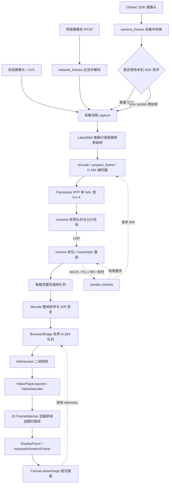
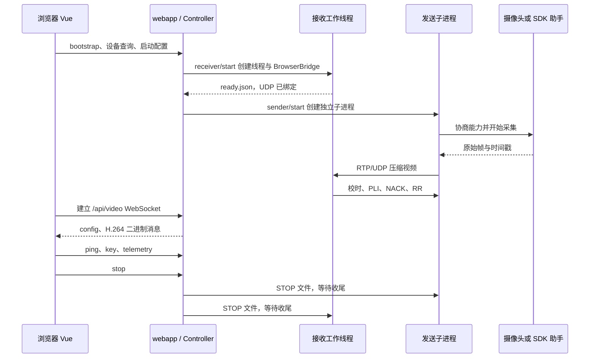

# 开发者指南：沿一帧视频理解整个项目

本文按 2026-09-29 工作区源码重写，以 **Vue + WebCodecs 接收端**为默认主线。阅读顺序是数据流、数据契约、各节点实现、异常恢复、测试与扩展。文中的“当前”指代码行为，不代表所有设备和网络组合都已通过实机验证。

覆盖范围：`video_demo/` 的全部 Python 业务文件、`frontend/src/` 的全部源码、启动脚本与 `tools/`；逐项解释显式定义的类、函数、方法，以及影响生命周期的浏览器回调。测试文件按验证对象说明，依赖库和 `frontend/dist/` 生成文件不逐行展开。表中的方法名可直接在源码中搜索；`run_sender.capture.accept_frame` 这类名字表示函数内部的嵌套函数，并非对象属性访问表达式。

使用与部署见 [README](README.md)、[局域网部署](LAN_SETUP.md)、[Web 接口与前端开发](WEB_UI.md)、[SDK 接入](SDK_CAMERAS.md)、[网络摄像机](NETWORK_CAMERAS.md)、[光学测量](OPTICAL_MEASUREMENT.md)。源码链接采用仓库相对路径，便于在另一台机器及 GitHub 阅读。

## 阅读导航

- [1. 完整数据流与进程边界](#flow)
- [2. 一帧数据的结构、标识与时钟](#contracts)
- [3. 节点 A：启动、网页配置和会话控制](#control)
- [4. 节点 B：输入选择与能力协商](#inputs)
- [5. 节点 C：SDK 采集与本机助手](#sdk)
- [6. 节点 D：采集时间映射、原始帧槽与编码](#encode)
- [7. 节点 E：RTP 分包、发送和反馈](#transport)
- [8. 节点 F：UDP 接收、重组和参考链恢复](#receive)
- [9. 节点 G：H.264 到浏览器的 WebSocket 桥接](#bridge)
- [10. 节点 H：浏览器解码、配帧和画面提交](#browser)
- [11. 节点 I：指标、日志和报告](#metrics)
- [12. 可选分支：原生 Qt 与无窗口接收](#native)
- [13. 可选工具：光学验证与 SDK 验证](#verification)
- [14. 容量、线程、恢复与故障定位](#operations)
- [15. 文件索引、测试与修改指南](#maintenance)

<a id="flow"></a>
## 1. 完整数据流与进程边界

### 1.1 默认媒体链路



逐步理解这条链路：

1. **输入统一成 `av.VideoFrame`。**系统摄像头由 PyAV 打开；RTSP 在发送机先解码；SDK 由本项目 C ABI 绑定读取，必要时经过管理员助手。只有显式测试源使用 RGB 数组。
2. **采集与编码解耦。**采集持续取帧，编码来不及处理时覆盖槽里的旧原始帧，不建立长 FIFO。
3. **每路独立编码。**每路编码器、转换器、帧号和 RTP SSRC 都独立，整个发送进程共享一个 UDP socket。
4. **接收机重建完整 H.264 帧并恢复顺序。**分片乱序在 `Assembler` 解决，整帧缺失及参考链在 `receiver.decode()` 解决。
5. **默认接收机不把 H.264 解码为 RGB。**`decode()` 在 Web 模式下只是排序和转发；真正解码发生在浏览器的 `VideoDecoder`。
6. **浏览器按策略选帧并提交。**Vue 管表单和指标，`VideoPlayer` 管逐帧解码与 Canvas 绘制，避免让 Vue 响应式状态承载每幅图像。
7. **统计沿原帧标识回传。**浏览器上报提交时间和阶段耗时，接收服务匹配曾转发的帧，再写报告。

RTSP 摄像机的 PoE 供电由网线、交换机与设备负责，程序处理的是其 RTSP 视频入口。当前会先解码再统一编码，不是原始压缩码流直通。SDK `depth` 入口会转成灰度预览，再经过有损 H.264，不保留可测距的原始深度精度。

### 1.2 控制流与媒体流是不同连接



这个时序展示同一服务管理两端的情况。两机运行时，两台机器各有自己的 Web 服务：发送页控制所在服务机器的摄像头，接收页控制所在服务机器的 UDP 接收任务。浏览器所在机器不一定是媒体接收机。

| 进程 / 线程 | 实际承担的工作 |
|---|---|
| Web 服务进程 | aiohttp 事件循环、HTTP 配置、WebSocket、会话管理。默认 TCP 8765。 |
| 发送子进程 | 每路采集线程、每路编码线程、共享 `transmit`、共享 `controls`、日志写盘线程。 |
| 接收工作线程 | Web 模式由 `Session.launch()` 在服务进程内启动 `run_receiver()`；其内部再启动收包线程、每路排序线程和日志线程。 |
| 浏览器页面 | WebCodecs 异步解码回调；页面主线程配帧、Canvas 提交、周期遥测。每个接收会话只允许一个活动视频查看连接。 |
| 可选 SDK 助手进程 | 由用户单独运行脚本并 sudo 授权；只负责 SDK 枚举与原始图像获取，通过本机 Unix socket 返回。网页、编码、UDP 仍以普通用户运行。 |
| CLI `demo` 父进程 | 用于原生对照测试；启动独立 `receive` 和 `send` 子进程，等待就绪并汇总两端结果。不是默认 Vue 播放路径。 |

通过 SSH `-L 18765:127.0.0.1:8765` 看远程接收页时，HTTP 和 WebSocket 经过隧道，RTP/UDP 5004 仍是发送机到接收机的独立连接。画面延迟包含浏览器所在路径；仅看 UDP RTT 不能解释全部预览延迟。

### 1.3 原生接收分支

```text
共同部分：UDP → Assembler → Unit 队列 → receiver.decode() 整帧排序
Web：    → BrowserBridge → WebSocket → VideoDecoder → JS FrameMatcher → Canvas
Qt：     → PyAV 解码 → RGB → Python FrameMatcher → DisplayScheduler → Window
headless：→ PyAV 解码 → RGB → Python FrameMatcher → selected 事件，无屏幕提交
```

Web 模式虽然在参数上设置 `headless=True`，但有 `ui_backend=webcodecs` 和 `web_sink`；它的报告应读 `browser_submit`，不能把原生 `decode` 样本为空解释为视频没有解码。

<a id="contracts"></a>
## 2. 一帧数据的结构、标识与时钟

### 2.1 对象如何变化

| 阶段 | 数据对象 | 下一步所需信息 |
|---|---|---|
| 设备交付 | `av.VideoFrame`，SDK 另带 metadata | 尺寸、格式、颜色范围、可用设备时间戳。帧可能有自己的原始 PTS。 |
| 原始帧槽 | `(capture_ns, image, timing)` | 应用取帧时间、图像、SDK 计时状态。 |
| 编码准备 | 新 PTS 的 `av.VideoFrame` | `pts` 是本路编码序号；原始设备 PTS 不能直接作为协议帧号。 |
| 编码输出 | `av.Packet` + `Meta` | 用输出 `packet.pts` 回查输入帧，取回正确采集时间。 |
| RTP 分片 | `bytes`，解析后为 `Packet` | `Meta`、SSRC、sequence、RTP timestamp、分片位置与载荷。 |
| 重组完成 | `Unit` | 完整 Annex B H.264、首片到达时间、重组完成时间。 |
| WebSocket | 4 字节 JSON 长度 + JSON 元数据 + H.264 | 路号、帧号、校时后的主机时间，以及解码用的压缩内容。 |
| 浏览器解码候选 | `item` + 原生 `VideoFrame` | 原始元数据、浏览器时钟域的采集时间、received/decoded 时刻。 |
| 当前可见帧记账 | `VideoPlayer.visible[stream]` | 该已提交帧的采集时间、提交时间、状态、epoch。这里只保存计时信息；绘制完成后关闭 `VideoFrame`。 |
| 原生解码候选 | `Decoded` | RGB 数组、原始 Meta、解码完成时刻和映射后的取帧时间。 |

### 2.2 标识与时间字段

| 字段 | 产生位置、单位和含义 |
|---|---|
| `stream` | 当前发送会话内从 0 开始的路号。顺序来自配置列表，不是设备永久 ID。 |
| `epoch` | `run_sender()` 启动生成的随机 32 位会话号，同进程所有路共用。 |
| `frame_id` | 每路从 0 递增的编码输入 PTS。不同路同帧号不表示同时拍摄。 |
| `ssrc` | 每路 `Packetizer` 的 RTP 源标识。 |
| `capture_ns` | 发送机单调时钟，应用拿到图像时的时间。SDK 路径在 SDK 取出帧时记录，经过助手仍保留原值；RTSP 在输入解码返回后记录。 |
| `sensor_capture_ns` | SDK Global Timestamp 映射成发送机单调时钟后的采集时间，仅 `sensor_status=ready` 有效。它没有替代 `capture_ns`。 |
| `sdk_device_timestamp_us` | SDK 设备时钟原值，单位微秒；不能直接和电脑单调时钟相减。 |
| `sdk_global_timestamp_us` | SDK 提供的全局采集时间，当前配置使用 Realtime 时钟源，单位微秒。SDK 自身拟合误差未知。 |
| `sdk_system_timestamp_us` | SDK 帧的系统时间，供本机合理性检查和采集日志；没有放进 RTP v2 扩展。 |
| RTP `timestamp` | `capture_ns` 转 90 kHz，再加随机偏移并以 32 位回绕。不能当作浏览器毫秒时间使用。 |
| `encode_us` | 开始准备编码帧到对应压缩包返回的微秒数，不包含此前原始帧槽等待。 |
| `first_rx_ns` / `complete_ns` | 接收机单调时钟，首分片到达 / 整帧重组完成。 |
| `host_capture_ms` | 发送机应用取帧时间映射到接收机后的毫秒值，供浏览器再次校时。 |
| `host_sensor_capture_ms` | SDK 采集时间映射到接收机后的毫秒值，仅传感器映射就绪时提供。 |
| 浏览器 `capture` / `sensorCapture` | 上述两个时间再映射到浏览器 `performance.now()` 时钟域。 |
| 浏览器 `submitted` | `Canvas.drawImage()` 返回后读取的时间，表示应用提交边界，不是屏幕像素出光时刻。 |

两段主机映射方向必须一致：

```text
offset_udp = 发送机单调时钟 − 接收机单调时钟
接收机取帧时间 = capture_ns − offset_udp

offset_browser = 接收机单调时钟(ms) − 浏览器 performance.now()(ms)
浏览器取帧时间 = host_capture_ms − offset_browser
```

SDK 时间先做 `GlobalTimestampMap` 的 epoch → 发送机单调时钟转换，再走同样的两段映射。每一步只能扣一次偏移。

### 2.3 当前界面各指标的精确口径

| 显示项 | 计算 |
|---|---|
| 视频延迟 · 估计 | `当前可见帧.submitted − 该帧计时起点`；SDK 映射有效时取 `sensorCapture`，否则取 `capture` 并明确标注应用取帧起点；校时不可用显示未知。 |
| 画面年龄 | `统计时刻 − 同一可见帧的同一起点`。停帧后继续增长；不是另一条延迟链路。 |
| 相机采集 → 应用取帧 | `capture − sensorCapture`，两者有效才显示。 |
| 应用取帧 → 画面提交 | `submitted − capture`；包含编码、UDP、接收排序、WebSocket/SSH、浏览器解码与等待。 |
| 提交后经过 | `统计时刻 − submitted`。视频延迟加它等于画面年龄。 |
| 可见画面取帧时间偏差 | 当前所有路可见帧的 `max(meta.capture_ms) − min(meta.capture_ms)`；要求路数齐全且 epoch 相同。仍是应用取帧口径，尚未用 SDK 曝光/采集时间配帧。 |
| UDP RTT | 最近一次发送机与接收机校时探测的往返耗时，扣除对端处理区间。 |
| 预览 RTT | 最近一次浏览器与接收服务的应用层 ping/pong 往返耗时，扣除对端处理区间；SSH 访问时包含隧道。 |

两项 RTT 都不是逐帧单程网络耗时，不直接除二当实测值，也不能再加到视频延迟上。当前仅实时展示，未加入逐帧 CSV 的 RTT 分布。软件延迟即使使用 SDK 起点，终点仍是提交而非出光；`glass_to_glass_latency_ms` 保持空值，真实场景到屏幕由光学录像另测。

<a id="control"></a>
## 3. 节点 A：启动、网页配置和会话控制

### 3.1 入口与启动脚本

这些文件没有业务方法，作用是把参数交给 Python 入口。

| 文件 | 执行过程 |
|---|---|
| [demo.py](demo.py) | 导入 `video_demo.cli.main`，用其返回值作为进程退出码。 |
| [video_demo/__main__.py](video_demo/__main__.py) | 为 `python -m video_demo` 提供同一个入口。 |
| [video_demo/__init__.py](video_demo/__init__.py) | 包标记与模块说明，无媒体初始化。 |
| [start_demo.command](start_demo.command) | 切换项目目录；需要时建立 `.venv`、安装依赖；无参数运行 `web`，有参数运行 CLI `demo`。 |
| [start_receiver.command](start_receiver.command) | 准备环境后运行 `web --page receiver`，附加参数传给 Web 命令。打开页面不等于点击开始接收。 |
| [start_sender.command](start_sender.command) | 复用接收启动脚本并追加 `--page sender`，选择发送页面。 |
| [start_demo.bat](start_demo.bat) | Windows 下完成相同的环境准备和 web/demo 分派，结束后 pause。 |
| [start_receiver.bat](start_receiver.bat) | Windows Web 接收页面启动器。 |
| [start_sender.bat](start_sender.bat) | 调用 Windows 接收启动器并选择发送页。 |
| [start_sdk_helper.command](start_sdk_helper.command) | 要求已有 `.venv`，调用 `tools/start_sdk_helper.py`；权限提升细节见 SDK 节点。 |

### 3.2 `video_demo/cli.py`

[源码](video_demo/cli.py)。这是 Web、发送、接收、诊断工具共用的参数层，不能仅修改 Vue 输入范围而忘记这里的校验。

| 方法 | 输入 → 行为 → 输出 / 注意事项 |
|---|---|
| `output_path(kind)` | 根据命令名、时间和 PID 返回默认 `runs/` 目录字符串，不在这里启动媒体。 |
| `parser()` | 建立 `web/doctor/cameras/sdk/optical/analyze/demo/send/receive` 子命令。注册公共输出、编码器、网络、同步、显示和光学测量参数，返回 ArgumentParser。 |
| `validate(p, args)` | 读取并校验配置、设备列表和输出值，推断路数并就地补全 args；发送地址先 trim；拒绝空地址、奇数输出尺寸、不合理队列预算、重复输出目录等。GUI CLI demo 缺少设备时才打开 Qt 选择器。`latest + strict_sync` 不允许。 |
| `doctor()` | 用内存诊断色块做真实编解码，报告编码器启动、首个输出、颜色误差与硬件状态；不访问摄像头，不是多路实机验收。返回诊断退出码。 |
| `stop_child(process)` | 已退出直接返回；否则先写该子进程 STOP 文件，等待后逐级 SIGINT/CTRL_BREAK、terminate、kill。尽量让媒体线程和 Journal 正常收尾。 |
| `run_demo(args)` | CLI 本机对照链路：协商输入、保存配置、启动独立接收进程、等待 ready.json、读取实际 UDP 端口、启动发送进程；任一结束后关闭两端，按 `(epoch, frame_id)` 比较 tx/decode，生成 report.json。 |
| `run_demo.launch(role, arguments)` | 嵌套函数，使用当前解释器启动子进程，设置日志文件和 STOP 路径；仅发送子进程继承经准备的 RTSP 凭据环境。 |
| `main(argv=None)` | 解析、注册中断、调用 validate 后分派命令；用户错误以脱敏文本写 stderr 并返回 1。未显式返回的成功分支返回 0。 |
| `main.terminate(_sig, _frame)` | SIGTERM 回调，抛 KeyboardInterrupt，复用各运行函数的 finally 收尾。 |

注意默认值来源：CLI `receive/demo` 默认 `aligned`，未指定等待值时多路取半帧且最多 20 ms，单路为 0；Vue 接收页显式发送 `latest` 和 8 ms。两条入口并非所有默认值都相同。Web 模式由 `media_args()` 在 CLI 校验后设置内部 headless 标记，不要求用户填写运行时长。

### 3.3 `frontend/src/main.js`、`App.vue` 与 `api.js`

[main.js](frontend/src/main.js) 只调用 `createApp(App).mount('#app')` 并加载全局样式，没有额外命名方法。[App.vue](frontend/src/App.vue) 管侧栏与 hash 页面；首次打开对应页才创建组件，之后通过 `v-show` 保留已创建页的状态。

| 文件 / 方法或回调 | 作用 |
|---|---|
| `App.vue: route()` | hashchange 时更新当前页面，并标记 senderSeen/receiverSeen，决定懒创建哪个面板。 |
| `App.vue: receiver()` | 收到发送页本机回环启动成功事件后，把 hash 切到接收页。 |
| `App.vue: onMounted` | 注册路由监听，调用 bootstrap，取得 token 和已保存的 SDK 目录；成功后显示面板，失败显示连接错误。 |
| `App.vue: onUnmounted` | 移除 hashchange 监听；服务端任务不随页面卸载停止。 |
| `api.js: bootstrap()` | GET `/api/bootstrap`，把返回 token 保存在模块内，返回其他初始化数据。 |
| `api.js: api(path, data)` | 无 data 时 GET；有 data 时 POST JSON 并携带 `X-Video-Token`。统一解析 JSON 和错误，返回响应对象或抛 Error。 |
| `api.js: videoUrl(pageLocation=location)` | 根据当前页面 HTTP/HTTPS 选 ws/wss，保持同一 host 和端口，并附加 token。因此 SSH 的转发端口也自然保留。 |

### 3.4 `frontend/src/components/SenderPanel.vue`

[源码](frontend/src/components/SenderPanel.vue)。持有普通设备、SDK 设备、选择结果、RTSP 地址、输出参数和发送状态。此文件控制任务，没有逐帧视频处理。

| 方法 / 响应式逻辑 | 输入 → 行为 → 结果 |
|---|---|
| `poll()` | 每次请求 `/sender/status`，新运行目录出现时把真实会话配置填回表单；在 finally 中安排约 1 秒后的下一次查询。 |
| `discover(sdk=false)` | 查询系统或 SDK 设备；更新 modes、不可访问设备和助手缓存提示；移除已经不存在的选择。失败展示错误，不伪造空白的成功采集结果。 |
| `refreshDevices()` | 查询普通设备；已填写 SDK 路径时也查询 SDK。两者查询的是能力列表，不开启视频。 |
| `choose(device, value)` | 接收 CameraInput 的 change；value 为配置则保存，为 null 则取消该路。 |
| `saveSdk()` | POST SDK 路径并重新查询 SDK 设备；不会下载 SDK 或自动提权。 |
| `start(loopback=false)` | 合并选中设备和逐行 trim 的 RTSP 地址，要求 1–8 路。普通模式提交目标地址；回环模式先启动本机接收再启动发送，后者失败会清理此次创建的接收任务。 |
| `stop()` | POST `/sender/stop` 并刷新状态；只停止发送，不自动停止原本独立运行的接收。 |
| `preset(event)` | 把选定预设拆成输出宽、高、FPS、每路 kbps，写回 output。 |
| `running / count / bitrate` | 派生运行状态、配置/实际路数和目标总码率。目标总码率是估算，不是 socket 实测。 |
| `onMounted / onUnmounted` | 挂载启动轮询与设备查询；卸载只停轮询，不向后端发停止命令。 |

### 3.5 `frontend/src/components/ReceiverPanel.vue`

[源码](frontend/src/components/ReceiverPanel.vue)。持有接收配置、状态、每路 canvas 引用和一个 `VideoPlayer` 实例。

| 方法 / 响应式逻辑 | 作用与生命周期 |
|---|---|
| `metric(value, digits=1)` | 有限数值格式化为小数，否则显示 `—`，避免把未知时延显示成 0。 |
| `timingOrigin(origin)` | 将 camera/application/未知转成实际计时起点文案。 |
| `timestampStatus(value)` | 把 SDK 映射状态、校时等待、旧助手等状态翻译为界面说明。 |
| `poll()` | 每约 1 秒读状态；运行且浏览器支持 WebCodecs 时，在 DOM 更新后创建播放器；运行目录变化先关闭旧播放器；接收停止时关闭播放器。请求失败清空 UDP RTT，防止旧值一直保留。 |
| `start()` | POST 当前配置启动接收任务，只改变服务状态；播放器由之后的 poll 创建。 |
| `stop()` | 先关闭播放器及预览连接，再 POST 停止接收，等待服务端日志收尾。 |
| `fullscreen()` | 对 video-grid 请求全屏，失败写入页面错误。 |
| `running / streamCount / totalBitrate` | 根据真实会话状态确定卡片数量和 RTP 接收总码率，不根据 Canvas 绘制速度猜码率。 |
| canvas `ref` 回调 | 将每路实际 canvas 加入/移出 Map，供 `canvasFor(stream)` 获取。 |
| `VideoPlayer` 三个构造回调 | 分别获取 canvas、接收统计写入 view、接收预览错误；Vue 不保管 VideoFrame。 |
| `onMounted / onUnmounted` | 挂载开始轮询；卸载取消定时器并 close 播放器，但不停止后台接收任务。 |

UI 默认是 `latest`、容差 18 ms、等待 8 ms、应用帧过期 100 ms、显示上限 60 fps。`window.isSecureContext` 和 `VideoDecoder` 可用性控制能否预览；远程普通 HTTP 控制页可访问不等于浏览器允许解码。

### 3.6 `video_demo/webapp.py`：会话对象

[源码](video_demo/webapp.py)。aiohttp 只编排工作，不在事件循环里做相机采集与 H.264 编码。

| 类 / 方法 | 作用、调用关系与错误处理 |
|---|---|
| `InputParser` / `InputParser.error(message)` | 将参数错误改为 ValueError，让无效 Web 配置返回错误响应，不终止服务进程。 |
| `media_args(role, data, directory)` | 白名单接收 JSON 字段，转换为 CLI 参数并复用校验。真实摄像头另用 validate_profile；临时 synthetic 标记仅用于避免弹出 CLI 选择器，不会把用户摄像头替换成合成源。返回内部 args。接收设为 WebCodecs 分支。 |
| `Session` / `Session.__init__(role, args)` | 创建运行目录、状态、日志读取位置、统计缓存；接收角色还创建 BrowserBridge。此时尚未启动媒体。 |
| `Session.launch()` | sender 生成配置文件并 Popen 当前 Python 的 send 子命令；receiver 启动同进程 daemon 工作线程。 |
| `Session.launch.worker()` | 接收线程入口，调用 `run_receiver(args, web_sink=bridge)`；捕获异常写入 Session.error，finally 标记 finished。 |
| `Session.running` | 属性：发送看进程 poll，接收看线程 is_alive。不是单凭前端按钮状态判断。 |
| `Session.stop()` | 标记 stopping、写 STOP；发送调用 stop_child 并关闭日志句柄；接收 join 最多 10 秒，仍未退出则抛错。 |
| `Session.snapshot()` | 增量读 events.jsonl，保留跨读取边界的半行；汇总最近事件和发送 FPS/码率，附上 bridge.snapshot、目录、报告就绪状态。发送窗口以最新日志事件为基准取约 2 秒，事件落后当前超过 2 秒才置零，避免异步 flush 造成周期性低帧率假象。 |
| `Controller` / `Controller.__init__(output_root)` | 保存两种角色的 Session、输出目录和 asyncio.Lock，串行处理启动/停止。 |
| `Controller.start(role, data)` | 拒绝覆盖仍运行的同角色任务；关闭旧预览并收尾旧 Session；创建新运行目录和 Session。接收最长约 20 秒等待 ready.json，超时停止并报错。发送启动响应不保证相机已成功打开，后续 status 会报告采集失败。 |
| `Controller.stop(role)` | 在同一锁内关闭预览、用 `asyncio.to_thread` 执行可能阻塞的 stop，再返回最终状态；没有会话返回 idle。 |
| `normalized_hostname(value)` | 规范化 IP/IDNA 域名并拒绝 URL、空白、端口、通配符等模糊配置。用于 Host 白名单。 |
| `web_settings(args)` | 校验监听 IP/端口、显式 LAN Host 和 TLS 成对参数，创建可选 SSLContext，返回允许主机集合、TLS 上下文、页面 URL。 |
| `run_web(args)` | 要求已有 dist；仅默认本机 HTTP 配置允许探测复用现有服务。显式 LAN/TLS 启动不会静默复用旧 localhost 服务。按参数打开浏览器并运行 aiohttp，退出走 cleanup。 |

### 3.7 `create_app()` 及其全部处理函数

`create_app(output_root=None, allowed_hosts=None)` 创建 Controller、随机 UI token、Host 白名单和路由，返回 aiohttp Application。下表函数均定义在它内部，可访问同一个 controller/token。

| 嵌套方法 | 路由或调用时机与行为 |
|---|---|
| `create_app.permitted_origin(request, handler)` | 中间件：校验 Host、同源 Origin；非 GET 检查 X-Video-Token。ValueError/RuntimeError/OSError 转脱敏 400 JSON；正常处理响应追加 no-store、nosniff。这是本机控制保护，不是用户登录系统。 |
| `create_app.bootstrap(request)` | GET `/api/bootstrap`：返回应用名、token、已保存 SDK 根目录和空的光学延迟值。 |
| `create_app.inventory(request)` | GET `/api/cameras`，`sdk=1` 切 SDK；通过 to_thread 枚举，补 device 标识与结构化 modes 后返回。 |
| `create_app.sdk_root(request)` | POST `/api/sdk`：验证 path 类型，在线程中调用 configure_root 并返回保存路径。 |
| `create_app.role_of(request)` | 从路由提取 sender/receiver；其他角色返回 404。 |
| `create_app.status(request)` | GET `/api/{role}/status`：返回对应 snapshot，没有会话则 idle。 |
| `create_app.start(request)` | POST `/api/{role}/start`：解析 JSON 并 await Controller.start。 |
| `create_app.stop(request)` | POST `/api/{role}/stop`：await Controller.stop。 |
| `create_app.report(request)` | GET `/api/{role}/report`：只有 summary.json 已生成才允许下载，否则 404。 |
| `create_app.video(request)` | GET `/api/video?token=...` 升级 WebSocket；要求接收已运行且无其他活动查看者；预留 Session.websocket，发送 config，读 ping/key/telemetry。退出时 detach bridge、取消发包任务、释放查看连接。 |
| `create_app.video.transmit()` | 协程循环从 bridge.pop 取二进制帧；空队列等 2 ms，单次 send_bytes 最多等 250 ms，慢连接触发关闭恢复。该超时不是 TCP 全链路缓存的严格年龄上限。 |
| `create_app.video.finished(task)` | 发包协程结束时取走异常并安排关闭 WS，交给客户端重连，不留下只有控制通道活着的预览。 |
| `create_app.index(request)` | GET `/`：返回 dist/index.html；未构建时给出 503 与构建命令。`/assets/` 使用静态文件路由。 |
| `create_app.cleanup(app)` | Web 服务关闭时逐角色停止 Session。关闭浏览器不会触发它，退出 Web 服务才会。 |

<a id="inputs"></a>
## 4. 节点 B：输入选择与能力协商

配置阶段输出每路独立的 `camera_settings`，公共 `width/height/fps/bitrate_kbps` 则是编码输出目标。设备采集 1280×800@25 而输出 1280×720@30，表示要转换尺寸、输出上限 30，不表示程序能创造缺少的 5 fps。

### 4.1 `frontend/src/components/CameraInput.vue`

[源码](frontend/src/components/CameraInput.vue)。单路选择卡片，没有命名业务函数，行为由 computed 和两个 watch 完成。

| 逻辑 | 输入 → 输出 |
|---|---|
| `mode` computed | 用 modeIndex 从 record.modes 取得当前设备模式。 |
| `watch(mode)` | 模式变化时把初始 30 fps 限制到该模式 min/max 范围。 |
| 配置数组 `watch` | 监听勾选、自动/手动、模式、FPS、宽高、格式与深度范围。自动只发 device，让后端协商；手动发具体约束；depth 加入近远范围。emit change(device, settings/null) 给 SenderPanel。 |

有能力列表时从实际模式中选择；无能力列表时允许手填，但后端仍须尝试和校验。卡片禁用由父组件传入，运行中不重配编码器。

### 4.2 `video_demo/cameras.py`

[源码](video_demo/cameras.py)。所有入口共用的设备能力和配置解析层，不持有长期采集线程。

| 方法 | 输入、输出与关键行为 |
|---|---|
| `inventory(include_modes=True)` | 返回 backend、devices 和元数据标记。macOS 完整查询调用 Swift，快速模式或无 Swift 时解析 FFmpeg 枚举日志；Linux 扫 sysfs 并可附 v4l2-ctl 文本；Windows 解析 DirectShow 名称与唯一替代名。没有启动图像流。 |
| `read_profile(path)` | 读 JSON 后调用 validate_profile，返回已解析配置。 |
| `validate_profile(data)` | 校验 version=1、1–8 路、允许字段、颜色矩阵及输出字段；解析 device_env；按 URI 分派 SDK/RTSP 特有校验。会将解析后的 camera 写回 data。 |
| `select_camera_profile(output, capture_format, exact)` | 延迟导入 Qt 选择器并返回 profile，普通 headless/Web 路径不因此创建 Qt 窗口。 |
| `capture_options(camera, width, height, fps)` | 返回 `(format, url, options)`。AVFoundation 使用 `device:none`、NV12 与 drop_late_frames；DirectShow 设置有限 rtbufsize；V4L2 使用设备路径/input_format。 |
| `capture_modes(record, backend)` | 将格式与 FPS 范围展开为结构化模式，过滤无法映射的格式和非法速率；当前 AVFoundation 接口只开放每个范围的最高 FPS，原始 inventory 仍保留设备声明范围。 |
| `describe_modes(modes)` | 把模式集合格式化为尺寸/FPS/像素格式描述，供启动错误展示。 |
| `select_capture_mode(camera, modes, width, height, fps, exact=False)` | 显式单路参数作为硬约束；公共输出作为软目标。候选按几何差、FPS 差、像素格式偏好排序，返回完整单路配置；无候选抛包含可用模式的错误，不静默跳过摄像头。 |
| `configure_camera_inputs(args)` | 启动媒体线程前分流 UVC、SDK、RTSP，协商各路模式并写回 args.camera_settings/camera_modes。RTSP 不伪装成可切换本机采集模式；普通相机无结构化能力时标记 unverified_requested_mode。 |

`PIXEL_FORMATS` 是系统 FourCC 到 FFmpeg 名称的映射，不是相机型号白名单。普通相机同名时必须解析为唯一编号/路径。Linux 返回 formats_text 不等于已具备和 macOS 相同的结构化自动协商能力。

### 4.3 `tools/camera_inventory.swift`

[源码](tools/camera_inventory.swift)。由 `cameras.inventory()` 启动的一次性元数据进程。

| 方法 / 顶层逻辑 | 作用 |
|---|---|
| `fourCC(value)` | 将 32 位 FourCharCode 转成四字符格式标识；不能表示 ASCII 时退回数字字符串。 |
| devices/formats 的 map 闭包 | 枚举设备名称、uniqueID、modelID，逐格式读宽高、媒体子类型和帧率范围。 |
| JSON 输出 | 输出 backend、authorization_status、metadata_only 与 devices，不创建 AVCaptureSession。查询支持模式不证明实际打开采集成功。 |

### 4.4 `video_demo/network.py`

[源码](video_demo/network.py)。RTSP 输入只发生在发送机，解码后的图像才进入本项目 H.264 回传链路。

| 方法 | 输入 → 行为 → 输出 / 异常 |
|---|---|
| `is_rtsp(value)` | 判断 rtsp/rtsps 前缀，非字符串返回 False。 |
| `redact(value)` | 递归清洗字典、列表和字符串内的 RTSP URL；日志与配置保存前调用。 |
| `redact.clean(match)` | 正则替换回调，保留 scheme 和主机，删除账号、路径、query；解析失败返回脱敏占位符。 |
| `resolve_device(camera)` | 将合法 device_env 从环境读出并 trim，返回含 device 的新配置；拒绝 device 与 device_env 并存或环境变量缺失。 |
| `validate_network_camera(camera)` | 验证 URL、transport、连接/读取/重试时限；拒绝 RTSP 单路 width/height/fps 等本机采集参数。这些由网络摄像机后台管理。 |
| `rtsp_options(camera)` | 构造 FFmpeg 小探测预算、只接收视频、坏包丢弃与有界重排选项。TCP 默认不设置 UDP 重排队列；RTSPS 开启证书验证。 |
| `open_rtsp(camera)` | 校验后 av.open，显式传连接与读取超时；捕获 FFmpeg 日志，避免凭据出现在 stderr。返回 InputContainer。 |
| `network_frames(camera, stop, on_event)` | 可中断重连生成器。每次连接选第一条视频流、单线程输入解码；首帧发 network_connected，断线发脱敏事件，关闭 container，等 retry_delay 后再连接。逐帧 yield VideoFrame，不把网络到达时间冒充曝光时间。 |
| `child_camera_profile(cameras)` | 返回 `(profile, env)`：RTSP URL 放入子进程环境，运行配置仅保存 device_env 引用；其他相机直接复制配置。 |

输入网络断开只触发该采集线程重试，不立即终止其他路。恢复首帧时发送端请求重新编码 IDR，以便下游恢复参考链。当前没有 ONVIF 发现、PTZ、远程相机画质写入或 RTSP 压缩流直通。

### 4.5 `video_demo/camera_settings.py`：CLI 的 Qt 配置分支

[源码](video_demo/camera_settings.py)。默认 Vue 页面不用这个文件，但 CLI `demo` 未指定设备时会使用。Qt 只在主线程操作控件，后台查询经队列回到主线程。

| 方法 | 作用 |
|---|---|
| `device_identifier(record, devices)` | 优先 device；同名且有 index_hint 时使用编号，否则名称。返回与 CLI 匹配规则一致的标识。 |
| `CameraRow.__init__(record, identifier, output, ...)` | 创建可勾选单路控件，保存共享输出目标；连接尺寸/格式/FPS 的联动，depth 额外创建近远距离输入。 |
| `CameraRow.set_record(record)` | 展开并过滤可表示的模式，重建尺寸选项，尽量保留原选择；无模式时允许手填。 |
| `CameraRow.dimensions()` | 从下拉或手填文本解析 `(width,height)`，校验尺寸边界。 |
| `CameraRow.matching_modes()` | 返回当前尺寸对应的能力记录，供格式和速率筛选。 |
| `CameraRow.update_pixels()` | 尺寸变化后重建像素格式，阻断中间信号避免连锁误更新，再调用 update_rates。 |
| `CameraRow.update_rates()` | 结合模式范围、常见速率与输出 FPS 构造候选，保留仍有效的原值；不把离散模式之间的空档填成可用速率。 |
| `CameraRow.automatic_settings()` | 生成设备与可选格式约束，调用共用 select_capture_mode；无能力时只返回请求的最少信息。 |
| `CameraRow.settings()` | 取得 capture_settings，SDK 增加标签/深度范围并执行 SDK 校验，返回最终单路配置。 |
| `CameraRow.capture_settings()` | 自动模式转 automatic_settings；手动模式解析尺寸/FPS/格式，并按 exact=True 验证真实能力。 |
| `CameraRow.update_enabled()` | 按自动开关禁用/启用手动控件，同步自动结果与说明。 |
| `CameraRow.sync_automatic_controls()` | 将自动协商出的尺寸、格式、FPS 显示到控件中；协商失败保持待提示状态。 |
| `CameraRow.update_hint()` | 显示实际选中模式、范围、AVFoundation 限制或错误；未知能力明确标注需启动验证。 |
| `CameraSettingsDialog.__init__(output, ...)` | 建立设备列表、SDK 查询、RTSP 多行输入、公共输出、确认按钮和结果队列；启动后台普通设备查询。 |
| `CameraSettingsDialog.__init__.discover()` | 后台完整能力查询失败后尝试基础枚举，向 results 放入 `(data,error)`；不触碰已创建的 Qt 控件。 |
| `CameraSettingsDialog.select_sdk_root()` | 文件夹选择后 configure_root，成功再发起 SDK 查询；取消不修改配置。 |
| `CameraSettingsDialog.start_sdk_query()` | 检查已配置 SDK 且无重复查询，禁用查询按钮，启动线程和轮询定时器。 |
| `CameraSettingsDialog.start_sdk_query.discover_sdk()` | 后台调用 sdk_inventory，把数据或错误写入 SDK 结果队列。 |
| `CameraSettingsDialog.poll_sdk()` | 主线程消费 SDK 结果，清理旧 SDK 控件，建立新流选择行及不可访问设备提示，恢复查询按钮。 |
| `CameraSettingsDialog.poll_inventory()` | 主线程消费普通枚举结果，创建 CameraRow，结束查询定时器并显示能力覆盖情况。 |
| `CameraSettingsDialog.output_changed()` | 把宽高/FPS/kbps 写回共享 output，更新预设与说明；只重新同步自动行，不覆盖手动行。 |
| `CameraSettingsDialog.apply_preset()` | 批量设置预设尺寸后统一触发 output_changed，避免中间宽高值影响选择。 |
| `CameraSettingsDialog.accept()` | 验证偶数输出尺寸、选中配置、SDK 序列号不重复和 RTSP 地址；生成 version=1 profile。错误留在窗口，不丢失用户填写内容。 |
| `select_camera_profile(output, ...)` | 创建或复用 QApplication，执行模态对话框；确认返回 profile，取消抛可展示错误。 |

<a id="sdk"></a>
## 5. 节点 C：SDK 采集与本机助手

### 5.1 `video_demo/sdk.py`：可选适配入口

[源码](video_demo/sdk.py)。普通 UVC/RTSP 不经此文件加载原生 SDK。`STREAMS` 映射 URI 流名、SDK sensor/frame 类型和显示标签，当前每个物理序列号只允许一种图像流。

| 方法 | 作用与返回值 |
|---|---|
| `is_sdk(device)` | 判断 orbbec:// 前缀。 |
| `device_uri(serial, stream)` | 对序列号做 URL 编码并构造稳定的 SDK URI。 |
| `parse_device(device)` | 解析、解码并验证序列号与 color/ir/depth 等流名，拒绝 query/fragment/非法空白，返回 `(serial,stream)`。 |
| `validate_camera(camera)` | 拒绝 SDK 不接受的 RTSP/input_format 参数；校验整数采集模式、深度近远范围以及范围参数只用于 depth。 |
| `configured_root()` | 优先读 ORBBEC_SDK_ROOT，再读 `.local/camera-sdks.json`；返回绝对 Path 或 None。 |
| `configure_root(path)` | 定位官方动态库确认安装结构，再保存本机 SDK 根目录。只写本机配置，不安装驱动或下载包。 |
| `inventory()` | 无 SDK 配置返回 not_configured；macOS 优先查询已运行助手；否则开隔离子进程枚举，最长 45 秒，仅解析 `VIDEO_DEMO_SDK_JSON=` 标记后的 JSON。 |
| `configure_inputs(settings, width, height, fps, exact)` | 查询实际 SDK 模式，禁止重复序列号，对每路共用 select_capture_mode，返回带标签的具体配置；设备缺失时合并 unavailable 原因报错。 |
| `frames(camera, stop)` | 生成器入口；macOS 有助手则 yield from helper_frames，否则直接 camera_frames。助手存在但异常时显式失败，不悄悄改用另一条权限路径。 |

### 5.2 `video_demo/orbbec.py`：C ABI、句柄和图像

[源码](video_demo/orbbec.py)。`FORMATS` 把官方 SDK 枚举值映射为 PyAV 像素格式；原始数值与通用格式保持分离。`_CONTEXTS` 按 SDK 根目录维护进程内共享 context，`_CONTEXT_LOCK` 只保护生命周期，不锁住逐帧采集。

| 类 / 方法 | 输入 → 行为 → 输出 / 资源边界 |
|---|---|
| `library_path(root)` | 按 macOS/Windows/Linux 在 lib/bin 下寻找对应动态库，返回路径；未找到则要求选择正确 SDK 根目录。 |
| `OrbbecError` | RuntimeError 子类，没有额外方法，用于区分 SDK 调用错误。 |
| `NativeSDK.__init__(root)` | 加载动态库、为 C 函数绑定准确 ctypes 参数/返回类型、配置错误对象接口，要求 SDK major=2。Global Timestamp 三个接口按可选能力绑定。 |
| `NativeSDK.call(name, *args)` | 追加 SDK error 指针调用函数；错误时读取并释放 error，再抛 OrbbecError。uvc_open 拒绝访问时根据平台和是否已为 root 给出不同提示。 |
| `NativeSDK.owned(kind, pointer)` | contextmanager，拒绝空指针，退出时调用 ob_delete_kind。所有权应只有一个明确释放点。 |
| `NativeSDK.context()` | 对同 SDK 根目录租用共享 context，增加用户计数；最后一个租用者退出才释放。避免多摄像头相互销毁进程级枚举器。 |
| `NativeSDK._create_context()` | 在临时目录复制/生成 SDK XML：关闭网络设备枚举、设 Realtime 时钟源、减少日志、帧队列设为 1；用该配置创建 context。原 SDK 安装文件保持原样。 |
| `NativeSDK.profile_info(profile)` | 读取 profile 的宽、高、FPS、SDK 格式整数，返回字典。 |
| `NativeSDK.global_timestamp_supported(device)` | 先确认三个可选 API 都存在，再查询设备支持；返回 bool，SDK 调用错误交给上层处理。 |
| `inventory(root, exclude_serials=())` | 枚举设备与图像流模式；排除正在采集的序列号后才打开设备；每个设备错误记到 unavailable，不阻止其他设备显示。返回版本、能力与支持状态。 |
| `convert_image(data, width, height, sdk_format, ...)` | 对已复制的字节验证长度/格式。MJPEG 解码成一帧；原始 YUV/RGB 按平面行宽填入 AVFrame，兼容 AVFrame 对齐；16 位灰度缩为 8 位，depth 按毫米范围转近亮远暗预览，0 保留为无效黑色。 |
| `camera_frames(root, camera, stop)` | 打开指定设备/流/精确模式，尝试开启全局时间戳，启动 pipeline；每次等待 frameset 最多 100 ms，连续 5 秒无图报错。复制 SDK 图像并采样时间，释放原生 frame 后转换为 VideoFrame，yield `(image,received_ns,metadata)`；finally 停止 pipeline，其余句柄按 ExitStack 逆序释放。 |

`camera_frames()` 的时间 API 失败会使 sensor_status 变成 sdk_error，但仍继续交付图像。图像缓冲只在 SDK frame 活着时可访问，所以必须先 `ct.string_at` 复制；不能把 SDK 指针直接交给后续编码线程。深度预览的 scale_mm 与有效位数来自设备，不按型号写死。

模块的 `__main__` 分支仅接受 `--inventory SDK_ROOT`，输出约定 JSON 标记，失败写 stderr 并返回非零。隔离只覆盖枚举；原生库崩溃并不总能由 Python try/except 捕获。

### 5.3 `video_demo/sdk_helper.py`：本机原始帧协议

[源码](video_demo/sdk_helper.py)。当前助手标识为 `global-timestamp-v4`。socket 在 `.local/orbbec-helper.sock`，不是 TCP 服务。消息是 4 字节大端长度加 JSON；图像消息后紧跟各平面的原始有效字节。头最多 128 KiB，帧最多 64 MiB。

| 方法 / 类 | 作用 |
|---|---|
| `HelperError` | 表示可展示的助手协议、身份或运行异常，无自定义方法。 |
| `peer_uid(connection)` | macOS 用 getpeereid，支持的平台用 SO_PEERCRED，从内核取得对端 UID；不信任 JSON 自报身份。 |
| `read_exact(connection, size, stop, timeout)` | 可中断的定长读取；select 每次最多等 100 ms，累计不超过 deadline；EOF、超时或停止分别抛异常，不把残缺帧当完整帧。 |
| `send_message(connection, message)` | JSON 禁止 NaN，检查头大小后发送长度和内容。 |
| `receive_message(connection, stop, timeout)` | 先读头再读 JSON，验证对象类型；收到 error 消息转 HelperError。 |
| `plane_row_bytes(frame)` | 按 packed/planar/NV12 等格式计算各平面每行有效字节，排除 AVFrame 分配器 padding。 |
| `send_frame(connection, frame, capture_ns, metadata)` | 逐平面提取有效数据，先发送尺寸/格式/布局/时间戳 JSON，再发送平面字节；不额外转 RGB 或再次视频编码。 |
| `receive_frame(connection, message, stop)` | 验证尺寸、格式、总长度、平面数量/行宽和时间字段；创建自己的 AVFrame 并按接收端 stride 填充，恢复颜色和设备 PTS。旧助手缺状态时标 legacy_helper，返回三元组。 |
| `connect_helper(root, path=None, required_uid=0)` | socket 不存在返回 None 供直接 SDK 路径使用；存在时验证类型、连接后确认服务端 UID 和固定 SDK 路径握手。残留/拒绝连接显式报错并关闭句柄。 |
| `helper_inventory(root)` | 新建连接发送 inventory，最多等 45 秒，附加 access=local_admin_helper；没有助手返回 None。 |
| `helper_frames(connection, camera, stop)` | 仅发送允许的采集字段，先请求 frames，再每轮 next 拉一帧；退出关闭连接。意外 EOF 包含具体设备标识和助手诊断提示。 |
| `Broker.__init__(root, owner_uid, inventory_fn, frames_fn)` | 保存固定 SDK 路径和允许用户，创建能力缓存、active 序列号集合、连接集合与两把锁；可注入函数用于测试。 |
| `Broker.inventory()` | active 设备保留既有能力，调用原生 inventory 时排除它们；闲置设备重新查询，合并结果并返回 cached_serials 与 revision。不会因为一路在采集就永久缓存另一台失败的设备。 |
| `Broker.reserve(camera)` | 校验字段和模式确实在能力表里，拒绝同序列号重复采集，然后把 serial 加入 active；返回 serial 供释放。 |
| `Broker.handle(connection)` | 单连接工作线程：先校验调用者 UID、版本、固定 SDK 根目录；仅接受 inventory 或 frames。采集分支每收到 next 才取并发一帧；finally 关闭连接、从 active 和 connections 移除。 |
| `Broker.shutdown()` | 设置 stop，shutdown 当前连接使阻塞读取退出；原生采集生成器由各 handle 的 closing/finally 释放。 |
| `serve(root, owner_uid, owner_gid)` | 限定 macOS 管理员进程和有效普通用户；检查目录/socket 所有权，拒绝重复助手；全程租用一个 context，建立本机监听，最多接纳 16 活动连接并派线程；退出回收工作线程，仅删除本次创建的 socket inode。 |

助手按需拉取一帧，不积累自己的无限 FIFO；这仍不是零拷贝，SDK 图像复制、平面序列化和 IPC 都有成本。正在运行的助手不会因 Git 同步自动加载新 Python 代码，修改助手后需用户重启它。

### 5.4 `tools/start_sdk_helper.py`

[源码](tools/start_sdk_helper.py)。这个脚本才负责显式提权，媒体业务不会自动执行 sudo。

| 方法 | 行为 |
|---|---|
| `main()` | 普通用户分支读取并验证 SDK、确保 `.local` 为本人真实目录且权限 700，再 exec sudo 启动固定 Python 脚本，携带固定 SDK 路径和原 UID/GID；服务分支检查 root 参数、启用 faulthandler，再调用 serve。 |
| `main.stop(_signal, _frame)` | 助手 SIGTERM 转 KeyboardInterrupt，进入 serve 的正常清理路径。 |

密码由终端 sudo 处理，项目不读取或保存。助手不运行 Web 服务、不发 UDP 视频、不接受任意命令或文件路径操作。

<a id="encode"></a>
## 6. 节点 D：采集时间映射、原始帧槽与编码

### 6.1 `video_demo/capture_time.py`

[源码](video_demo/capture_time.py)。作用是检查并映射 SDK 已提供的全局采集时间，不能通过“把设备时间拟合到 USB 到达时刻”消掉真实的前段等待。

| 方法 | 输入与处理 |
|---|---|
| `GlobalTimestampMap.__init__()` | 初始化主机 offset、上次 device/global 时间、稳定检查起点及最多 8 个 global-device 差值。 |
| `GlobalTimestampMap.update(device_us, global_us, system_us, wall_ns, mono_before, mono_after, received_ns)` | 取单调时钟括住 wall clock 的中点，计算 `offset=midpoint-wall_ns`，再得 `mapped=global_us*1000+offset`。检查主机跳变、设备回退、零时间、未来时间、超过 5 秒的不合理年龄、括号采样超过 2 ms；异常清空稳定窗口并返回相应状态。至少 8 样本、持续 2 秒且 global-device 差值跨度 ≤2 ms 才 ready。返回 sensor_capture_ns/status/uncertainty 字典。 |
| `sensor_latency_fields(meta, clock, now)` | 原生接收路径用 UDP offset 将有效 sensor_capture_ns 映射到接收机；计算 sensor_latency_ms 和主机/网络误差提示，负值或未就绪返回 None。 |

`TIMESTAMP_STATUSES` 同时决定 RTP v2 状态码顺序：unavailable、warming_up、ready、unsupported、sdk_error、invalid、clock_jump、device_reset、legacy_helper。改变顺序会改变线协议，不能只改文案。`clock_sync` 是浏览器测量状态，不是 RTP sensor 状态码。

这里的 uncertainty 只包含主机采样括号等可观测部分，SDK 内部拟合精度仍未知，报告保留 `sensor_sdk_fit_error_ms=None`。稳定性检查通过不等于硬件校准。

### 6.2 `video_demo/media.py`

[源码](video_demo/media.py)。集中提供采集后端打开、原始帧槽、颜色转换和编解码器工厂。

| 方法 / 类 | 作用、输入输出与约束 |
|---|---|
| `font(size=20)` | 按平台字体候选返回 Pillow 字体，找不到退回默认；只供诊断图和静态报告。 |
| `Synthetic.__init__(width,height,stream)` | 准备测试图背景、字体与路号，无设备输入。 |
| `Synthetic.frame(sequence,elapsed)` | 返回带序号、运动元素和闪变区的 RGB 数组，用于协议/自动化测试；不是默认真实摄像头来源，也不能证明相机曝光同步。 |
| `LatestSlot.__init__()` | 建一个 Condition、空 item 与 replaced 计数。每路单独实例。 |
| `LatestSlot.put(item)` | 加锁替换原始帧，已有未消费 item 则增加 replaced，notify 编码线程；不会等待下游把旧帧处理完。 |
| `LatestSlot.take(stop)` | 等待非空或 stop，每次 Condition 等待最多 100 ms；取走后置空，停止时可返回 None。 |
| `make_encoder(name,width,height,fps,bitrate)` | 创建独立编码器，设无 B 帧、约一秒 GOP、low_delay、BT.709 limited range 与对应低延迟选项；VideoToolbox/QSV 用 NV12，其余 yuv420p。打开后检查是否还有未被消耗的选项，避免无效参数悄悄通过。 |
| `encoder_candidates(requested)` | 指定编码器只尝试它；auto 在 macOS 先 libx264 再 VideoToolbox，其他平台先 NVENC/QSV 再 libx264。这是当前项目策略，不代表任意平台的软件编码必然更快。 |
| `prepare_frame(image,pts,encoder,reformatter)` | 接受 VideoFrame 或测试 RGB 数组，按输入颜色信息转换尺寸/像素格式到编码器目标，复用本路 VideoReformatter；设置新 PTS/time_base。采集原本是 YUV 时不强制先转 RGB。 |
| `make_decoder(requested='auto')` | 原生接收用；macOS auto 尝试 VideoToolbox 再 software，其他 auto 走软件。单线程 low_delay，显式硬件请求禁用静默软件 fallback；返回 `(decoder,name)`。浏览器不调用这个工厂。 |
| `open_camera(camera,width,height,fps)` | 支持字符串或配置，调用 capture_options 后 av.open；失败补充设备、实际请求模式和后端。返回容器，由 capture 的 with 负责关闭。 |

### 6.3 `video_demo/sender.py` 的创建、采集和编码

[源码](video_demo/sender.py)。`run_sender(args)` 是整个发送会话的所有者，内部函数共享 stop、socket、日志和路状态。

| 方法 | 调用过程与边界 |
|---|---|
| `run_sender(args)` | 先 trim 并解析目标 IPv4 地址，DNS 失败在相机查询前报错；再协商输入，建立 epoch、Journal、UDP socket、每路槽/Packetizer/IDR Event、有界发送队列和重传缓存。启动线程，主循环看 STOP/时长/日志错误，finally 停止线程、关 socket、汇总。工作线程异常最终抛回调用者。 |
| `run_sender.guarded(fn,*items)` | 所有工作线程的统一包装；捕获异常、脱敏日志、放入 errors 并设置 stop，避免某一路静默死亡而会话继续声称成功。 |
| `run_sender.generate()` | 仅 synthetic 模式；在一个时间节拍生成全部测试路，共用当次应用时间；落后时跳过积压节拍，不补播所有错过的帧。 |
| `run_sender.capture(stream,settings)` | 每路独立线程；按 SDK/RTSP/系统相机分支获取帧。系统实时输入遇到 EAGAIN 短等后继续，而非立即终止；所有成功帧汇入 accept_frame。 |
| `run_sender.capture.accept_frame(frame,origin,capture_ns,source_meta)` | 选传入 SDK 取帧时间或本地当前单调时间；首帧记 camera_opened，允许显式颜色矩阵覆盖；保留 SDK timing，状态改变记 sdk_timestamp_state；将三元组放 LatestSlot，每约秒记实际采集 FPS、设备 PTS、覆盖数量。 |
| `run_sender.capture.network_event(kind,**fields)` | RTSP 回调：写脱敏连接事件；成功恢复设置本路 IDR 请求，失败展示重试信息。 |
| `run_sender.encode(stream)` | 每路只拥有一个编码器和转换器；按候选打开并记录回退原因；必要时按输出 FPS 限制取槽频率，prepare_frame 后编码。首帧/受限的请求触发 I/IDR；用 pending[PTS] 保存原时间，在压缩包返回后按 packet.pts 找回，创建 Meta、记录阶段耗时、分包并送 outbound。 |

编码线程的 `pending` 关联是关键：编码器可能延迟产出，输出包不一定对应刚送入的图像。若 PTS 丢失，或未返回输入超过 16 帧，代码直接报错，不把积压当正常低延迟。停止时记录尚未返回数量，不为清空尾部缓存而继续补发大量旧视频。

采集速率高于输出或来源为 RTSP 时，编码按输出上限取最新帧；其他相机不会被补帧。`raw_overwritten` 是被覆盖的原始候选，不等于 RTP 丢包。

<a id="transport"></a>
## 7. 节点 E：RTP 分包、发送和反馈

### 7.1 `video_demo/protocol.py` 的数据类与线格式

[源码](video_demo/protocol.py)。这是本项目配套协议，不是完整 WebRTC，也不保证任意通用 RTP 发送器可直接接入。

| 类 | 字段与用途 |
|---|---|
| `Meta` | frozen dataclass：stream/epoch/frame_id/capture_ns、编码耗时、帧大小、IDR/depth 标志、SDK 时间和状态。没有自定义方法，构造/比较由 dataclass 生成。 |
| `Packet` | 一个解析后的 RTP 分片，携带 Meta、SSRC、sequence、timestamp、index/count/payload。没有自定义方法。 |
| `Unit` | 一个完整压缩帧，携带 Meta、SSRC、Annex B bitstream、first_rx_ns/complete_ns。没有自定义方法。 |

固定 PT=96，RTP 扩展 profile=`0x4C56`，全部整数网络字节序。基础头 `!BBHII` 12 字节，加扩展说明 4 字节和 `!BBHIIQIIHH` 32 字节，共 48 字节。基础扩展依次放版本、标志、路号、epoch、frame_id、capture_ns、encode_us、frame_bytes、片序号、片总数。

sensor_status 不为 unavailable 时发送 v2，再加 `!QQQII` 32 字节，顺序为 sensor_capture_ns、sdk_device_timestamp_us、sdk_global_timestamp_us、状态码、sensor_clock_uncertainty_us，总头 80 字节。ready 必须有非零且不晚于应用取帧的 sensor 时间；非 ready 的 sensor_capture_ns 必须为 0。新接收端兼容 v1，旧接收端不能解析 v2。

MTU 默认 1200 字节，指本程序单个 RTP UDP 载荷的上限，不包括 IP/UDP 外层头。加入 v2 扩展会减少分片有效载荷，不能继续按 48 字节假设切片。

### 7.2 分片、解析和重组方法

| 方法 | 作用与验证条件 |
|---|---|
| `nals(data)` | 识别 Annex B 三/四字节起始码或四字节长度 AVCC，返回 NAL 列表；拒绝截断长度、空 NAL、非法类型。 |
| `is_idr(data)` | 遍历 NAL，含 type=5 才返回 True。不能将任意 I 帧标为可恢复 IDR。 |
| `Packetizer.__init__(ssrc=None,mtu=1200)` | 校验 MTU 256–1400，建立随机 SSRC/16 位序列号/32 位时间偏移。每路独立。 |
| `Packetizer.packetize(bitstream,meta)` | 规范化帧大小和 IDR，选 v1/v2；小 NAL 单包，大 NAL 拆 FU-A；填相同帧元数据、分片序号和最后一片 marker，返回 bytes 列表。帧最多 4 MiB、最多 4096 分片。 |
| `parse_packet(data)` | 验证 RTP 头、PT、扩展长度与版本、标志、分片范围、帧大小、marker 和 sensor 语义；返回 Packet。错误抛 ValueError，由 receive 记录 malformed_packet。 |
| `join_payloads(payloads)` | 按分片顺序恢复 Annex B；验证 FU-A start/end、原 NAL 类型、连续性和单包不能打断未完成 FU-A。 |
| `Assembler.__init__(timeout_ms=20,max_pending=8)` | 初始化每路未完成帧表、完成/过期去重表、NACK 尝试表；超时是组包预算，不是固定等满预算才交付。 |
| `Assembler.add(p,now)` | 按 `(ssrc,epoch,frame_id)` 入组，验证每片 Meta/count/timestamp 一致；相同重复片忽略，冲突重复片拒绝；所有片到齐立即 join、验证长度与 IDR 并返回 Unit，否则 None。 |
| `Assembler.missing(now)` | 对首片到达至少 4 ms 的未完成帧推算缺失 RTP sequence；两次请求间隔至少 4 ms，每帧最多 2 次、每次最多 64 包，接近组包期限时不再请求。 |
| `Assembler.expire(now)` | 删除超期帧并返回其 Meta，供 receive 记丢弃和请求 IDR；完成/过期去重表有界保留最多 64 条。 |

### 7.3 RTCP 子集

| 方法 | 功能 |
|---|---|
| `pli(sender_ssrc,media_ssrc)` | 生成请求目标视频源关键帧的 PLI 字节串。 |
| `parse_pli(data)` | 匹配支持的 PLI 结构并返回 media_ssrc，否则 None。 |
| `nack(sender_ssrc,media_ssrc,sequences)` | 生成 1–64 个 sequence 的 Generic NACK，每项 PID、BLP=0。 |
| `parse_nack(data)` | 验证头与长度，展开 PID 与 BLP 位图，去重并限制最多 64 个，返回目标 SSRC 和列表。 |
| `ReceptionReport.__init__()` | 初始化扩展序列号、唯一收包计数、去重集合、前次区间计数和 jitter 状态。 |
| `ReceptionReport.observe(p,now)` | 处理 sequence 回绕与重复包，更新唯一收到数量；用 90 kHz 时间差更新到达抖动估计。 |
| `ReceptionReport.packet(receiver_ssrc,media_ssrc)` | 生成 RR：区间丢包比例、累计丢包、最高序号、jitter；更新区间基线。LSR/DLSR 为 0，没有实现完整 SR/RR 时间关联。 |

RR 当前用于记录，不驱动自动码率控制。没有 FEC、SRTP、ICE、音频或完整拥塞控制。校时使用同一 UDP socket 上的自定义 JSON，并不是通过 RR 计算时钟偏移。

### 7.4 `sender.py` 的发包与反向控制

| 方法 | 调用过程 |
|---|---|
| `run_sender.transmit()` | 从 outbound 取整帧分包任务，active 最多 2×路数；每次发送一个分片后轮到下一任务，降低一路大 IDR 独占发送的情况。可按 link_mbps 限速、按 seed/loss 注入丢包；缓存最近 4096 包，整帧发完写 tx。 |
| `run_sender.controls()` | 同一 socket 接收目标接收机反馈，忽略其他来源。NACK 查缓存并有限重传；PLI 设置该路 IDR Event；RR 写日志；clock_ping 立即回包含 t1/t2/t3 的 pong。 |

重传仅考虑缓存发送时间不超过 30 ms、应用取帧年龄不超过 75 ms 的包，避免花带宽恢复已明显过期的画面。重传也受测试 loss 注入影响。未编码的原始帧可以覆盖；已经编码的 P 帧不能随意删后继续沿用原参考链。

<a id="receive"></a>
## 8. 节点 F：UDP 接收、重组和参考链恢复

### 8.1 `video_demo/receiver.py`

[源码](video_demo/receiver.py)。每个会话只接纳一个发送进程的多路视频，不能把不同发送机的独立单调时间直接混成一组。

| 方法 | 输入、调用链与结果 |
|---|---|
| `run_receiver(args,web_sink=None)` | 创建 Journal/LiveStats/ClockMap、UDP socket、每路 Assembler/RR/完整帧队列、Python 配帧器及可选窗口；绑定失败关闭已创建资源。绑定 bridge、启动收包和每路排序线程后写 ready.json；主循环响应 STOP/时长/窗口关闭/日志失败，finally 关线程、解绑 bridge、关 socket 并写 summary。 |
| `run_receiver.request_key(stream)` | 向已知 peer 和本路 SSRC 发 PLI；control_lock 内每路最少间隔 150 ms，写 rtcp_pli_sent，避免恢复请求风暴。 |
| `run_receiver.drop(meta,reason,count=1)` | 同时更新 LiveStats 丢弃数并记录带帧标识的 drop 事件。配帧器内部丢帧并非全部经这个函数。 |
| `run_receiver.guarded(fn,*items)` | 工作线程异常写 errors 和 Journal，设置 stop，主循环退出后再向上抛出。 |
| `run_receiver.receive()` | 专职 recvfrom，不做视频解码。识别已发 ping 的 pong 或 RTP；维护 peer、epoch/SSRC 和退役标识；统计收包、组包并非阻塞入队；每轮清缺片/超时，约 200 ms 发校时 ping，约秒发 RR 和 sample。 |
| `run_receiver.decode(stream)` | 从本路完整 Unit 队列取数据，按 frame_id 排序、处理新 epoch、等待 IDR。Web 路径排序后 `web_sink.offer(unit,clock)`；原生路径才调用 PyAV decode、转 RGB、记录阶段耗时并交 Python FrameMatcher。 |
| `run_receiver.decode.reset()` | Web 分支只清 origins；原生分支重建解码器并清 origins。用于会话变化、参考链间隙或解码异常。 |
| `run_receiver.snapshot()` | 用户显式截图入口：有窗口保存 Window，否则保存 Dashboard 最近图像；图片写入会话目录。Web 页面本身没有通过它自动截取 Canvas。 |

接收机只在原 peer 至少 2 秒没有有效媒体到达时考虑新地址；切 peer 清空校时样本。每路 `(epoch,ssrc)` 变化会重建组包器和 RR，并有界保留退役身份以拒绝旧包。这是会话隔离，不是网络身份认证。

### 8.2 `decode()` 的状态变量与处理顺序

| 状态 | 表示什么 |
|---|---|
| `queues[stream]` | 收包线程交来的完整 Unit，最多 8 个。 |
| `pending` | 已收到但可能尚未轮到的完整压缩帧，键为 frame_id。 |
| `expected` | 下一期待帧号。 |
| `waiting_key` | 当前参考链不可信，必须先收到 IDR。 |
| `origins` | 仅原生解码用：已送进解码器但尚未输出图像的 Unit 与 decode_start。 |
| `epoch` | 当前发送会话；变化后旧 pending 与参考状态不能继续使用。 |

处理流程：

1. 新 epoch 清 pending，已有解码会话则 reset，进入等待 IDR。
2. 帧号小于 expected 的 Unit 记 late_complete_frame；大于等于 expected 的放 pending。
3. expected 缺失时，优先跳到可用 IDR；没有 IDR 且仍在 reorder 预算内则等待。
4. 等待到期或缓存已多时记 reference_gap、请求 IDR、reset，并清理将被跨过的旧帧。
5. waiting_key 时 P 帧记 awaiting_idr 丢弃；IDR 到达后解除等待。
6. Web 路径此时转桥接；原生路径设置 Packet 的 PTS/DTS，decode 输出必须按 frame.pts 查回 origins，不能拿当前输入包冒充对应输出。
7. 原生 decode/RGB 完成先记录所有成功样本，再筛掉过期显示候选，避免报告只剩快帧；解码错误请求 IDR 并重建状态。

`reorder_ms` 同时影响分片组包与完整帧缺口等待，但两处分别计时，不能把它视为整条接收链路唯一的等待上限。

### 8.3 `video_demo/timing.py` 的 `ClockMap`

[源码](video_demo/timing.py)。由接收线程更新，桥接/原生解码/状态快照读取，内部 Lock 保护样本。

| 方法 | 定义与行为 |
|---|---|
| `ClockMap.__init__(shared=False)` | 保存共享时钟模式、最多 32 个校时样本和独立 latest_rtt，建立锁。 |
| `ClockMap.update(t1,t2,t3,t4)` | 要求正整数且区间有效。`RTT=(t4-t1)-(t3-t2)`；0–2 秒有效样本更新最新 RTT，超过 200 ms 不进入校时样本。可用于拟合的样本保存 `offset=((t2-t1)+(t3-t4))//2` 并返回 True，否则 False。False 不一定表示 RTT 未被记录。 |
| `ClockMap.clear()` | 同一锁内清校时与 RTT，用于切换发送对端。 |
| `ClockMap.network_rtt(now)` | 返回最近样本的完整往返毫秒值；样本超过 5 秒或时间倒退返回 None。shared 模式也测实际 RTT，没有样本不填 0。 |
| `ClockMap.estimate(now)` | shared 返回 `(0,0)`；estimated 要求至少三个 5 秒内样本，选其中最小 RTT 返回发送机减接收机 offset 与 RTT/2 的毫秒误差提示。没有足够样本返回 `(None,None)`。 |

四时刻分别是接收机发 ping、发送机收 ping、发送机发 pong、接收机收 pong。RTT 不需要两机时钟起点相同，但偏移估计依赖路径对称近似；最小 RTT 只降低排队影响，不提供 PTP/硬件精度保证。显示“最近 RTT”和拟合“最小 RTT”故意是两个样本选择口径。

<a id="bridge"></a>
## 9. 节点 G：H.264 到浏览器的 WebSocket 桥接

### 9.1 `video_demo/webbridge.py`

[源码](video_demo/webbridge.py)。`BrowserBridge` 连接 Python 媒体线程与 aiohttp 事件循环，内部 RLock 允许 recover 等方法嵌套调用。它传原始 H.264 access unit，不做 JPEG 转码，也不在 Python 逐帧转 RGB。

| 方法 | 作用及所有权 |
|---|---|
| `BrowserBridge.__init__(streams)` | 建立队列、每路 waiting-IDR 集合、连接状态、空回调、发送追踪表、统计和锁。 |
| `BrowserBridge.bind(request_key,journal,stats,clock=None)` | run_receiver 就绪时注入 PLI 回调、日志、实时统计和 ClockMap，使 bridge 可转发恢复请求、记录提交和返回 UDP RTT。 |
| `BrowserBridge.unbind()` | 接收退出时解除这些引用与回调、清待发送队列；UDP RTT 随 clock 清空而不可用。 |
| `BrowserBridge.attach(connected)` | 浏览器连接/断开时清队列、sent、browser 状态并让所有路等 IDR；新连接请求各路关键帧。断开预览不清仍在运行的 UDP 校时。 |
| `BrowserBridge.recover(stream)` | 清该路桥接积压，加入 waiting 集合，请求 IDR；其他路不受此路清理影响。 |
| `BrowserBridge.browser_recover(stream,reason)` | 验证路号和允许的原因，记录 browser_recovery，再调用 recover。浏览器任意字符串不会直接作为无限制日志标签。 |
| `BrowserBridge.offer(unit,clock)` | 无浏览器直接返回；某路队列已有至少 3 帧则记桥接拥塞并恢复本路。waiting 期间只接受 IDR；用 ClockMap 为两类采集时间添加接收机域映射，入队 `(Meta,header,bitstream)`。 |
| `BrowserBridge.pop()` | 出队一帧，追加 host_sent_ms，按 `(stream,epoch,frame_id)` 放 sent 表（最多 2048），记 browser_forward，返回长度头+JSON+H.264 字节串。 |
| `BrowserBridge.telemetry(records)` | 最多处理 1024 条；仅接受 sent 中存在的原帧并 pop，避免未知/重复提交记账；数值字段做有限/非负/范围检查，根据原 Meta 校验 sensor 状态，写 browser_submit、更新 presented 和 browser 最近值。 |
| `BrowserBridge.snapshot()` | 返回预览连接、队列长度、桥接丢弃、最近 UDP RTT、LiveStats 和最近浏览器回报。不能用它把实际出光时间补出来。 |

`sent` 是遥测关联表，不是重传视频缓存。表被淘汰或连接重置后回来的旧 telemetry 不会补写为有效提交。浏览器断开只停止预览转发，UDP 接收和上游发送仍可继续。

### 9.2 WebSocket 契约

```text
二进制： uint32_be(JSON 字节数) | UTF-8 JSON | Annex B H.264
控制：   config / ping / pong / key / telemetry
```

- 服务端 config 携带流数、同步策略、年龄预算、显示帧率等。浏览器收到后 reset 并重新创建 matcher/pacer。
- 服务端视频 JSON 保留原始发送机 `capture_ms` 用于同发送机多路配帧，同时提供 `host_capture_ms` 和可选 `host_sensor_capture_ms` 用于最终延迟。
- 浏览器 ping 携带 t1；服务端 pong 回 t1/t2/t3，浏览器收包时取 t4。
- key 携带 stream 与恢复原因，最终转成 UDP PLI。
- telemetry 带逐帧提交、解码/等待/绘制耗时和同步偏差。它是客户端报告，受页面调度与实现限制。

`host_sent_ms` 是桥接出队时间，目前没有把它做成可靠的“视频单程纯网络时延”指标。状态页两段 RTT 使用已有探测消息，不靠视频帧到达顺序推测。

<a id="browser"></a>
## 10. 节点 H：浏览器解码、配帧和画面提交

### 10.1 `frontend/src/media/player.js`：`VideoPlayer`

[源码](frontend/src/media/player.js)。每个接收页一个实例；实例内部每路一个 VideoDecoder。浏览器解码器是否真正选择硬件由浏览器决定，`prefer-hardware` 是偏好，不能当实测硬件状态。

| 方法 | 输入 → 状态变化 → 输出 |
|---|---|
| `VideoPlayer.constructor(canvasFor,onStats,onError)` | 保存三个回调，初始化解码器表、校时、RTT、统计、可见帧信息、遥测和关键帧节流；立即连接 WS，安排 500 ms report 与 rAF tick，注册 visibilitychange。 |
| `VideoPlayer.send(data)` | 仅在 WS OPEN 时发送 JSON；连接关闭时忽略，不在页面里积累未发送控制消息。 |
| `VideoPlayer.connect()` | 创建同源 WebSocket、设 binaryType=arraybuffer、安装 open/message/close/error 回调；stopped 时不再建立连接。 |
| `VideoPlayer.control(data)` | config：reset 后重建 FrameMatcher/DisplayPacer。pong：计算 RTT 和 offset，保留 ≤2 秒最近 RTT；<200 ms 的有效样本才进入最多 32 条/5 秒校时窗口，至少 3 条时选最小 RTT，否则清映射。 |
| `VideoPlayer.key(stream,reason='awaiting_key')` | 每路至少间隔 200 ms 才发 key，避免页面频繁重建导致 PLI 风暴。 |
| `VideoPlayer.reset()` | 关闭所有 decoder，清 matcher 原生帧、校时/RTT、visible、telemetry 与关键帧节流，重建已有配置的 pacer；不停止整个会话，累计 counters 仍可保留。 |
| `VideoPlayer.dropStream(stream,requestKey=true,reason='decode_error')` | 关闭并删除该路 decoder，可选择请求关键帧；不重置其他路，也不把旧 canvas 擦成空白。 |
| `VideoPlayer.packet(buffer)` | 解出长度与 JSON/H.264，检查流号；维护接收计数，按 epoch、帧号缺口、解码积压判断重建。无解码器时仅 IDR 可初始化；解析 SPS 得 codec，创建低延迟 VideoDecoder；将时间映射到浏览器，保存 pending[frame_id] 后送 EncodedVideoChunk。 |
| `VideoPlayer.tick(now)` | rAF 回调；可见且 pacer 到期才 poll matcher，逐帧再次检查年龄；获取 canvas、必要时设置尺寸、drawImage 后记 submitted，更新 visible/计数/阶段耗时；finally close 每个 VideoFrame。用最终全部可见画面计算偏差并追加遥测，再安排下一次 rAF。 |
| `VideoPlayer.report()` | 每约 500 ms 发 ping、批量提交 telemetry；按实际间隔生成接收/解码/显示 FPS，从同一个 visible 帧计算统一 timing；校时过期清延迟有效性；向 Vue 回调 streams、连接、RTT、偏差和 matcherDrops。 |
| `VideoPlayer.report.elapsed(end,start)` | 内部辅助箭头函数；两端均有限且 end≥start 才返回差值，否则 null，防止未来/未知时间变成看似有效的零延迟。 |
| `VideoPlayer.close()` | 最后 report 一次，置 stopped，取消计时器/rAF/重连，移除可见性监听，关闭 WS 并 reset 原生资源。 |

`packet()` 内部几个阈值是触发恢复检查的条件：decodeQueueSize > 3、未输出 pending.size > 8；它们不是操作系统或 GPU 缓存的精确上限。新帧提交前后还会继续有异步变化。

### 10.2 必须理解的匿名回调

| 定义位置 | 作用 |
|---|---|
| constructor 的 `visibility` | 页面隐藏时 reset 并释放解码/配帧资源；隐藏期间 packet 不消费视频。重新可见后，通过后续来帧的缺少解码器/IDR 检查恢复，不重放隐藏期间积压。 |
| connect 的 `ws.onopen` | 标记已连接、清错误、立即发送首个 ping。 |
| connect 的 `ws.onmessage` | 文本交 control、二进制交 packet；处理异常报给页面并 reset。 |
| connect 的 `ws.onclose` | 标记断开并 reset；未主动关闭时约 1 秒后重连，提示检查另一个页面是否占用查看权。 |
| connect 的 `ws.onerror` | 更新预览连接错误提示，具体连接释放由 close 路径完成。 |
| packet 创建的 `VideoDecoder.output(frame)` | 按 frame.timestamp 找到原 pending item；旧解码器、隐藏页面、已停止或无法关联的输出立即 close。有效帧写 decoded 时刻、加解码计数、交 matcher。 |
| packet 创建的 `VideoDecoder.error(error)` | 仅当前仍有效的 decoder 回调可改状态；记原因和丢弃，dropStream 并请求恢复。 |

已收到 IDR 的缺口恢复不会再请求一个新 IDR。否则 bridge 会重新进入 waiting，把刚恢复链条后面的 P 帧丢弃，造成“收到 IDR → 再次请求 → 再丢 P 帧”的循环。

### 10.3 一帧的时钟映射与显示记账

`packet()` 先检查浏览器校时是否在 5 秒内有效，之后分别映射应用和 SDK 时间。负年龄/未来时间不能直接夹成 0；SDK 时间晚于应用取帧也会被判 invalid。`EncodedVideoChunk.timestamp` 使用 frame_id，只用于配对解码输入输出，不代表真实微秒采集时刻。

`tick()` 的 visible 记录包含 `capture/sensorCapture/sensorStatus/uncertainty/sensorUncertainty/submitted/source/epoch`。report 的所有时间来自这个已提交帧；新包尚未绘制时不能改变旧画面的计时起点。

```text
camera ready：timing.latency = submitted − sensorCapture
否则可测：   timing.latency = submitted − capture
未知：       timing.latency = null

timing.age = report_now − 同一个起点
```

Canvas 提交发生在同一个 rAF 回调内，但各路 drawImage 仍按顺序执行，不是硬件原子多屏刷新或曝光同步。页面卡顿、解码器调度、浏览器合成与屏幕扫描都可能影响最终体验。

### 10.4 `frontend/src/media/matcher.js`

[源码](frontend/src/media/matcher.js)。真正的 Web 多路配帧发生在这里，依据 `meta.capture_ms`，即同一发送机的应用取帧时刻。

| 方法 | 行为 |
|---|---|
| `FrameMatcher.constructor(config)` | 按路数创建队列、pending 目标和 drops；读取 sync_mode/tolerance/wait/max_age。 |
| `FrameMatcher.clear()` | 对所有剩余 VideoFrame 调 close 并清 pending，供播放器 reset/close 使用。 |
| `FrameMatcher.add(item)` | 本路 epoch 变化时关掉本路旧候选并清 pending；本路已有 6 帧则关闭最旧并计 drops，再入新帧。 |
| `FrameMatcher.poll(now)` | 先丢超过 max_age 的候选；latest 每路取最新并关闭其他帧；aligned 固定本轮目标、找最近时间候选、检查全路数量与整体跨度、按等待预算返回完整或部分组。取出的选中帧归调用方负责 close。 |
| `avcCodec(bytes)` | 扫 Annex B 三/四字节起始码，找到 SPS NAL(type 7)后读取 profile/constraints/level，返回 `avc1.xxxxxx`；没有 SPS 返回 null，使首个 IDR 初始化明确失败。 |

aligned 算法展开：

1. 目标为各非空队列最新帧时间中的最大值，记下开始等待的浏览器时刻。
2. 每路选最接近目标的一帧，只有离目标不超过容差的才纳入候选。
3. 路数齐且 `max(capture_ms)-min(capture_ms)≤tolerance` 才算完整。
4. 未完整且未到 wait 时返回空，保留目标继续等。
5. 到期后返回已有候选；被选帧及更旧帧从缓存移除，缺失路的 canvas 保留旧画面。

因此 18 ms 容差是完整组目标，不是任何时刻屏幕偏差的硬上限。超时后的部分输出甚至可能没有通过完整组的整体跨度检查。8 ms 等待也要等下一次显示调度才执行到期处理，实际增加的等待可能更长。

同一发送进程的各路共享应用时钟，所以相互比较原始 capture_ms 不需要先校准到浏览器；但**这不代表相机本身同步**。当前 SDK 时间仅用于延迟，未进入 FrameMatcher。若扩展为 SDK 时间配帧，必须明确全组时钟有效性和降级策略，不能将一部分路的 sensor 时间与另一部分路的应用时间悄悄混用。

### 10.5 `frontend/src/media/pacer.js`

[源码](frontend/src/media/pacer.js)。控制 Canvas 提交节奏，不改变视频输入 FPS。

| 方法 | 行为 |
|---|---|
| `DisplayPacer.constructor(fps)` | period=1000/fps，next 初始为 null，使第一幅图不等待空闲周期。 |
| `DisplayPacer.due(now)` | 没有 next 或 now 加 0.5 ms 取整容差已到 next 则允许处理。容差避免 rAF 时间戳舍入造成 60 fps 被节流到近 30 fps。 |
| `DisplayPacer.submitted(now)` | 首次建立下一时隙，以后沿固定时间轴推进；落后时跳过错过的时隙，不补播积压，也不每次从迟到时刻重新等完整周期。只有实际提交了一帧才调用。 |

<a id="metrics"></a>
## 11. 节点 I：指标、日志和报告

### 11.1 `video_demo/metrics.py` 的方法

[源码](video_demo/metrics.py)。热路径只非阻塞入队，磁盘写入由独立线程处理；离线汇总在会话收尾执行。

| 方法 | 输入 → 处理 → 输出 |
|---|---|
| `Journal.__init__(directory,config)` | 建目录、保存脱敏 config.json、创建最多 50000 条事件队列，启动 `_write` 线程。 |
| `Journal.log(kind,meta=None,**fields)` | 加本机 time_ns，展开 dataclass Meta，合并阶段字段并脱敏，put_nowait；满队列增加 lost，不阻塞媒体线程。 |
| `Journal._write()` | 按序写 events.jsonl；空闲超时或约秒周期 flush；收到 None 写 telemetry/lost_events 尾记录并退出。IO 异常保存 error 供会话主循环感知。 |
| `Journal.close()` | 向仍存活写盘线程发送哨兵，最多 join 5 秒；失败报错，不把未写完日志当成功；正常后调用 summarize 并返回 summary。 |
| `LiveStats.__init__(streams)` | 每路建立累计 decoded/presented/drops/wire_bytes、最后延迟/解码器、120 点历史及滚动事件 Counter，统一锁保护。 |
| `LiveStats.add(stream,event,value=1,**fields)` | 更新累计和附加字段；decoded/presented/wire_bytes 同时记滚动事件，原生 decoded 更新历史曲线和最后帧时刻。 |
| `LiveStats.snapshot()` | 从每路队首移出超过 1 秒事件并扣 Counter，生成 fps/submit_fps/mbps 和可序列化历史；累计数量不清零。 |
| `distribution(values)` | 返回 samples/mean/p50/p95/p99/max；无样本返回 None 统计值，绝不填 0ms 冒充测量。 |
| `summarize(directory)` | 读取配置和事件，一遍分类写 CSV、聚合阶段/丢弃/SDK 状态/吞吐/间断/同步偏差，最终写 summary.json 并返回；Web 分支覆盖原生 headless 的间断/超时解释。 |

### 11.2 事件、文件和读报告方式

| 输出 | 生产者与用途 |
|---|---|
| `config.json` | Journal，保存本次最终配置，不是前端尚未提交的表单值。 |
| `camera-inputs.json` | 父进程传给发送子进程的相机配置；RTSP 只存环境变量引用。 |
| `process.log` / CLI 的 `send.log`、`receive.log` | 进程 stdout/stderr，适合检查模式选择、权限、原生错误与最终报错。 |
| `ready.json` | 接收初始化与线程启动后的就绪信息，包含实际 UDP 端口。不是收到摄像头图像的证明。 |
| `events.jsonl` | 原始事件证据：camera_opened/sample、SDK 状态、encode、tx/rtx、drop、decode、browser_forward/submit、恢复和错误等。 |
| `frames.csv` | summarize 导出的逐事件帧信息与阶段字段；不意味着每一行都对应一幅成功显示图。 |
| `metrics.csv` | 周期 sample：FPS、码率、丢弃、时钟偏移等。Web FPS 字段标记为浏览器回报提交口径。 |
| `camera_metrics.csv` | 采集真实交付 FPS、覆盖数量、设备时间与 SDK 状态。 |
| `summary.json` | 每个会话的分布、计数与状态摘要。停止后生成，也可 analyze 从事件重建。 |
| `report.json` | 仅 CLI demo 的双进程合并报告，用唯一帧号比较发送和原生解码交付。 |
| `STOP` | 文件存在即请求会话退出，不是配置文件；不能重用包含旧 STOP/历史结果的运行目录。 |

主要阶段字段：

| 字段 | 起点 → 终点 |
|---|---|
| `raw_queue_ms` | 应用取帧 → 编码线程取走槽内帧。 |
| `prepare_ms` | 编码准备开始 → 色彩/尺寸转换完成。 |
| `codec_encode_ms` | 准备完成 → 该 PTS 的压缩包返回。 |
| `assembly_ms` | 首分片到达 → 整帧重组完成，当前由原生 decode 事件记录，不等于跨机网络耗时。 |
| `decode_queue_ms` | 重组完成 → 原生解码调用开始，包含完整帧重排。 |
| `codec_decode_ms` / `rgb_convert_ms` | 原生解码调用 → 对应输出 / 输出 → RGB 数组完成。 |
| `match_wait_ms` | 原生 RGB 就绪 → 配帧返回。 |
| `ui_wait_ms` / `ui_work_ms` | 原生选中 → 窗口更新开始 / 更新开始 → Qt pump 返回。 |
| `browser_decode_ms` | 浏览器收到该完整二进制帧 → VideoDecoder 输出；包含浏览器解析与解码排队，不只是硬件计算时间。 |
| `browser_wait_ms` | 浏览器解码完成 → drawImage 开始，包含配帧和显示节拍等待。 |
| `browser_draw_ms` | drawImage 调用前 → 返回后；不包含显示器出光。 |

Web 报告优先看 `browser_submit_latency_ms`（应用起点）、`sensor_to_browser_submit_ms`（SDK 起点）、`browser_submit_fps_over_recording`、`browser_inter_submit_ms`、`browser_visible_skew_ms` 和 drop/recovery 事件。原生路径看 decode_latency_ms、render_submit_latency_ms 和 visible_groups。没有运行的分支为空样本是正常现象。

分位数不可直接相加：每阶段样本集合与相关性不同，“各项 P95 之和”不是总延迟 P95。浏览器同步偏差按 browser_submit 事件汇总，同一绘制批次多路可各带一条相同偏差，因此分布按帧事件加权，不是独立批次计数。

接收端滚动 1 秒统计、发送页日志事件约 2 秒统计、浏览器约 500 ms 统计、summary 全记录平均的分母不同。浏览器间断分布仅有成功提交之间的区间，启动前和断开后的空白须结合事件时间线；不能用几次成功帧的低延迟证明稳定 100 ms。

<a id="native"></a>
## 12. 可选分支：原生 Qt 与无窗口接收

### 12.1 `video_demo/timing.py` 的原生帧、配帧和显示调度

[源码](video_demo/timing.py)。这些类供 CLI 接收使用；Web 分支虽然创建了 Python matcher，但不往其中加 RGB 帧，实际配帧由 JS 完成。

| 方法 / 类 | 作用 |
|---|---|
| `Decoded` | dataclass，持有 Meta、RGB image、decoded_ns、local_capture_ns、latency_ms、uncertainty_ms 和 decoder；没有自定义方法。RGB 内存必须活到绘制完成。 |
| `frame_expired(frame,now,max_age_ns)` | 优先用映射后的应用取帧时间判年龄；没有校时用 decoded_ns。后者只限制接收机内部停留，无法证明整条链路年龄。 |
| `FrameMatcher.__init__(streams,tolerance_ms,wait_ms,max_age_ms,strict,mode)` | 每路最大 6 帧 deque，保存配帧预算和锁；拒绝非法 mode 与 latest+strict。 |
| `FrameMatcher.add(frame)` | 锁内检查本路 epoch，清旧候选；满队列覆盖并计数，加入新帧。 |
| `FrameMatcher.poll(now)` | 锁内先清过期帧；latest 每路取最新；aligned 固定目标、找最近候选、检查整体跨度，等到预算后返回完整/部分组。返回 `(chosen,complete,skew)` 或 None；strict 模式不完整时丢弃所选组并返回空 chosen。 |
| `DisplayScheduler.__init__(fps)` | 初始化提交间隔、图像下次可更新时刻和状态刷新时刻。 |
| `DisplayScheduler.due(now,has_frames)` | 有新帧按图像节拍；无新帧只按约 200 ms 状态节拍，避免空闲刷新耗掉第一帧显示额度。 |
| `DisplayScheduler.submitted(now,had_frames)` | 有图像才推进 next_frame；始终推进状态刷新。调用者传 ui_started，而非绘制结束，避免把绘制耗时再加到节拍后。 |

Python matcher 支持 CLI `--strict-sync`，当前 Vue 没有同等严格组输出开关。严格只保证所选组符合应用时间条件，并不代表硬件曝光同时。

### 12.2 原生接收主循环中的数据所有权

`current_frames` 保存各路当前候选；`pending_present` 每路最多一幅尚待提交图像；`selected_at` 记录配帧返回时间；`displayed_frames` 保留上次提交图像。

新候选覆盖尚未显示的候选时记 ui_superseded。真正更新窗口前再判年龄，过期记 pre_submit_deadline_expired 并恢复上一幅显示帧。Window.show_frames 后 pump，返回时记录 submit 和 visible_group。无窗口原生分支只记 selected，没有 submit，不能把 selected 时间写成屏幕显示时间。

### 12.3 `video_demo/ui.py`

[源码](video_demo/ui.py)。`Window` 是实时 Qt 窗口；`Dashboard` 是 Pillow 静态拼图，不应每帧在实时热路径生成。

| 方法 / 内部类 | 作用与资源边界 |
|---|---|
| `Dashboard.__init__(args)` | 缓存字体与 1280 宽报告布局、保存最近图像引用。 |
| `Dashboard.draw(frames,stats,group_info,now)` | 将 RGB 帧、码率/FPS/解码延迟、旧帧标记与曲线绘成 Pillow Image，保存 last_image 并返回。是原生应用取帧/解码统计，不复用 Vue 主指标文字。 |
| `Dashboard.text(draw,xy,text,size,color)` | 用缓存字体绘制一段文字。 |
| `Dashboard.save(path)` | 仅存在 last_image 时保存，不在此隐式生成画面。 |
| `Window.__init__(on_snapshot)` | 延迟导入 Qt，创建/复用 QApplication；建立 Host、VideoSurface、Plot 内部类、指标和网格、截图按钮/快捷键。所有 Qt 操作应在 GUI 主线程。 |
| `Window.__init__.Host.closeEvent(event)` | 设置外部 Window.closed 并接受关闭，由 receiver 主循环统一退出。 |
| `Window.__init__.VideoSurface.__init__()` | 初始化空 frame/image，设置不透明绘制属性。 |
| `Window.__init__.VideoSurface.set_frame(frame)` | 持有整个 Decoded 以保活 numpy RGB 内存，用真实 stride 建立引用该内存的 QImage，调用 update。 |
| `Window.__init__.VideoSurface.paintEvent(event)` | 清背景，按比例算目标矩形，直接 drawImage；缩放在绘制时做，不预生成 QPixmap 副本。 |
| `Window.__init__.Plot.paintEvent(event)` | 绘制延迟历史与 100 ms 参考线；图形范围裁剪不改变原始测量日志。 |
| `Window.show_frames(frames,stats,group_info,now,args)` | 首次建立每路卡片；仅图像身份变化时替换表面内容；约 200 ms 更新指标、曲线、held/stale 说明，显示当前同步策略。 |
| `Window.save(path)` | grab 窗口并保存 PNG，有同步成本，因此由用户截图或显式 save-preview 触发。 |
| `Window.pump()` | processEvents，处理绘制、关闭与输入；返回不表示显示扫描完成。 |
| `Window.destroy()` | 关闭窗口并处理剩余 Qt 事件。 |

QImage 避免了一次不必要的 QPixmap 预转换，但这仍是 CPU RGB 路径，不能宣称 GPU 零拷贝。不要在其他线程释放/复用正在被 QImage 引用的 RGB 数组。

<a id="verification"></a>
## 13. 可选工具：光学验证与 SDK 验证

### 13.1 `video_demo/optical.py`

[源码](video_demo/optical.py)。输入是一段外部高速录像，要求同时看见原始光学事件和接收屏幕里的同一事件。它不依赖发送/接收软件时钟。

| 方法 | 作用 |
|---|---|
| `roi(value,width,height)` | 解析 x,y,width,height，要求至少 2×2 且在原图内，返回坐标元组。 |
| `select_rois(rgb)` | 用首帧创建 Qt 选择窗口，让用户先选源、再选屏幕；确认后把预览坐标映回原图，返回两段 ROI 字符串。 |
| `select_rois.Canvas.__init__()` | 把首帧缩到可选区域，创建用于交互的 pixmap。 |
| `select_rois.Canvas.paintEvent(event)` | 绘制首帧与已选/拖动中的两种颜色矩形。 |
| `select_rois.Canvas.mousePressEvent(e)` | 记录拖动起点；已有两个区域时开始重新选择。 |
| `select_rois.Canvas.mouseMoveEvent(e)` | 更新规范化矩形并限制在控件边界内，触发重绘。 |
| `select_rois.Canvas.mouseReleaseEvent(e)` | 完成足够大的选区，更新提示并清拖动状态。 |
| `transitions(values,settle=2,min_contrast=15)` | 亮度 10/90 分位估计暗亮平台；找 50% 阈值翻转，用稳定的高/低后续样本确认，但记录首次 crossing 帧，不把确认耗时加进延迟；对比度不足报错。 |
| `match_events(source,screen,capture_fps,max_delay_ms)` | 只匹配同极性、非负且在窗口内的一对一事件；多个候选或多源争同屏事件保持未匹配。返回延迟记录及双方未匹配数量，采样区间为帧差时间 ±一个物理采样周期。 |
| `run_optical(args)` | 校验物理 FPS 与空输出目录，逐帧解码、检查尺寸和 ROI 重叠/时间戳均匀性，提亮度、找事件并匹配；输出 luminance.csv、matches.csv、events.json、measurement.json。有匹配返回 0，否则 1。 |

物理采集 FPS 必须由操作者确认，不能用慢动作文件播放 FPS 代替。均匀 PTS 也不能证明录像没有插帧。报告仍是 review_required，采样区间没有包住外部摄像机滚动快门、曝光、屏幕扫描位置和阈值偏差。

### 13.2 `tools/verify_sdk_capture.py`

[源码](tools/verify_sdk_capture.py) 的 `verify()` 解析 1–8 个不重复序列号及有限时长，保存 SDK inventory，只选 color/color_left/color_right 真彩色入口，然后调用 CLI main 跑有时限的双进程 headless 回传验证。找不到彩色流会失败，不能拿 depth/IR 替代并声称 RGB 正常。默认不保存图像，不自动 sudo；它验证原生接收路径，不验证浏览器提交或实际屏幕延迟。

<a id="operations"></a>
## 14. 容量、线程、恢复与故障定位

### 14.1 每个缓冲的位置与过载结果

| 位置 | 当前边界 | 达到边界后的行为 |
|---|---|---|
| 相机驱动 / FFmpeg 输入 | 后端参数控制，如 AVFoundation drop_late_frames | 设备内部缓存仍可能存在，应用不能仅凭参数证明它已清零。 |
| SDK context 配置 | PipelineFrameQueueSize 与 FrameProcessingBlockQueueSize 为 1 | 约束 SDK 缓存；原生库实际交付和设备内缓存还需验证。 |
| SDK 助手 | next 拉一帧、每连接有限读超时、总连接最多 16 | 不无限预取；暂停读取、超时或断开释放采集连接。 |
| LatestSlot | 每路 1 个原始帧 | 覆盖旧候选，增加 replaced。 |
| 编码 pending | 未返回帧超过 16 报错 | 终止该发送会话并记录错误，不隐藏内部积压。 |
| outbound / active | 路数个整帧任务 / 最多 2×路数任务 | 编码线程在 outbound 满时等待；采集仍覆盖最新原始帧。 |
| 重传缓存 | 4096 包；额外 30 ms 包龄、75 ms 应用帧龄检查 | 淘汰旧包，拒绝超龄重传。 |
| Assembler | 每路 8 个未完成帧，默认 20 ms 期限 | 容量超限报 malformed；超时记 incomplete_rtp_frame 并请求 IDR。 |
| 完整 Unit 队列 | 每路 8 个 | 入队失败记 compressed_decode_queue_full，请求 IDR。 |
| 完整帧 pending | 缺口按 reorder 时间和数量判断 | 跳到可恢复位置，等 IDR，不连续解码缺参考的 P 帧。 |
| BrowserBridge | 每路排队达到 3 帧时触发恢复 | 清本路积压并等待 IDR，其他路继续。 |
| WS send_bytes | 单次 await 最多 250 ms | 关闭慢查看连接，客户端重连；不是所有 OS/TCP 缓存的硬年龄界限。 |
| VideoDecoder | 队列 >3 或 pending >8 时在 packet 检查恢复 | 关闭本路 decoder，等/使用 IDR 重建；已收到 IDR 时不重复要求新 IDR。 |
| JS/Python matcher | 每路最多 6 个候选，另有 max_age | 丢旧帧；aligned 只有限等待，不无限追齐慢路。 |
| 原生待提交 | 每路一个最新候选 | 覆盖记 ui_superseded，提交前再检查过期。 |
| 浏览器 telemetry / bridge.sent | 1024 条 / 2048 帧身份 | 截断旧遥测或淘汰身份；不能据此保证所有显示帧都有日志。 |
| Journal | 50000 条事件 | 丢遥测计 lost；写盘失败使会话报错退出。 |

这些界限限制内存和排队趋势，但各阶段预算不能直接解释为一个严格端到端上限。捕获阻塞、线程调度、编码器内部、浏览器合成及显示扫描不全受这些队列控制。

### 14.2 锁与内存所有权

- `LatestSlot.cond` 只保护一个候选的移交；每路 VideoReformatter、编码器、解码器都归该路线程所有，不能多路共用有状态实例。
- `cache_lock` 保护重传表，`control_lock` 保护 PLI 节流与相关控制状态；不要在这些锁内做编码或等待磁盘。
- `ClockMap.lock`、`LiveStats.lock`、Python matcher.lock 保护短状态操作；BrowserBridge 用 RLock，因为 offer/recovery 可能嵌套。
- SDK context 的生命周期锁不包逐帧读取。助手进程持久租用 context，避免一台相机结束时影响另一台的共享枚举器。
- JS VideoFrame 是原生资源：选中帧由 tick finally 关闭；淘汰/清理帧由 matcher 关闭；迟到解码输出由 output 回调关闭。不能仅依赖垃圾回收。
- Qt QImage 引用 RGB 数组时，VideoSurface.frame 必须保活底层内存；SDK 原始句柄则必须在复制后及时释放。

### 14.3 关键错误的恢复链

```text
RTP 缺片 → Assembler.missing → NACK → sender.controls → 有限重传
仍不完整 → expire/drop → request_key → PLI → sender.encode 强制关键帧

整帧序号缺口 → receiver.decode 重置参考链 → 等 IDR → 恢复 bridge
桥接积压 → bridge.recover → 等 IDR → 恢复 WebSocket 输出
浏览器序号缺口/解码异常 → player.key → WS key → bridge → UDP PLI
SDK 连接断开 → 采集线程报错 → sender.guarded → 停发送、写错误与汇总
RTSP 连接断开 → 本路重试 → 首帧到达请求 IDR → 恢复输出
```

SDK 与普通相机工作线程异常会结束发送会话，RTSP 则有本路重连循环，这是当前有意不同的故障策略。页面重连也不等于重启摄像头。

### 14.4 按现象找到第一个异常节点

| 现象 | 先读哪里 | 如何继续判断 |
|---|---|---|
| 找不到彩色 SDK 流 | SDK inventory 的 devices/unavailable/cached_serials | 确认看到的是 color 而非 depth/ir；闲置设备是否重新查询、助手版本是否已更新。 |
| `uvc_open -3` | orbbec.NativeSDK.call 提示、助手终端 | 区分未授权和已授权但设备仍占用；查询成功不等于模式启动成功。 |
| 输入显示支持但打不开 | camera_modes、camera_opened、process.log | 对比协商尺寸/格式/FPS 和实际后端，不只看公共输出目标。 |
| 应用采集 FPS 低 | camera_metrics.csv / camera_sample | 判断设备/输入解码交付是否先变慢；后端无法通过更高显示 FPS 补回缺帧。 |
| 采集正常、发送 FPS 低 | raw_overwritten、raw_queue/prepare/codec_encode | 编码输出是否内部延迟，是否输出限速，是否 outbound 堵塞。 |
| UDP 码率有、浏览器接收少 | malformed/incomplete/reference_gap、browser_forward、桥接 drops | 先确认整帧重建，再看 WS 查看权、积压和 SSH 路径。 |
| 浏览器收到多、解码少 | player 的 reset reasons、decode FPS | 检查 frame_gap、decode_queue_full、decode_output_stalled、SPS/IDR 恢复。 |
| 解码多、显示少 | matcherDrops、browser_wait、显示策略与上限 | 对齐等待、过期过滤、rAF 调度、页面隐藏都可能降低提交率。 |
| 两路画面不同步 | 可见画面偏差、各路实际 FPS、sync_mode | latest 不等待；aligned 超时可部分更新；应用取帧同步不等于设备曝光同步。 |
| UDP RTT 低但预览慢 | 预览 RTT、browser_decode/wait/draw | 远程浏览器的 WS/SSH 或浏览器资源可能成为瓶颈，不能只看机器间 UDP。 |
| 显示 `—` 而非延迟 | sensor 状态、两段校时新鲜度、是否已有提交帧 | 未稳定/过期/负值被拒绝应保持未知，不能为好看改填 0。 |
| 软件延迟低、实景仍迟 | 光学录像与计时起点 | 应用起点排除了相机内部等待；所有软件终点都排除了实际出光。 |

<a id="maintenance"></a>
## 15. 文件索引、测试与修改指南

### 15.1 生产源码到数据流节点的完整索引

| 文件 | 阅读位置 |
|---|---|
| `demo.py`、`video_demo/__init__.py`、`video_demo/__main__.py`、全部 `start_*.command/.bat` | 节点 A 的入口；SDK 启动器再看节点 C。 |
| `video_demo/cli.py` | 节点 A，参数、独立进程、诊断与命令分派。 |
| `video_demo/webapp.py` | 节点 A 和 G，会话、HTTP、WS 事件循环。 |
| `frontend/src/main.js`、`App.vue`、`api.js` | 节点 A，应用挂载、路由、控制请求。 |
| `frontend/src/components/SenderPanel.vue`、`ReceiverPanel.vue` | 节点 A，配置、会话轮询、播放器生命周期。 |
| `frontend/src/components/CameraInput.vue` | 节点 B，单路模式配置。 |
| `video_demo/cameras.py`、`camera_settings.py`、`tools/camera_inventory.swift` | 节点 B，能力协商与可选 Qt 配置。 |
| `video_demo/network.py` | 节点 B，RTSP 输入与凭据处理。 |
| `video_demo/sdk.py`、`orbbec.py`、`sdk_helper.py`、`tools/start_sdk_helper.py` | 节点 C，SDK 路由、C ABI、助手与权限生命周期。 |
| `video_demo/capture_time.py` | 节点 D，SDK 时钟有效性和映射。 |
| `video_demo/media.py` | 节点 D，帧槽、转换、编解码器工厂。 |
| `video_demo/sender.py` | 节点 D/E，采集、编码、轮询发包与反馈。 |
| `video_demo/protocol.py` | 节点 E/F，元数据、分片、重组、RTCP。 |
| `video_demo/receiver.py` | 节点 F 和原生分支，收包、整帧排序与生命周期。 |
| `video_demo/timing.py` | 节点 F 的 ClockMap，以及原生分支的配帧/显示调度。 |
| `video_demo/webbridge.py` | 节点 G，线程间 H.264 桥接和提交回报。 |
| `frontend/src/media/player.js`、`matcher.js`、`pacer.js` | 节点 H，解码、选帧、提交与浏览器计时。 |
| `video_demo/metrics.py` | 节点 I，事件、滚动统计、CSV/JSON 报告。 |
| `video_demo/ui.py` | 原生分支，Qt 画面与静态报告图。 |
| `video_demo/optical.py`、`tools/verify_sdk_capture.py` | 验证工具，光学分析与有限 SDK 实机验证。 |

### 15.2 前端构建与其他配置文件

| 文件 / 方法 | 作用 |
|---|---|
| [frontend/index.html](frontend/index.html) | 页面语言、viewport、标题、挂载节点和 main.js 模块入口，没有业务函数。 |
| [frontend/src/style.css](frontend/src/style.css) | 页面框架、设备卡片、接收视频网格、指标、展开明细、网络 RTT 行、移动宽度与全屏样式。只负责布局，延迟值来自 player/API。 |
| [frontend/vite.config.js](frontend/vite.config.js) | 注册 Vue 插件、ES2022 构建目标；开发监听 localhost，将 /api HTTP 与 WS 代理到本机 8765。 |
| `vite.config.js: configure(proxy)` | 给 HTTP 和 WS 代理请求注册 sameOrigin 回调。 |
| `vite.config.js: configure.sameOrigin(request)` | 将开发代理请求的 Origin 设置为目标服务 origin，配合后端同源检查；仅用于本机开发代理。 |
| [frontend/package.json](frontend/package.json) | 声明 Vue/Vite/测试与格式化依赖；dev、build、test、format 命令。 |
| [frontend/package-lock.json](frontend/package-lock.json) | 锁定 npm 依赖树，另一台机器使用 npm ci 复现。 |
| `frontend/dist/index.html`、`frontend/dist/assets/*` | Vite 生成并由 Python 服务的部署产物。修改 src 后需重新 build，不能手改带 hash 文件当源码。 |
| [requirements.txt](requirements.txt) | PyAV、NumPy、Pillow、PySide6-Essentials、aiohttp 运行依赖。 |
| [requirements-dev.txt](requirements-dev.txt) | 复用运行依赖并添加 pytest。 |
| [.gitignore](.gitignore) | 忽略虚拟环境、缓存、runs、`.local`、SDK Log 和 node_modules；dist 目前随仓库交付。 |
| `.local/camera-sdks.json`、`.local/orbbec-helper.sock` | 本机 SDK 配置与运行 IPC，不应当作跨机器通用路径同步。 |
| `docs/examples/network-cameras.json` | 配置示例。`docs/results/`、`docs/cameras/` 是历史验证记录，不是运行时依赖或通用验收结论。 |

修改前端后在 `frontend/` 执行 `npm run build`，同步源码与新的 dist。Python 已运行服务不会自动重载文件，助手更是独立进程；按修改涉及的进程分别重启。只刷新网页不能加载新的 Python 业务代码。

### 15.3 测试文件分别保护什么

测试使用的合成帧与假 SDK 是为确定性验证提供输入，不会改变真实相机作为默认用户输入的行为。下面按文件定位测试意图；测试内部 mock/fixture 是隔离依赖用的替身，不是额外生产采集后端。

| 测试文件 | 验证边界 |
|---|---|
| [tests/test_cameras.py](tests/test_cameras.py) | 模式协商、后端选项、不同设备独立 FPS、精确约束、能力不可用和配置传递，YUV 输入颜色。 |
| [tests/test_network.py](tests/test_network.py) | RTSP 参数、凭据不落盘、本地/网络混合输入、真实 FFmpeg 拉流转本项目 UDP、TCP 重连和停滞中断。 |
| [tests/test_sdk.py](tests/test_sdk.py) | context 共享及销毁、格式转换、depth 灰度范围、图像句柄所有权、SDK 状态与主传输分支。原生 API 多用替身，不等于设备实测。 |
| [tests/test_sdk_helper.py](tests/test_sdk_helper.py) | 原始平面 IPC、stride/padding、UID/握手/操作校验、超限数据、重复设备、两路独立连接、闲置设备重新查询、断开清理和显式 sudo 启动器。 |
| [tests/test_capture_time.py](tests/test_capture_time.py) | 全局时间映射保留相机/USB 延迟、时钟跳变/设备重置/未来值拒绝、稳定窗口和接收端偏移仅减一次。 |
| [tests/test_codec.py](tests/test_codec.py) | 真实 H.264 编解码 PTS 与 RGB 颜色往返。 |
| [tests/test_protocol.py](tests/test_protocol.py) | FU-A、乱序、重复、丢片超时、回绕、元数据冲突、v1/v2 兼容与 sensor 语义、RTCP/NACK。 |
| [tests/test_timing.py](tests/test_timing.py) | 校时新鲜度、最新 RTT 与最小 RTT 分离、完整/部分/严格组、latest、不复用帧、过期与显示节奏。 |
| [tests/test_web.py](tests/test_web.py) | JSON 配置、地址 trim/DNS 顺序、发送 FPS 事件窗口、桥接积压/恢复、sensor/RTT 穿透、HTTP/WS/真实 H.264 回环生命周期。 |
| [tests/test_web_access.py](tests/test_web_access.py) | LAN/TLS 启动配置、Host/Origin/token 校验、显式 LAN 启动不复用已有本机服务。 |
| [tests/test_metrics.py](tests/test_metrics.py) | 滚动计数到期但累计不丢、阶段汇总、可见旧帧偏差、相机延迟与应用延迟分离。 |
| [tests/test_processes.py](tests/test_processes.py) | 独立发送/接收进程的多路 UDP 及 estimated 校时。 |
| [tests/test_ui.py](tests/test_ui.py) | Qt 实际绘制、颜色/宽高比/内存保活、相机/RTSP/SDK 选择和输出配置传递。不是 Vue 页面端到端测试。 |
| [tests/test_optical.py](tests/test_optical.py) | 已知物理帧差、采样区间、缺失与歧义拒绝、低对比度、ROI、物理采集率和播放率区分。 |
| [frontend/tests/access.test.js](frontend/tests/access.test.js) | HTTP/HTTPS 与 SSH 转发端口下 videoUrl 的 ws/wss 同源生成。 |
| [frontend/tests/matcher.test.js](frontend/tests/matcher.test.js) | JS 候选匹配、有限等待、latest、资源 close、epoch 与 SPS 提取。 |
| [frontend/tests/player.test.js](frontend/tests/player.test.js) | 模拟浏览器时钟/VideoDecoder，验证 IDR 恢复、两路 60Hz 节拍、FPS 分段、SDK 起点/降级、同帧统一延迟/年龄和最新 RTT 到期。不是对真实 GPU/显示器的测量。 |

[tests/rtsp_server.py](tests/rtsp_server.py) 是仅监听回环的 RTSP 测试装置，其方法如下：

| 方法 | 测试职责 |
|---|---|
| `RtspCamera.__init__(credentials,disconnect_once,stall)` | 预编码一组 H.264、提 SPS/PPS、建立 localhost 随机端口和测试故障开关。 |
| `RtspCamera.url` | 生成带可选测试凭据的 RTSP URL 属性。 |
| `RtspCamera.__enter__()` | 启动 accept 线程并返回实例。 |
| `RtspCamera.__exit__(*exc)` | 停止监听和客户连接，等待工作线程，避免测试残留服务。 |
| `RtspCamera._accept()` | 接受本机测试客户端并逐连接启动 _client。 |
| `RtspCamera._client(client)` | 实现测试所需 OPTIONS/DESCRIBE/SETUP/PLAY/TEARDOWN、可选 Basic 认证、TCP interleaving 或 UDP；不是生产 RTSP 服务。 |
| `RtspCamera._client.respond(cseq,headers,body,status)` | 拼 RTSP 响应并持锁发送，避免和交织视频包混写。 |
| `RtspCamera._client.play(disconnect)` | 按 30 fps 节拍发送测试 RTP，剥掉本项目私有扩展成为普通 H.264 RTP；按开关在第 25 帧断线或完全停发。 |

在项目根目录执行后端测试，在 frontend 执行前端测试与构建：

```bash
.venv/bin/python -m pytest -q
cd frontend
npm ci
npm run test
npm run build
```

这些是开发者按需执行的命令。涉及 Qt、真实 socket、SDK 的验证要满足对应运行环境；测试通过不会自动证明两台真实摄像头或跨机光学延迟达标。

### 15.4 修改需求应从哪一层开始

| 要改的行为 | 需要一起检查的文件与不变量 |
|---|---|
| 新相机输入或像素格式 | cameras/sdk/orbbec/network → media.prepare_frame；真实长度、stride、颜色矩阵、句柄所有权都要验证，不能只让预览出现图。 |
| SDK 时间戳含义或字段 | capture_time → sender Meta → protocol v2 → webbridge → player → metrics；明确单位/时钟域/状态码，更新双方兼容与测试。 |
| 按真实相机采集时间配帧 | JS matcher/player 与 Python matcher；同组各路起点必须可比，不能悄悄混用 SDK 与应用时间；偏差文案和报告字段也要同步。 |
| 编码器/硬件优化 | media.make_encoder/prepare_frame 与 sender.encode；检查首个输出、PTS、内部积压、参考链与真实多路负载，而非仅创建编码器成功。 |
| UDP 丢包恢复 | protocol Assembler/NACK、sender.controls、receiver.decode；丢 P 帧必须考虑依赖链；重传期限和 IDR 节流一起验证。 |
| SSH/浏览器低 FPS | bridge → webapp.video.transmit → player/pacer；分别查看接收/解码/提交 FPS，避免为“追齐”增加无限缓存。 |
| 新界面指标 | 先定义起止时间和数据来源，再改 metrics/bridge/player/ReceiverPanel；未知值保持 null/—，不要通过 UI 改名扩大测量范围。 |
| 生产部署 | 独立评估访问身份、加密传输、拥塞/码率控制、设备热插拔、多发送机时钟与运行维护；当前 Host/token 与有限缓存不等于这些能力已经完成。 |

维护此文时，先枚举源码中的类、`def/async def`、JS 方法和 Vue 回调，再把新增符号补到所属节点。函数重命名、默认值、容量、时间戳语义、线协议版本变化都要同步修订，而不是只在末尾追加一段历史说明。
