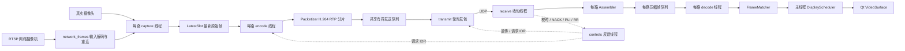

# 开发者代码导读

本文对应 2026-09-28 的 Python/PyAV Demo（含 RTSP、SDK 输入）。默认界面已迁为 **Vue 3 + WebCodecs**，详细新增类、函数、HTTP/WS 协议及前端开发流程见 [WEB_UI.md](WEB_UI.md)。本文下面保留 CLI / Qt 对照路径的完整导读。使用方法见 [README](README.md)，网络接入见 [NETWORK_CAMERAS](NETWORK_CAMERAS.md)，优化取舍与实测见 [优化报告](OPTIMIZATION_REPORT.md)，物理延迟测量见 [OPTICAL_MEASUREMENT](OPTICAL_MEASUREMENT.md)。

默认 Vue 路径的阅读顺序：`webapp.py` → `SenderPanel.vue` / `ReceiverPanel.vue` → `sender.py` → `protocol.py` → `receiver.py` 的 `web_sink` 分支 → `webbridge.py` → `frontend/src/media/player.js` / `matcher.js` → `metrics.py`。

## 1. 项目要解决什么

默认从真实摄像头采集，在发送端将各路视频分别编码成 H.264，经 RTP/UDP 发往一个接收端。接收端分别解码，再按时间戳配帧、显示和记录指标。视频单向传输，但接收端可以反向发送校时、丢包重传请求和关键帧请求。

它是可测量、可修改的局域网原型，支持本地摄像头及 RTSP 网络摄像机输入，可混用。网络流经 FFmpeg 解码后接入原有编码链路，不是压缩流直通；没有 ONVIF 自动发现或 PTZ 管理。当前不是通用 WebRTC 客户端。输出 RTP 携带本项目私有扩展，发送端和接收端需要配套使用。没有实现 ICE、SRTP、拥塞控制、FEC、音频和设备级曝光同步。`FMP` 的具体协议定义尚未提供，不能据此做性能排名。

## 2. 文件与进程

| 文件 | 职责与直接调用关系 |
|---|---|
| `demo.py`、`video_demo/__main__.py` | 薄入口，调用 `cli.main()`；后者支持 `python -m video_demo` |
| `start_demo.command` / `.bat` | 定位项目、准备虚拟环境；无参数打开 Vue `web` 命令，有媒体参数仍执行旧 `demo` |
| `start_sender` / `start_receiver` 启动脚本 | 打开 Vue 指定页面；同机端口已有服务时复用 |
| `webapp.py` / `webbridge.py` | 本机 HTTP/WS 服务、独立收发会话、控制接口、有界原始 H.264 桥接、网页计时回报 |
| `frontend/src/` | Vue 组件、WebCodecs 解码器、浏览器配帧与 Canvas 显示 |
| `cli.py` | 参数、校验、启动与停止子进程、合并报告 |
| `cameras.py` | 设备枚举、用户选择、配置文件、逐设备模式协商 |
| `camera_settings.py` | 启动设置窗口、异步模式查询、逐路采集选择、统一输出画质 |
| `sdk.py` / `orbbec.py` | 可选厂商 SDK 路由、安装路径、隔离枚举、C ABI 绑定、图像转换与采集生命周期 |
| `network.py` | RTSP 输入、连接/读取超时、重连、URL 脱敏、环境变量凭据交接 |
| `tools/camera_inventory.swift` | macOS AVFoundation 能力枚举；不启动采集 |
| `media.py` | 帧转换、编码器/解码器工厂、相机打开、原始帧槽 |
| `sender.py` | 采集/编码/发送/反馈线程与资源生命周期 |
| `protocol.py` | 二进制协议、分片重组、丢包反馈 |
| `receiver.py` | 收包/解码/配帧/显示主循环 |
| `timing.py` | 跨机时钟映射、配帧和显示调度 |
| `ui.py` | Qt 实时显示；Pillow 静态报告图 |
| `metrics.py` | 异步事件日志、实时统计、离线汇总 |
| `optical.py` | 外部高速录像的真实场景到屏幕延迟分析 |
| `tests/` | 编解码、协议、时钟、配置、独立进程、绘制、光学分析回归 |

`demo` 是父进程，它先协商输入模式，再启动 `receive` 子进程。接收端完成窗口初始化并写出 `ready.json` 后，父进程读取其 UDP 端口，再启动 `send` 子进程。两个进程即使在同机也经过真实 UDP 和 H.264，不是绕过传输的预览。

发送端：每路一个采集线程、一个编码线程，另有共享发送、控制反馈、日志线程。接收端：一个收包线程，每路一个解码线程，主线程负责配帧/Qt，另有日志线程。不要把 Qt 控件移到媒体线程；不要让两路共用同一个有状态的编码器、解码器或 `VideoReformatter`。

## 3. 时间与帧标识：最容易误读的地方

| 字段 | 来源、单位、含义 |
|---|---|
| `stream` | 应用内从 0 开始的路号；不是设备全局 ID |
| `epoch` | 发送进程启动时生成的随机 32 位标识，用于隔离旧会话 |
| `frame_id` | 每路编码帧序号，映射到编解码 PTS；不是相机硬件序号 |
| `capture_ns` | 相机帧交给应用后的 `perf_counter_ns()`，单位 ns；**不是曝光开始或场景发生时间** |
| RTP timestamp | `capture_ns` 换算为 90kHz，加随机偏移并按 32 位回绕 |
| `encode_us` | 编码准备开始到对应压缩包返回，单位 μs；不含原始帧槽等待 |
| `first_rx_ns` / `complete_ns` | 接收端首片到达 / 整帧重组完成，接收端单调时钟 |
| `decoded_ns` | 解码并转换为 RGB 数组完成的接收端时刻 |
| `local_capture_ns` | 由发送端取帧时间减去估计时钟偏移得到；未完成校时则为 `None` |
| `submit` | Qt 更新与 `processEvents()` 返回后记账；不代表显示器已经出光 |

`ClockMap` 的偏移方向是 **发送端时钟 − 接收端时钟**。跨机不能直接相减两个 `perf_counter_ns()`。同一台机器的两个进程可使用 `shared`，两台机器必须用 `estimated` 或日后接入受验证的共同时间源。

界面的“距应用取帧”（原“画面年龄”）是 `(now - local_capture_ns) / 1e6`。它随当前保留帧变旧而增长，区别于该帧在解码/提交时记下的固定延迟样本。悬停说明明确输入时间戳起点；未校时显示未知。这个值不证明屏幕已经出光。

物理总延迟包含曝光等待、传感器读出、ISP、USB/驱动缓存、应用链路、系统合成、显示扫描和像素响应。RTSP 输入还包含相机内部编码及前段网络/输入解码，网络输入的 capture_ns 在图像解码返回后生成，并标记 `timestamp_origin=network_decode`；上述前段等待不在现有软件延迟内。当前软件只能观测其中一部分。配帧偏差同样只是应用取帧时间戳偏差，不是曝光同步误差。

## 4. `cli.py`：入口和运行管理

| 函数 | 具体作用与注意事项 |
|---|---|
| `output_path(kind)` | 生成带日期、命令名和 PID 的运行目录，避免覆盖证据 |
| `parser()` | 注册 `demo/send/receive/cameras/doctor/analyze/optical`；默认真实相机、720p30 输出、每路目标 3000kbps |
| `validate(p,args)` | 读取逐路配置、补默认值、推断路数、检查尺寸/FPS/端口/缓冲参数；无设备参数的 GUI Demo 弹出选择窗口；禁止 `latest + strict-sync` |
| `doctor()` | 在内存中用诊断色块实际编解码，报告首个压缩包出现时对应的输入帧序号、颜色误差和硬件解码情况；小尺寸成功不能保证真实多路摄像头成功 |
| `stop_child(process)` | 优先写 STOP 文件请求正常收尾，再按超时升级进程终止；不要直接杀进程后期待完整汇总 |
| `run_demo(args)` | 协商相机 → 保存 `camera-inputs.json` → 启动接收/发送进程 → 监听结束 → 停止两端 → 对比双方唯一帧 ID → 生成 `report.json` |
| 内部 `launch(role,arguments)` | 用当前虚拟环境 Python 启动子进程，重定向日志，关联该子进程的 STOP 文件 |
| `main(argv)` | 解析和分派命令；捕获可展示的错误；注册 SIGTERM 以进入正常中断路径 |

`demo` 的子进程只接收已经协商好的逐路输入配置，公共输出参数不会覆盖这些配置。网络 URL 由 `child_camera_profile()` 转成发送子进程环境变量，camera-inputs.json 只存 device_env 引用；父/子进程 config、日志和报告经 redact 脱敏。CLI 的 `--rtsp-url` 可重复且不按逗号拆分，可与 --cameras 混用；使用 --camera-profile 时不再同时接收这两个输入列表。手动两机运行时，双方路数应一致；接收端的时钟模式不能照搬本机 Demo。

## 5. `cameras.py`：通用相机入口

| 函数/常量 | 作用 |
|---|---|
| `inventory(include_modes)` | macOS 调用 Swift 获取 AVFoundation 格式/FPS 范围；快速枚举或无 Swift 时解析 FFmpeg 设备列表；Linux 读取 sysfs 并可附带 `v4l2-ctl` 格式文本；Windows 解析 DirectShow 名称及唯一替代名 |
| `read_profile(path)` | 校验 JSON `version=1`、1–8 路设备、允许字段及参数范围；`output` 和每路采集参数分开 |
| `select_camera_profile(output,capture_format,exact)` | 延迟导入 Qt 设置窗口，返回完整的 cameras + output 配置；无窗口命令不依赖 GUI 初始化 |
| `capture_options(camera,w,h,fps)` | 生成后端、URL、FFmpeg options：AVFoundation 默认 NV12/drop_late_frames；DirectShow 限制捕获缓冲；V4L2 使用设备路径和输入格式 |
| `PIXEL_FORMATS` | 将系统 FourCC 转成 FFmpeg 像素格式；是格式映射，不是厂商适配表 |
| `capture_modes(record,backend)` | 将能力记录展开为尺寸、格式、FPS 范围列表，过滤未知格式/无效速率；当前 FFmpeg AVFoundation 只开放原生范围的最高帧率，原始 inventory 仍保留硬件完整声明 |
| `describe_modes(modes)` | 生成人可读模式列表，用于错误诊断 |
| `select_capture_mode(...)` | 显式逐路参数为硬约束；auto 下公共输出参数为软目标，先比较几何接近程度，再比较 FPS，再选优先像素格式；容忍 UVC 的极小 FPS 舍入差 |
| `configure_camera_inputs(args)` | 启动前枚举并逐路解析设备，拒绝歧义名称，选择模式并写回 `camera_settings/camera_modes`；无结构化能力时明确标记为未验证的请求模式 |

当前完整自动模式协商已在 macOS 验证。Windows/Linux 入口可用性不等于所有设备已实测；Linux 格式文本尚未转换成结构化协商数据。请求 25fps 不代表设备实际交付 25fps，必须看 `camera_sample`。`read_profile` 也支持 device_env 解析；设置窗口包含多行 RTSP 输入框，即使没有本地相机也能使用。`configure_camera_inputs` 对 RTSP 跳过设备模式枚举和尺寸/FPS 请求，只记录 `rtsp_camera_managed_mode`，不探测或修改远端相机设置。

不要将 AVFoundation 的原生帧率范围直接作为 FFmpeg 能力：当前 `configure_video_device` 只按 maxFrameRate 匹配，并将最小、最大采集间隔都设为 minFrameDuration。实机 640×480 的原生 15–30fps 范围请求 15fps 会失败，因此 GUI 与 CLI 必须共用经过 backend 限制的模式表，自动选择 30fps 后再按输出上限取最新帧；显式采集 15fps 应在启动前拒绝。[上游实现](https://ffmpeg.org/doxygen/trunk/avfoundation_8m_source.html)。

### `camera_settings.py`：用户画质设置

`CameraRow` 是可勾选的单路本地相机控件；持有设备标识、能力列表和共享输出目标。自动模式复用 `select_capture_mode()`，手动模式将尺寸、格式、FPS 作为硬约束，不能绕过能力校验。未知能力只允许标注为未验证的请求。RTSP 不创建这类控件，因为普通拉流没有声明远端相机可切换的采集模式。

| 类 / 函数 | 作用与边界 |
|---|---|
| `device_identifier(record,devices)` | 优先设备路径；同名设备使用枚举编号；其他情况使用名称，与 CLI 设备匹配规则一致 |
| `CameraRow.set_record(record)` | 展开能力，过滤超出配置范围的模式，建立分辨率列表并初始化依赖选项 |
| `dimensions()` / `matching_modes()` | 读取选择尺寸；未知能力时解析手填尺寸，按当前尺寸筛选能力记录 |
| `update_pixels()` / `update_rates()` | 尺寸改变后重建格式，格式改变后重建 FPS；连续范围可输入非预设帧率，离散模式不填补中间间隙 |
| `automatic_settings()` / `settings()` | 分别生成自动或最终逐路配置；最终设置再次调用后端共用的能力验证器 |
| `update_enabled()` / `sync_automatic_controls()` / `update_hint()` | 自动状态禁用手动控件；同步展示自动选择的实际模式；显示范围或错误原因 |
| `CameraSettingsDialog.__init__()` | 建立可滚动相机列表、RTSP 输入和公共输出设置；后台线程只查询元数据并写队列，不触碰 Qt 控件 |
| `poll_inventory()` | Qt 定时器在主线程消费查询结果并建立逐路控件；完整查询失败时尝试基础枚举，RTSP 输入无需等查询完成 |
| `apply_preset()` / `output_changed()` | 同步分辨率预设、自定义宽高、FPS 上限、每路目标 kbps；只更新自动采集选择，不覆盖手动采集设置 |
| `accept()` | 验证输出偶数尺寸、逐路模式、RTSP URL、1–8 路限制；失败保留窗口和用户输入，成功返回 version=1 的 cameras/output 配置 |
| `select_camera_profile(...)` | 创建或复用 QApplication，运行模态对话框，返回配置或报告用户取消 |

`cli.validate()` 将命令行输出值填入窗口初值，用户最终选择写回 args，`run_demo()` 将同一组输出尺寸/FPS 传给两个子进程，码率传给编码端。逐路采集设置继续通过 camera-inputs.json 传递。显式输入列表/配置文件仍跳过窗口，配置文件的输出值仍可被 CLI 覆盖。窗口修改在启动时生效，当前没有运行中的编码器重配置或重启协议；再次调节需要重新启动。

### SDK 相机接口：`sdk.py` / `orbbec.py`

`sdk.py` 是轻量入口，识别 `orbbec://序列号/流类型`，不在普通 USB/RTSP 运行时加载原生库。SDK 查询在独立 Python 进程中执行，最多等待 45 秒，GUI 用单独工作线程接收结果。`CameraSettingsDialog.start_sdk_query/poll_sdk/select_sdk_root` 分别负责查询、结果入 UI 和安装目录登记；失败设备显示原因，普通相机列表继续可用。

| 类 / 函数 | 职责和重要约束 |
|---|---|
| `sdk.is_sdk/device_uri/parse_device` | URI 路由、序列号编码和流类型校验；不要按产品名或 PID 路由 |
| `sdk.validate_camera` | 整数采集尺寸/FPS、流类型、深度映射范围校验；拒绝混入 RTSP 参数 |
| `sdk.configured_root/configure_root` | 环境变量优先，其次 `.local/camera-sdks.json`；只登记本地 SDK，不安装驱动或下载库 |
| `sdk.inventory` | 隔离原生设备查询；解析带固定标识的 JSON，忽略 SDK 可能输出的控制台文本 |
| `sdk.configure_inputs` | 根据实际 SDK 能力调用共用的 `select_capture_mode`；拒绝不存在的流及重复物理序列号 |
| `sdk.frames` | 按已验证设置进入厂商适配器，产出 AVFrame、本机取帧时刻、SDK 源元数据 |
| `orbbec.library_path` | 从已解压 SDK 根目录定位当前平台动态库；不改系统搜索路径 |
| `NativeSDK.__init__` | 为所用 C API 声明精确参数与返回类型，检查 SDK 主版本为 2；Windows 保留 DLL 搜索目录句柄 |
| `NativeSDK.call` / `OrbbecError` | 每次传独立 ob_error**，复制错误文本后释放原生错误对象，补充 USB 访问拒绝诊断 |
| `NativeSDK.owned` | 管理 SDK 句柄所有权；正常返回、异常和生成器关闭均释放资源 |
| `NativeSDK.context` | 复制 SDK XML 到临时目录，管线/内部队列设为 1，关闭 SDK 文件日志；不修改原始配置；禁用 SDK 网络自动发现 |
| `NativeSDK.profile_info` | 读取每个实际流配置的宽、高、FPS 和格式枚举 |
| `orbbec.inventory` | 按序列号打开控制接口，枚举可用传感器及视频模式；不调用 start；逐设备错误写 unavailable，不伪造模式 |
| `orbbec.convert_image` | 根据真实尺寸与格式转换复制后的数据；按 AVFrame 各平面 stride 写入 YUV/RGB；MJPEG 解码；Y16 IR 使用有效位数，深度使用每帧 value_scale 和指定距离范围 |
| `orbbec.camera_frames` | 一台设备一条选定流；显式关闭其他流，100ms 等待，5s 无图像报错；取帧后复制数据、释放 SDK 帧，再做格式转换；finally 停 pipeline 并逆序销毁所有句柄 |

`sender.capture.accept_frame` 对 SDK 保留转换前的本机取帧时刻，原点为 `sdk_host_dequeue`；SDK 设备/系统微秒时间戳额外入 JSONL/CSV。它们未作为跨设备统一时间源。SDK 库内缓冲仍发生在软件时间戳之前。图像所有权不能跨过 `ob_delete_frame`；当前明确复制一份，不能为减少复制而让 numpy 引用已释放的 SDK 地址。

`Meta.depth_preview` 占 RTP 扩展 flags 的 bit 1，bit 0 仍为 IDR。普通流 wire 格式保持原样；新接收端允许 flags 0–3，其他位仍拒绝。旧接收端会拒绝深度预览包，所以两端必须同时更新。UI 与静态截图依据这一标志注明深度预览，不会仅在本机启动时才显示说明。

SDK 配置和 ABI 在一个独立适配层，新增其他厂商时应扩展 URI 路由、能力枚举及 frames 接口，继续复用后面的编码/传输/显示。当前限制：未做同设备多传感器同时采集、自动重连、原始深度无损传输、固件升级或预设切换。不要把“支持 Orbbec SDK”描述成支持任意厂商 SDK。

## 6. `media.py`：媒体对象和低延迟设置

### `LatestSlot`

一个受 `Condition` 保护的单元素槽。`put(item)` 用新原始帧替换尚未取走的帧，增加 `replaced` 并唤醒消费者；`take(stop)` 等待新帧或停止信号，取走后将槽置空。丢弃的是**编码前的原始帧**，没有破坏 H.264 参考关系，适合实时预览。不要把它直接用来任意替换编码后的 P 帧。

### 编解码与转换函数

| 函数 | 作用与设计理由 |
|---|---|
| `make_encoder(name,w,h,fps,bitrate)` | 配置 H.264、BT.709 limited、1/fps 时间基准、无 B 帧、约一秒 GOP 和 low_delay；x264 关闭 lookahead 并使用小 VBV；硬件后端分别配置实时/低延迟选项；未消费选项视为错误，避免“参数写了但没生效” |
| `encoder_candidates(requested)` | 显式指定只尝试该编码器；auto 在 Mac 优先当前实测可用的 libx264，在其他平台依次尝试 NVENC/QSV/libx264。打开阶段回退不等于运行时自动回退 |
| `prepare_frame(image,pts,encoder,reformatter)` | 接受原生 AVFrame 或诊断 RGB 数组；按源色彩空间选择转换矩阵，转换到目标尺寸/像素格式/BT.709 limited，设置编码 PTS 和 time_base；编码线程复用自己的转换器 |
| `make_decoder(requested)` | 创建低延迟 H.264 解码器；Mac auto 尝试 VideoToolbox，再尝试软件；显式硬件禁止内部静默软件回退；实际是否启用硬件仍写进逐帧日志 |
| `open_camera(camera,w,h,fps)` | 使用通用后端打开相机；失败时补充设备、尺寸、FPS、格式和原始异常 |
| `font(size)` | 在各系统候选字体中寻找可用字体，供静态报告和诊断图使用 |

`prepare_frame` 必须同时处理 PTS 和时间基准。相机输入可能用微秒单位，直接赋新 PTS 而保留旧 time_base 会造成编码器重缩放错误。复用 `VideoReformatter` 只复用转换上下文，不能让多个编码线程共享一个实例。

`Synthetic.__init__()` 准备诊断背景/字体，`frame(sequence,elapsed)` 生成有运动与帧号的测试图。它只在显式 `--source synthetic` 或自动测试中使用，不能拿其延迟冒充摄像头总延迟。

## 7. `sender.py`：发送端线程

`run_sender(args)` 创建 socket、每路原始帧槽/分包器/关键帧事件、共享发送队列、重传缓存与日志对象，启动线程，响应 duration/STOP/中断，最后写汇总。嵌套函数共享这些对象，不能随意改变锁的边界。

| 内部函数 | 输入 → 处理 → 输出 |
|---|---|
| `guarded(fn,*items)` | 包装工作线程；异常写入错误队列和 Journal，并置停止事件，防止一条线程悄悄死亡 |
| `generate()` | 仅诊断源：同一 tick 为多路打共享源时间戳，分别写 LatestSlot；落后时跳过积压周期 |
| `capture(stream,settings)` | 打开真实相机，持续 dequeue，立即记录应用取帧时间，把原生帧放入槽；记录首帧实际格式和每秒 FPS/覆盖计数/原始 PTS；EAGAIN 短暂等待后重试 |
| `encode(stream)` | 打开后端并复用转换器；取最新帧，必要时限速；转换/编码、处理 IDR 请求；用 pending 映射将压缩包 PTS 找回原始时间戳，分包后放入共享发送队列 |
| `transmit()` | 维护活动帧任务双端队列，以包为单位轮询多路；可选总链路 pacing 和随机丢包注入；发送前放入有界重传缓存，整帧发送后写 `tx` |
| `controls()` | 验证反馈来源；处理 NACK 重传、PLI 关键帧请求、RR 丢包记录、四时间戳校时回应 |

`encode.pending` 存放 `(capture_ns, encode_in_ns, converted_ns)`，包返回时由 packet.pts 匹配。超过 16 个未返回帧会报错，避免硬件持续积压却展示虚假的低延迟。关闭时不强制 flush 旧视频以追求“每一帧都送出”，未输出帧数写入 `sender_totals`。

`transmit` 的任务 `[packets,index,meta,sent_bytes,injected]` 表示一帧的包列表、下个发送位置及统计。重传缓存键为 `(SSRC,sequence)`，最多 4096 包；只有距首发不超过 30ms 且距应用取帧不超过 75ms 的包允许重传，重传也接受丢包注入。

发送队列满时编码线程等待，采集槽继续覆盖旧原始帧。这限制了内存，却不等于链路严重拥塞下有严格时间上限；当前没有根据 RR 自动调整码率。不要把 `--link-mbps` 当成拥塞控制器。

### 网络输入分支

`capture()` 内部的 `accept_frame(frame,origin)` 共用于本地和 RTSP，负责取帧打戳、首帧格式记录、原生帧入槽及 FPS 采样。网络分支迭代 `network_frames()`；内部 `network_event()` 记录连接状态，成功恢复时设置本路关键帧请求并打印脱敏地址。一条 RTSP 流断开不设置全局 stop。网络输入始终按输出 FPS 上限从最新帧槽消费，因为输入实际 FPS 由远端决定。

发送端停止时 join 预算包含最大网络 open/read timeout；父进程的 stop_child 等待预算也同步放宽，避免网络读取正在正常超时退出时被过早强制终止。

## 7a. `network.py`：RTSP 输入生命周期

| 函数 | 作用与边界 |
|---|---|
| `is_rtsp(value)` | 识别 RTSP/RTSPS URL，决定走网络入口还是本地采集 |
| `resolve_device(camera)` | 将明确指定的 device_env 解析为 device，拒绝同时写二者及空环境变量 |
| `validate_network_camera(camera)` | 验证 URL、端口、超时、重试、TCP/UDP；拒绝把本地采集尺寸/FPS 参数传给 RTSP |
| `rtsp_options(camera)` | 配置仅视频、有限探测、20ms 重排预算；TCP 重排队列为 0，UDP 为 32；RTSPS 启用 TLS 证书验证 |
| `open_rtsp(camera)` | 使用 FFmpeg RTSP demuxer 和 PyAV (open,read) timeout 打开流；捕获底层日志，避免原始凭据写 stderr |
| `network_frames(camera,stop,on_event)` | 每路独立循环连接，选择第一个视频轨并单线程解码；第一帧才发送 connected 事件；断流/超时后关闭容器并可中断地等待重试；结束由 stop 控制 |
| `redact(value)` | 递归处理字典/列表和字符串中的 RTSP URL，保留主机但隐藏 userinfo、路径、查询参数；用于 Journal、config、report 和错误输出 |
| `child_camera_profile(cameras)` | 返回不含原始网络 URL 的 profile 与专属子进程环境映射，保持本地条目不变 |

`network_connecting` 表示尝试，`network_connected` 表示得到图像（记录 input_codec/input_rate/尺寸/成功连接次数），`network_disconnected` 表示异常或 EOF（记录类型/错误码/重试间隔）。读取不会因断流让主线程无限阻塞，但停止可能等待本次网络调用的超时预算。没有对网络摄像机重编码前的编码参数、曝光时刻和缓存深度作假设；原始 RTSP PTS 仅用于诊断。

`tests/rtsp_server.py` 中 `RtspCamera` 是仅绑定 127.0.0.1 的测试服务，提供 SDP、标准 H.264 RTP TCP/UDP、Basic 认证、断流与无数据场景；它不是生产模块，不参与正常摄像头演示。`tests/test_network.py` 验证真实 RTSP 客户端至本项目 UDP 接收端的完整软件链路。

## 8. `protocol.py`：线格式与恢复机制

### 三个数据类

| 类 | 字段与生命周期 |
|---|---|
| `Meta`（frozen） | 路号、会话、帧号、取帧时间、编码耗时、帧字节数、是否 IDR；同一帧所有分片必须一致 |
| `Packet` | Meta + SSRC、16 位 sequence、90kHz timestamp、分片 index/count、payload；由解析器产生 |
| `Unit` | 已完整重组的 Meta、SSRC、Annex B bitstream、首片和完成时间；是收包到解码队列的交接对象 |

RTP 固定头 12 字节，扩展头 4 字节，私有扩展 32 字节，总计 48 字节；默认 UDP payload 上限 1200 字节。固定 PT=96，扩展 profile=0x4C56。全部整数使用网络字节序。扩展格式为 `!BBHIIQIIHH`，依次为版本、IDR 标志、路号、epoch、frame_id、capture_ns、encode_us、frame_bytes、片序号、总片数。

### 分包、解析与重组

| 函数/方法 | 作用 |
|---|---|
| `nals(data)` | 识别 Annex B 起始码或四字节长度 AVCC；返回 NAL 列表并验证边界 |
| `is_idr(data)` | 检查是否含 type=5 的 IDR NAL；不能把所有 I 帧都当可独立恢复的 IDR |
| `Packetizer.__init__()` | 初始化 SSRC、序列号和 RTP 时间戳随机偏移，校验 MTU |
| `Packetizer.packetize(bitstream,meta)` | 小 NAL 单包，大 NAL 用 FU-A；填入总大小、IDR、分片元数据；最后一片置 marker；序列号按 16 位回绕 |
| `parse_packet(data)` | 验证头长、PT、扩展版本、标志、分片范围、大小和 marker；拒绝不满足本项目契约的数据 |
| `join_payloads(payloads)` | 将有序 single NAL/FU-A 恢复成 Annex B；校验 FU 起止、类型和连续性 |
| `Assembler.__init__()` | 建立未完成帧、完成去重和 NACK 尝试状态；默认最多 8 个未完成帧 |
| `Assembler.add(packet,now)` | 允许片间乱序，忽略完全相同重复片，拒绝冲突；凑齐后验证总长度与 IDR 标记，立即返回 Unit，不额外固定等待 20ms |
| `Assembler.missing(now)` | 组包超过 4ms 后尝试早期 NACK，间隔至少 4ms，每帧最多两次，每次最多 64 个缺失包；接近超时停止重传请求 |
| `Assembler.expire(now)` | 删除超过组包期限的未完成帧，返回 Meta 给接收端记录丢弃并请求 IDR；有界保留完成/过期记录以去重 |

### RTCP

`pli()/parse_pli()` 编解码关键帧请求；`nack()/parse_nack()` 编解码 Generic NACK，发送侧每项一个 PID，解析侧也支持 BLP 位图。`ReceptionReport.observe()` 展开回绕的序列号、统计唯一收到包并更新 RFC 风格 jitter；`packet()` 输出 RR 的区间丢包比例、累计丢包、最高序列号、jitter。RR 的 LSR/DLSR 目前为 0，没有实现完整 SR/RR 时钟关联。

这些是 RTP/RTCP 子集，不包含完整会话协商和认证。普通 H.264 RTP 解包器可能忽略扩展，但本接收器要求它存在；不能假定拿一个通用 RTP 发送器即可接入。

## 9. `receiver.py`：接收端状态机

`run_receiver(args)` 创建 UDP socket、每路组包器/接收统计/压缩帧队列、时钟映射、配帧器、窗口和日志。GUI 初始化完成才写 `ready.json`。退出时停止工作线程、写汇总，只有显式 `--save-preview` 才自动保存画面。

| 内部函数 | 作用与状态变化 |
|---|---|
| `request_key(stream)` | 向当前发送端发 PLI；每路最少间隔 150ms，避免错误风暴 |
| `drop(meta,reason,count)` | 同时更新实时丢弃计数和逐帧原因日志 |
| `guarded(fn,*items)` | 工作线程异常统一上报并停止接收端 |
| `receive()` | 单独收包，不解码；识别校时 JSON 或 RTP；维护 peer/epoch/SSRC，隔离退役会话；重组后放入该路队列；周期执行缺片重传、超时清理、校时和 RR |
| `decode(stream)` | 独占该路解码器；按 frame_id 消费，短暂容忍帧间乱序；参考缺失时请求 IDR；实际解码并转 RGB，记录所有成功解码帧，再过滤过期显示候选 |
| `decode.reset()` | 重建解码器并清空 PTS 到原始 Unit 的映射；用于会话切换、参考链断裂或解码异常；初次收流不重复创建已经存在的解码器 |
| `snapshot()` | 响应用户 S/按钮，保存当前窗口或离线 dashboard；截图可能造成短暂停顿，不能把截图期间的延迟隐藏 |

### 解码状态详解

`expected` 是下一期待帧号，`pending` 是整帧乱序缓存，`origins` 是已送入解码器但还没产出图像的帧元数据。`waiting_key=True` 时非 IDR 直接丢弃。

1. 新 epoch 清空 pending，切换会话；旧解码器状态必须重建。
2. 帧号小于 expected 表示迟到完整帧，记录 `late_complete_frame`。
3. expected 缺失时，优先跳到可用 IDR；没有 IDR 时最多等待 reorder 预算，之后认定参考间隙、重建解码器并请求 IDR。
4. 连续帧按顺序解码。已有 expected 时不再为了等队列新数据额外阻塞 2ms。
5. 解码器返回图像后，利用 frame.pts 找回 Unit 和 decode_start；不能拿“当前送入的包”冒充“当前返回的图像”。
6. 使用该解码线程的持久转换器转 RGB，写 decode/阶段指标。超出 max-age 的成功解码帧仍计入 decode 分布，然后记录丢弃，避免只统计快帧。
7. 可显示帧封装为 `Decoded` 交给 FrameMatcher。

队列满时不能任意保留最新 P 帧然后接着解码，因为它可能依赖已经丢失的参考帧。当前采用丢弃、请求 IDR 和解码状态重建的恢复路径。慢解码/丢包情况下依然可能出现短暂停画；没有宣称靠缩小队列就能保证无损与低延迟同时成立。

### 主线程与显示

主循环每次 `matcher.poll(now)` 得到选中帧，更新 `current_frames`。`pending_present` 只保留每路尚未提交的最新候选；被覆盖的候选记录 `ui_superseded`。`selected_at` 存配帧返回时刻，`displayed_frames` 保存上次提交的画面。

`DisplayScheduler` 允许有新帧时尽早刷新，并把提交开始频率限制在 display-fps；没有新帧时只约每 200ms 刷新状态，不占用下一帧刷新额度。绘制已经消耗的时间不再重复加到刷新间隔后面。

每次提交前重新检查候选年龄：若在配帧/界面等待期间过期，记录 `pre_submit_deadline_expired`，恢复该路上一显示帧。然后 `show_frames()` 设置图像，`pump()` 处理 Qt 事件，记录 submit。显示旧帧会标记“旧帧”，不会伪装成不断到达的新帧。提交前检查是尽力而为，Qt/操作系统内部阻塞仍可能让实际 submit 超出预算。

`visible_group` 记录一次提交时所有当前画面（包含保留旧帧）的时间戳跨度与旧帧路号。它比只统计成功配对组更接近用户看到的同步状态，但仍不是曝光偏差或屏幕像素实测。

## 10. `timing.py`：时钟、配帧、刷新

### `ClockMap`

`update(t1,t2,t3,t4)` 接收四个单调时刻：接收端发 ping、发送端收 ping、发送端发 pong、接收端收 pong。计算 RTT=`(t4-t1)-(t3-t2)`，offset=`((t2-t1)+(t3-t4))/2`，拒绝非法/过大的 RTT，保留最近 32 个样本。

`estimate(now)`：shared 返回 `(0,0)`；estimated 要求至少 3 个五秒内有效样本，选择 RTT 最小的一组，返回 offset 与 RTT/2 的毫秒值。后者只是基于对称路径假设的误差提示，不是经过校准的硬件精度保证；时钟漂移、路径不对称仍影响测量。

### `Decoded`

跨解码/配帧/显示线程的数据类：`meta`、RGB `image`、`decoded_ns`、`local_capture_ns`、软件 `latency_ms`、`uncertainty_ms`、实际 `decoder`。图像引用必须活到 Qt 绘制完成，不能把底层数组提前复用或释放。

### `FrameMatcher`

构造参数分别控制路数、取帧时间戳容差、等待预算、最大年龄、严格配帧和模式。每路使用最大长度 6 的 deque，以锁隔离 `add()` 与 `poll()`。

- `add(frame)`：会话变化时清空该路旧帧；满队列会覆盖最旧元素并计数。
- `poll(now)`：先清理过期帧，再按模式选帧；返回 `(chosen,complete,skew_ms)` 或 None；任何进入新组的帧都不重复使用。
- `aligned`：选各路最新时间戳中的最大值作为目标，寻找离它最近且在容差内的帧；还要检查整组最早/最晚跨度，不允许“分别近似”掩盖两端超过容差。组不完整时最多等 wait；超时后允许部分输出，strict 则丢弃不完整组。
- `latest`：每路只取当前最新可用帧，立即输出，不等待别路；旧候选计入丢弃。不保证多路同一曝光时刻，也不保证相邻两次提交各路同时更新，因此不可与 strict 配合。

`dropped` 是配帧阶段总丢弃数，与 `drop` 事件不是同一统计范围。若要追踪到每一帧的匹配丢弃原因，需要扩展此接口；当前只在退出写 `matcher_totals`。

### `DisplayScheduler` 与 `frame_expired`

`DisplayScheduler.__init__(fps)` 设置最小提交开始间隔；`due(now,has_frames)` 判断该处理图像还是仅刷新状态；`submitted(now,had_frames)` 记录这次刷新开始时间，只有确实提交图像才占用图像频率额度。

`frame_expired(frame,now,max_age_ns)` 优先按本地映射的取帧时间判断；尚未校时时退回解码完成时刻。后一种只能限制接收端内部存留，不能保证从相机开始的总年龄。

## 11. `ui.py`：画面生命周期与显示

### `Window`

`__init__(on_snapshot)` 创建 QApplication（或复用）、主窗口、指标卡片、网格、曲线、截图按钮和快捷键。Qt 必须在主线程调用。

| 方法/内部类 | 作用 |
|---|---|
| `Host.closeEvent()` | 标记 `Window.closed`，由 receiver 主循环执行完整退出流程 |
| `VideoSurface.__init__()` | 创建不透明绘制区域，初始无帧 |
| `VideoSurface.set_frame(frame)` | 持有 Decoded/RGB 数组引用，创建直接引用 RGB 内存的 QImage，调用 update；不预先生成和缩放 QPixmap |
| `VideoSurface.paintEvent()` | 清背景，按宽高比计算目标矩形，直接 drawImage；调整窗口大小时自动重新绘制，不必再次分配缩放后的图像 |
| `Plot.paintEvent()` | 画软件耗时历史与 100ms 参考线；曲线显示上限 100ms，原始日志不会裁剪数值 |
| `show_frames(frames,stats,group_info,now,args)` | 首次创建每路卡片，之后仅替换帧标识发生变化的图像；每 200ms 更新文字、旧帧状态和统计曲线；区分 aligned/latest 模式 |
| `save(path)` | Qt grab 并保存 PNG；只在用户截图或显式自动截图时调用 |
| `pump()` | 处理 Qt 事件，包含绘制、关闭、按钮事件；不是显示器出光回调 |
| `destroy()` | 关闭窗口并处理收尾事件 |

这次 QImage 路径减少了一次 QPixmap 创建与预缩放，但它仍是 CPU RGB 图像绘制，**不是 GPU 零拷贝视频管线**。Qt/窗口系统可能继续复制、合成、等待刷新。改成硬件 YUV 纹理与原生显示需要新后端和单独验证。

### `Dashboard`

静态 Pillow 图，不在实时窗口每帧调用。`__init__()` 缓存字体和布局参数；`draw()` 将当前帧、指标和曲线组成一张 RGB 图；`text()` 是字体绘制辅助；`save()` 保存最近生成图像。用于 headless 的显式截图及结束后预览。不要重新把 `Dashboard.draw()` 塞进实时循环，否则会重新引入大图重画/缩放/字体开销。

## 12. `metrics.py`：指标与证据

### `Journal`

构造时保存 config、创建最大 50000 条的事件队列和写盘线程。`log(kind,meta,**fields)` 打本地单调时间戳，展开 Meta，非阻塞入队；队列满增加 lost。`_write()` 异步写 JSONL 并周期 flush，记录 IO 错误。`close()` 发送结束哨兵、等待写盘、检查失败，再调用 summarize。不要在每个 RTP 包的关键路径同步写 CSV。

### `LiveStats`

`add()` 在锁内更新累计帧数/码率字节数、最近软件延迟、历史曲线与事件队列。当前维护滚动 Counter，`snapshot()` 只移除超过一秒的旧事件并扣减计数，生成 fps/submit_fps/mbps，不再每次快照遍历并重新累加全部 RTP 包。累计值不因滚动窗口过期而清零。

### `distribution`、`summarize`

`distribution(values)` 给出 samples/mean/p50/p95/p99/max，空数据返回 None，不伪造 0 延迟。`summarize(directory)` 读取 config 和 JSONL，一次遍历导出 frames/metrics/camera_metrics CSV 并生成 summary。统计包含全部解码帧、丢弃原因、码率、完整匹配组、当前可见画面偏差、长间断、采集实际 FPS、阶段耗时与日志丢失数。

| 阶段字段 | 定义与局限 |
|---|---|
| `raw_queue_ms` | 应用取到相机帧 → 编码线程拿走；不包含相机内部缓存 |
| `prepare_ms` | 输入颜色/尺寸转换与编码帧准备 |
| `codec_encode_ms` | 准备完成 → 对应编码包返回，可能含编码器内部缓存 |
| `assembly_ms` | 首个 RTP 分片到达 → 完整帧组包；不等于纯网络时延 |
| `decode_queue_ms` | 组包完成 → 送入解码器，含整帧乱序等待 |
| `codec_decode_ms` | 送入 → 对应图像返回，可能含解码器内部缓存 |
| `rgb_convert_ms` | 解码图像 → RGB 数组 |
| `match_wait_ms` | RGB 就绪 → 主循环拿到配帧/最新帧结果 |
| `ui_wait_ms` | 选中 → 本次窗口更新开始 |
| `ui_work_ms` | 窗口更新开始 → Qt 事件处理返回；同一批多路共享此值 |

这些分位数来自各阶段自己的样本集合，**不能把各项 P95 直接相加当作总 P95**。没有提交的帧没有 UI 阶段样本；不能用成功提交帧分布掩盖解码超时和丢弃。

`decoded_fps_over_recording` 等全记录平均数包含启动和停止阶段，与最近一秒 FPS、相机交付 FPS 的分母不同。`groups.capture_skew_ms` 仅统计完整匹配组；`visible_groups.capture_skew_ms` 则统计拥有全部画面的提交批次，包含被保留的上一帧。看同步效果需要结合二者及不完整组比例。

## 13. `optical.py`：真实场景到显示器

输入必须是一段外部高速相机同时拍到“原始光学事件”和“接收屏幕中同一事件”的录像。它不访问传输链路时钟，因而可以跨设备测量。物理采集 FPS 由操作者确认，不能用慢动作文件的播放 FPS 替代。

| 函数 | 作用 |
|---|---|
| `roi(value,w,h)` | 解析 `x,y,width,height` 并检查图像边界 |
| `select_rois(rgb)` | Qt 首帧上框选源事件和屏幕事件两块 ROI；内部 Canvas 的鼠标按下/移动/松开维护矩形，paintEvent 绘制选区；最终从预览坐标映射回原图 |
| `transitions(values,settle,min_contrast)` | 用亮度分位数估计低/高平台，寻找 50% 阈值翻转，并用后续稳定样本确认；记录最早 crossing 帧，不把确认等待叠加成额外延迟 |
| `match_events(source,screen,capture_fps,max_delay_ms)` | 只匹配同极性、非负且在窗口内的一对一事件；有歧义则保留为未匹配，不猜配对；输出帧差/FPS 延迟及 ±一个采样周期的区间 |
| `run_optical(args)` | 解码外部录像、检查维度/ROI 重叠/明显变速或掉帧时间戳、提取亮度、检测和匹配边沿、导出原始序列/事件/统计 |

`measurement.json` 的 acceptance_status 仍为 review_required。采样区间不包含外部相机曝光/滚动快门、显示器扫描位置和阈值误差；均匀时间戳也不能证明录像未插帧。源/屏幕 ROI 尽量在录像同一扫描行，使用短曝光和足够多不易歧义的闪变事件，并复核未匹配比例。

## 14. 缓冲、锁与资源边界速查

| 位置 | 上限/策略 | 过载时的行为 |
|---|---|---|
| 相机输入 | AVFoundation drop_late_frames / 后端缓冲参数 | 驱动行为依平台和设备，不能保证无内部缓存 |
| 原始帧槽 | 每路 1 帧，Condition | 覆盖旧原始帧，计 replaced |
| 发送等待队列 | 路数个帧任务 | 编码线程等待，采集继续取最新帧 |
| 发送 active | 最多 2×路数个帧任务 | 按包轮询发送；限制容量不等于严格限制年龄 |
| 重传缓存 | 4096 包，cache_lock | 容量清理；超龄请求不重传 |
| RTP 组包 | 每路 8 帧，默认 20ms | 超时丢弃、NACK/PLI 恢复 |
| 压缩解码队列 | 每路 8 个 Unit | 满则丢弃该帧并请求 IDR |
| 编解码 origins/pending | 编解码器未返回超过 16 帧报错 | 防止不明原因的持续内部积压 |
| FrameMatcher | 每路 6 帧 + 年龄预算，独立锁 | 丢旧帧；aligned 有等待预算，latest 不跨路等待 |
| UI 待提交 | 每路一个最新候选 | 覆盖旧候选并记录 ui_superseded |
| Journal | 50000 条事件 | 丢失遥测显式计数；日志失败终止运行 |

锁只保护短期共享状态，不应在持有 stats/matcher/cache 锁时做编码、绘制或磁盘 IO。socket 同时用于媒体和控制；共享 peer 是单发送进程多路模型，不是任意多发送器混流。

## 15. 调试路径、测试与扩展建议

| 现象 | 首先看哪里 | 下一步 |
|---|---|---|
| 摄像头打不开 | `cameras`、`camera-inputs.json`、send.log | 确认实际模式、权限、占用、连接；不要直接套统一分辨率 |
| FPS 不达标 | camera_metrics / raw_overwritten | 采集本身低：检查设备交付；覆盖多：看 prepare/encode 与 CPU |
| 软件解码延迟高 | raw_queue、encode、assembly、decode_queue、codec_decode、RGB 分阶段值 | 判断是发送、重组、排队还是解码器缓存；再针对性调整 |
| 解码快但显示慢 | match_wait、ui_wait、ui_work | 降低配帧等待或选择 latest；检查 UI/截图和显示负载 |
| 偶发花屏/停画 | incomplete_rtp_frame、reference_gap、awaiting_idr、PLI/NACK | 先确认丢包与重排，不要无条件跳过 P 帧 |
| 多路看起来不同步 | 匹配完整率与 visible_groups | 检查不同实际 FPS、相机相位、保留旧帧、传感器曝光；校时不能消除这些差异 |
| 软件延迟低但人眼仍觉得慢 | 外部光学录像 | 继续测量传感器/驱动前半段和合成/显示后半段 |

在项目目录运行 `.venv/bin/python -m pytest -q`。测试分别覆盖：真实 H.264/颜色/PTS；FU-A/乱序/重传/回绕；时钟与配帧；逐相机模式协商；真实独立进程 UDP 链路；Qt 实际绘制后的颜色/宽高比/内存生命周期；滚动统计与阶段汇总；光学匹配及其拒绝路径。诊断图只用于自动测试，不是默认摄像头源。

修改原则：增加像素格式先验证颜色和范围；换编解码器必须测真实尺寸、多路、首帧和内部积压；改变队列先检查参考链恢复；改变时间戳先定义单位与时钟域；改变 UI 必须保留 RGB 内存所有权；优化比较固定输入模式、编码器、码率、场景、持续时间，并保留失败数据。

下一阶段若扩展到产品，可把采集/编解码/传输/显示抽象成独立后端接口，逐步将媒体热路径迁到原生 C++/GStreamer。先复用现有协议测试和光学测量，再替换实现，避免重写后失去验证能力。当前原型没有生产级设备热插拔恢复、自动码率、跨发送器同步和统一可插拔后端，这些不能仅靠调几个命令行参数补齐。
