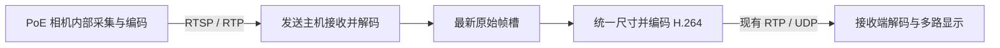

# PoE / 网络摄像机接入

本功能适用于**提供 RTSP 视频流的网络摄像机**。PoE 表示同一根网线传输数据和供电，不代表视频协议；只有厂商 SDK、GigE Vision 或专有协议的设备不能仅凭 PoE 接口直接接入。当前实现不自动扫描网络、不做 ONVIF 发现、不修改相机设置。

## 连接与准备

将摄像机接到匹配其供电规格的 PoE 交换机或 PoE 供电器；电脑接入可访问摄像机的网络。普通电脑网口通常不能给 PoE 摄像机直接供电。确认电脑可以访问相机 IP，并在相机管理页面启用 RTSP、设置取流账号。

从相机管理页面或厂商手册获取**完整 RTSP 地址**。仅有 IP 地址不够，不同厂家/型号的主码流、子码流路径不同。本项目不猜测路径。例如 `rtsp://192.168.1.100:554/实际视频路径` 中的“实际视频路径”必须替换，不能原样使用。

相机端优先选择 H.264、合适的实际 FPS、短 GOP、无 B 帧，并关闭会明显增加延迟的编码增强选项；这些需要在设备端设置和实测，程序不会因为输出目标为 720p30 就远程修改相机模式。H.265 等输入可由当前 FFmpeg 支持的解码器解码，但本轮协议实测使用 H.264，不保证所有厂商编码配置都可用。

## 双击启动

继续双击 `start_demo.command`（Windows 使用 `start_demo.bat`）。选择窗口底部新增网络摄像机地址输入框，每行一个 RTSP 地址：

```text
rtsp://用户名:密码@192.168.1.100:554/实际视频路径
rtsp://用户名:密码@192.168.1.101:554/实际视频路径
```

可以只填写网络地址，也可以同时勾选本地 USB/内置相机。按本地勾选顺序在前、网络地址行顺序在后编号，合计最多 8 路。窗口支持没有任何本地摄像头的机器。默认 RTSP 通过 TCP 传输；需要 UDP 时使用下面的命令行或配置文件。

## 命令行

```bash
cd /Users/fushuai/Work/low_latency_video_demo

# 单路网络相机
.venv/bin/python demo.py demo --rtsp-url 'rtsp://192.168.1.100:554/实际视频路径'

# 两路网络相机；每路一个 --rtsp-url，不以逗号拆分 URL
.venv/bin/python demo.py demo \
  --rtsp-url 'rtsp://192.168.1.100:554/实际视频路径' \
  --rtsp-url 'rtsp://192.168.1.101:554/实际视频路径' \
  --sync-mode latest

# 本地 + 网络混用
.venv/bin/python demo.py demo --cameras 0 \
  --rtsp-url 'rtsp://192.168.1.100:554/实际视频路径'

# 可控局域网中对比 UDP；也可显式传 --rtsp-transport tcp
.venv/bin/python demo.py demo \
  --rtsp-url 'rtsp://192.168.1.100:554/实际视频路径' --rtsp-transport udp
```

TCP 便于穿过常见网络配置并避免 RTP 包丢失，但重传可能增加等待；UDP 允许较小的乱序预算，丢包则可能花屏或等关键帧恢复。当前默认 TCP，UDP 接收的乱序等待设为最多约 20ms、32 包；这些设置不等于相机到屏幕的总延迟上限。FFmpeg 的 RTSP 传输与缓冲选项见 [官方协议文档](https://ffmpeg.org/ffmpeg-protocols.html#rtsp)。

两机回传时，在发送主机上使用相同输入参数：

```bash
# 接收主机
.venv/bin/python demo.py receive --streams 1 --port 5004 --clock-mode estimated

# 能访问摄像机的发送主机；192.168.1.20 是接收主机 IP
.venv/bin/python demo.py send --host 192.168.1.20 --port 5004 \
  --rtsp-url 'rtsp://192.168.1.100:554/实际视频路径'
```

## 配置文件与账号

推荐从 [网络摄像机配置示例](docs/examples/network-cameras.json) 开始，用环境变量提供完整地址：

```bash
export POE_CAMERA_1_URL='rtsp://用户名:密码@192.168.1.100:554/实际视频路径'
.venv/bin/python demo.py demo --camera-profile docs/examples/network-cameras.json
```

也支持直接写 `"device": "rtsp://..."`，但该用户配置文件会包含原始地址。用户名或密码中有 `@`、`:`、`/`、`#` 等特殊字符时，应仅对相应用户名/密码部分做 URL 编码。PowerShell 可用 `$env:POE_CAMERA_1_URL='rtsp://...'`，随后使用 `.venv\Scripts\python.exe`。

| 逐路字段 | 默认值与含义 |
|---|---|
| `device` 或 `device_env` | 二选一：完整地址，或保存完整地址的环境变量名称 |
| `label` | 可选配置标识；当前画面按路号对应输入顺序 |
| `rtsp_transport` | `tcp`；可设 `udp` |
| `open_timeout_s` | 3 秒；打开连接/初始探测的等待预算，可设 0.2–10 |
| `read_timeout_s` | 2 秒；读取等待预算，可设 0.2–10 |
| `retry_delay_s` | 1 秒；失败后等待多久重试，可设 0.1–30 |
| `colorspace` | `auto`；可用 `bt709` / `bt601` 覆盖输入颜色矩阵 |

网络单路配置不接受 width/height/fps/pixel_format/input_format：它们不能用来控制 RTSP 相机。统一输出尺寸、帧率上限、码率放在顶层 `output`。本地相机依然可以在自己的条目里配置独立采集模式。命令行 `--rtsp-transport` 会覆盖配置文件内各网络输入的传输选项；`--capture-format` 只作用于本地输入。

运行生成的 config、JSONL、CSV、报告与控制台会隐藏 RTSP URL 中的账号、路径和查询参数。自动 Demo 的 `camera-inputs.json` 为网络路写入环境变量引用，原地址通过发送子进程环境传递，不写入该文件。此运行文件不是可独立重放的凭据文件，重新启动请使用原始配置及环境变量。程序无法清除用户自行写入的配置、shell 历史或进程启动参数。

## 延迟与同步的边界

当前数据路径为：



这是解码后重新编码的通用接入，能够与 USB 相机混用并保持统一输出；目前没有实现相机 H.264 码流直接转发，因此也不能宣称没有二次编码损失或已经达到更低的总延迟。

网络相机的 `capture_ns` 在**发送主机完成输入解码、得到图像后**生成，`camera_opened.timestamp_origin` 为 `network_decode`。软件延迟不包含相机曝光、相机内部编码、RTSP 网络传输及输入解码之前的等待。同屏配帧也只是到达/解码后时间戳的配对，不能证明网络摄像机之间曝光同步。

真正的“场景变化 → 屏幕出光”仍使用 [外部光学测量](OPTICAL_MEASUREMENT.md)。相机内部可能已有较大缓存，仅缩短电脑端队列不能消除这段延迟。

## 断流、日志与排错

每路 RTSP 独立连接和重试。一条网络流离线时不会停止其他路，界面沿用“等待/旧帧”提示，终端打印失败类型、错误码和重试间隔。恢复后继续该路发送帧号，并请求输出编码器生成 IDR。停止程序时等待网络打开/读取超时结束再收尾，最长等待受配置约束。

发送端 `events.jsonl` 新增 `network_connecting`、`network_connected`、`network_disconnected`；其中 connected 在获得第一帧时记录输入 codec、输入声明速率、实际尺寸和连接次数。`camera_metrics.csv` 仍记录程序实际取得的帧率，不能当成设备曝光帧率。

| 现象 | 检查项 |
|---|---|
| 连接拒绝或超时 | PoE 供电、相机 IP、RTSP 开关、端口、防火墙、VLAN/路由 |
| HTTPUnauthorizedError / 401 | 相机取流账号与权限、特殊字符编码；部分设备网页账号和 RTSP 账号不同 |
| 连上但始终没图 | 视频路径/主子码流选择、编码格式、关键帧间隔；确认该路径确实含视频 |
| UDP 没图，TCP 有图 | RTP 动态 UDP 端口、防火墙、路径丢包；先使用默认 TCP |
| 画面明显滞后 | 相机内部编码/缓存、实际 FPS、网络抖动、输入解码负载；最后用光学测量定位总延迟 |

固定时长的 demo 在任一路始终没有解码结果时返回非零退出码，报告仍保留各路结果；运行中的重连不等于已经验证输入可用。当前没有自动发现、PTZ、远程曝光设置或 ONVIF 设备管理功能。

## 验证范围

自动测试使用仅监听本机回环的 RTSP 服务夹具，真实发送标准 H.264 RTP，通过 FFmpeg RTSP 客户端读取，再经过现有独立发送/接收进程的 H.264/UDP 链路。覆盖 TCP、UDP、Basic 认证、断线重连、无数据超时、双路网络流、凭据脱敏、环境变量配置和无本地摄像头的 GUI 地址输入。

2026-09-28 完整回归 **58 项通过**。另完成本机内置摄像头 + 本地 RTSP 服务的 8 秒混合输入验证：本地路发送/解码 209/209 帧，网络路 203/203 帧；网络服务主动断开一次后成功重连（两次 connected），两端正常退出、无进程错误，未保存摄像头画面。[混合输入报告](docs/results/network-cameras-20260928/mixed-local-and-rtsp.json)。RTSP 端是测试服务，不是实体 PoE 摄像机；报告没有填写光学总延迟。

这验证了软件协议链路，不能替代某个实体 PoE 摄像机的兼容性、供电、画质、固件认证方式和光学延迟验收。代码也接受 RTSPS 地址并开启 TLS 证书验证，相机证书需受信任；本轮未对 TLS 相机实机验证。
