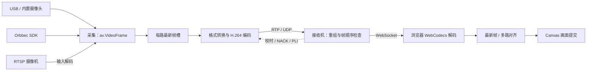

# 多路摄像头低延迟视频回传

通过局域网将多路摄像头画面单向传到接收机，使用 Vue 3 控制发送、接收与预览，记录延迟、帧率、码率和画面同步偏差。媒体采用 H.264 / RTP / UDP，接收端回传校时、关键帧请求及限时重传反馈。

目标是在合理画质与码率下，将真实场景变化到屏幕显示的延迟稳定控制在 100ms 内。**当前软件指标用于分析链路，尚不能作为真实场景到屏幕出光的 100ms 验收结论。**

## 功能与数据流

- 支持 1–8 路输入：内置/USB 摄像头、提供 RTSP 的网络或 PoE 摄像机、Orbbec SDK v2 图像流，可混合使用。
- 可选采集模式，统一设置输出分辨率、帧率上限及每路目标码率；默认输出 1280×720、30fps、3000kbps/路。
- 原始帧槽只保留最新一帧；编码禁用 B 帧和前瞻，接收端限制重组、解码和显示队列长度。
- 提供逐路最新帧显示、多路软件对齐、运行数据导出和外部录像光学测量。
- 业务代码只接受摄像头输入，已移除自绘测试画面及 `--source` 选项。



这是默认 Vue 链路。CLI 接收模式也可在 Python 中解码，通过 Qt 窗口显示或无窗口记录数据。网络摄像机目前先解码再重新编码，尚未实现压缩码流直通。深度流传输的是可视化图像，不能作为原始深度数据使用。

## 安装与启动

macOS / Linux，首次克隆并建立环境：

```bash
git clone https://github.com/bulichuchu/low_latency_video_transmit.git
cd low_latency_video_transmit
python3 -m venv .venv
.venv/bin/python -m pip install -r requirements.txt
.venv/bin/python demo.py doctor
.venv/bin/python demo.py web --no-browser
```

已有仓库时直接进入项目目录，无需再次克隆。已验证的 Python 环境为 3.13。Windows PowerShell 可用以下命令建立环境；其他命令中的 Python 路径相应替换：

```powershell
py -3.13 -m venv .venv
.\.venv\Scripts\python.exe -m pip install -r requirements.txt
.\.venv\Scripts\python.exe demo.py web --no-browser
```

仓库包含 `frontend/dist/`，正常使用不需要 Node.js。PyAV wheel 自带媒体库，无需单独安装 FFmpeg 命令行程序。`doctor` 只检查运行环境和编解码器初始化，不采集或生成视频，也不验证实际画质、帧率与延迟。

启动后打开：

- [发送端](http://127.0.0.1:8765/#/sender)：选择摄像头，配置输出画质、接收机地址和 UDP 端口。
- [接收端](http://127.0.0.1:8765/#/receiver)：配置接收路数、UDP 端口和显示策略，点击“开始接收”。

macOS 也可使用 `start_demo.command`、`start_sender.command`、`start_receiver.command`；Windows 使用对应 `.bat`。`start_demo` 无参数打开 Vue，有媒体参数时进入 CLI/Qt demo。启动网页服务不会自动开始采集；“本机联调”会启动本机的接收与发送。

接收浏览器需要支持 H.264 WebCodecs，预览要求安全上下文：本机回环 HTTP 或受信任的 HTTPS。一个接收会话支持一个活动预览页面。关闭页面不会停止传输，需点击停止按钮或在服务终端按 Ctrl+C。画质设置在下次启动采集时生效。

本地采集后端为 macOS AVFoundation、Windows DirectShow、Linux V4L2。macOS 模式查询使用系统 Swift / Apple Command Line Tools；Linux 可通过 `v4l2-ctl` 提供模式信息。Windows、Linux 和具体设备模式仍需在目标机器验证。

## 两台机器部署

两端使用相同版本的仓库，各自安装 Python 依赖。先在接收机运行：

```bash
.venv/bin/python demo.py web --page receiver --no-browser
```

在接收机本地浏览器打开接收页，设置监听地址 `0.0.0.0`、UDP 端口 `5004`、正确的视频路数，选择“两台设备 · 自动估计”，点击“开始接收”。再在发送机启动 Web 服务、选择摄像头，将接收机地址填为接收机的 IPv4 地址或可解析的域名，例如 `192.168.1.20`。地址栏不要包含 `http://`、路径或端口；端口单独填写。

| 连接 | 默认端口 | 用途 |
|---|---|---|
| 浏览器 → Web 服务 | TCP 8765 | 页面、控制、WebSocket 预览 |
| 发送机 → 接收机 | UDP 5004 | 视频及发送端对校时探测的回复 |
| 接收机 → 发送机 | 发送端临时 UDP 端口 | 校时探测、关键帧与重传请求 |

Web 默认只监听 `127.0.0.1`，这与 UDP 视频监听地址是两项设置。放行防火墙不会让仅监听回环的 Web 服务变成网络监听。跨机媒体需要接收机允许 UDP 入站，双方允许反馈返回；当前媒体协议用于可信网络，没有 SRTP、NAT 穿透或完整拥塞控制。

### 从另一台电脑打开接收页

接收机已启用 SSH 时，可保持 Web 服务只监听回环，在查看页面的电脑运行：

```bash
ssh -N -o ExitOnForwardFailure=yes \
  -L 127.0.0.1:18765:127.0.0.1:8765 \
  user@receiver.local
```

将 `user@receiver.local` 替换为接收机的 SSH 用户和地址。登录成功后终端保持无输出是正常的，需保持连接。浏览器打开 [转发后的接收页](http://127.0.0.1:18765/#/receiver)。SSH 只转发这里的 Web TCP 连接，视频的 UDP 5004 仍需直接互通。

如果直接通过域名访问，可在接收机显式设置监听和 Host 白名单；下面示例还为浏览器视频预览启用 HTTPS：

```bash
.venv/bin/python demo.py web --bind 0.0.0.0 \
  --allow-host receiver.local --port 8765 \
  --tls-cert /path/to/fullchain.pem --tls-key /path/to/privkey.pem \
  --page receiver --no-browser
```

域名、证书和私钥需替换为实际配置，证书必须覆盖域名并受浏览器信任。去掉 TLS 参数后是 HTTP 控制页面，远程域名 HTTP 无法满足视频预览的安全上下文要求。`--allow-host` 可重复指定；它是 Host 白名单，不是账号登录，仅应向可信客户端开放控制服务。

通过远程页面观看时，链路为“摄像头 → 发送机 → 接收机 → 当前浏览器”，显示延迟还包含最后一段传输。页面中的摄像头枚举与 SDK 路径属于运行 Web 服务的机器。

## 摄像头配置

### 内置 / USB 摄像头

Vue 中刷新设备并选择实际列出的模式，也可使用 CLI：

```bash
.venv/bin/python demo.py cameras
.venv/bin/python demo.py demo --cameras "摄像头名称" --width 1280 --height 720 --fps 30
# 两路设备，编号以本次 cameras 查询为准
.venv/bin/python demo.py demo --cameras 0,1 --sync-mode latest
```

macOS 支持设备名称/编号，Windows 使用 DirectShow 名称，Linux 使用 `/dev/video0` 等路径。带窗口的 `demo` 未指定输入时打开选择器；独立 `send` 和无窗口 demo 必须指定摄像头。

默认 `--capture-mode auto` 根据设备能力选择接近目标的采集模式。`exact` 或逐相机显式参数要求设备支持该组合。输出宽高必须为偶数；输出 FPS 是上限，不会补出相机未采到的帧。没有可查询模式的后端可手动填写，但需启动采集验证。

逐相机配置可保存为 `cameras.json`：

```json
{
  "version": 1,
  "output": {"width": 1280, "height": 720, "fps": 30, "bitrate_kbps": 3000},
  "cameras": [
    {"device": "设备 A", "width": 1280, "height": 720, "fps": 60, "pixel_format": "nv12"},
    {"device": "设备 B", "width": 1280, "height": 720, "fps": 30, "pixel_format": "nv12"}
  ]
}
```

运行 `.venv/bin/python demo.py demo --camera-profile cameras.json`。本地/SDK 逐路配置控制采集模式，顶层 `output` 控制传输输出；命令行输出参数可覆盖配置文件的输出值。不同输入统一缩放为输出尺寸，优先选择相同比例以避免拉伸。

### PoE / RTSP 网络摄像机

PoE 描述供电方式，视频接入要求摄像机实际提供 RTSP 地址。先给相机供电、配置网络并开启 RTSP，在发送页每行填写一个地址，或执行：

```bash
.venv/bin/python demo.py demo --rtsp-url 'rtsp://192.168.1.100:554/实际视频路径'
# 网络与本地相机混用；多个网络输入重复添加 --rtsp-url
.venv/bin/python demo.py demo --cameras 0 \
  --rtsp-url 'rtsp://192.168.1.100:554/实际视频路径'
```

默认 RTSP 使用 TCP，可用 `--rtsp-transport udp` 对照。各路连接独立超时和重连。相机原始分辨率、帧率、码率在相机后台配置；本程序设置的是输入解码后的重编码输出。目前不提供 ONVIF 自动发现或 PTZ 控制。

账号可放在 URL 中，也可通过环境变量传给[网络摄像机配置示例](docs/examples/network-cameras.json)：

```bash
export POE_CAMERA_1_URL='rtsp://用户名:密码@192.168.1.100:554/实际视频路径'
.venv/bin/python demo.py demo --camera-profile docs/examples/network-cameras.json
```

生成的配置、日志和报告会隐藏 RTSP 凭据。逐路可配置 `rtsp_transport`、`open_timeout_s`、`read_timeout_s`、`retry_delay_s`，不接受用逐路 width/height/fps 控制网络相机。

### Orbbec SDK 摄像头

发送机需安装匹配平台、架构和设备的 Orbbec SDK v2，完整保留动态库及配套文件；接收机不需要 SDK。在 Vue 的“厂商 SDK · Orbbec”中登记目录并查询，或运行：

```bash
.venv/bin/python demo.py sdk --orbbec-root '/实际/OrbbecSDK_v2目录'
.venv/bin/python demo.py cameras --sdk
.venv/bin/python demo.py demo --cameras 'orbbec://实际序列号/color'
```

也可设置 `ORBBEC_SDK_ROOT`。本机路径保存在 `.local/`，不通过 Git 同步。当前适配器读取设备实际提供的彩色、红外或深度预览模式；同一物理 SDK 设备一次选择一种图像流，不同设备可并行。其他厂商需要新增适配器。

macOS SDK 直连报 `uvc_open ... -3` 时，可在接相机的电脑运行 `./start_sdk_helper.command`，在终端完成管理员授权并保持助手运行，Web 服务继续以普通用户运行。助手就绪不等于设备取图成功；仍需实际查询和收帧。同一相机不要同时被系统 UVC、SDK 或其他应用采集。

当前时间戳助手版本为 `global-timestamp-v4`。支持 Global Timestamp 的设备会在采集前启用该功能，经稳定性检查后映射到发送机时钟。更新 SDK 助手代码或路径后需停止采集、重启助手，再查询设备。SDK 时间戳与实际曝光的关系、映射误差仍需设备级标定。

## 延迟、帧率与多路对齐

Vue 的主要指标以**当前已提交画面的同一帧**计算，不是把不同帧的时间混在一起：

| 指标 | 含义 |
|---|---|
| 视频延迟 · 估计 | 画面提交时刻 − 映射后的计时起点 |
| 画面年龄 | 当前统计时刻 − 同一起点；等于视频延迟加提交后经过的时间，停帧时继续增长 |
| 显示帧率 | 实际提交的新帧速率，不是配置的目标 FPS |
| 相机交付 / 应用链路分段 | 时间戳有效时可分别观察相机采集 → 应用取帧、应用取帧 → 画面提交 |
| 发送机 ↔ 接收机 UDP RTT | 两端校时探测的最近往返时间，包含调度开销 |
| 接收服务 ↔ 浏览器预览 RTT | WebSocket 探测的最近往返时间，包含 SSH 等预览路径 |
| 可见画面同步偏差 | 同屏各路已显示帧的应用取帧时间戳跨度 |

计时起点优先使用有效的 SDK 相机采集时间戳，否则明确回退为应用取帧。普通 USB 从程序取到图像起算；RTSP 从发送机完成输入解码起算，不包含之前的相机编码、输入网络和输入解码。跨机时钟使用四时间戳估计；`shared` 仅能用于同一台电脑，校时不可用时显示未知。

网络传输耗时已经包含在应用取帧到画面提交的链路中。RTT 用于单独观察网络状态，**不能直接当作单程视频延迟，也不能再与视频延迟相加**。RTT 超过 5 秒未更新时显示未知。软件指标的终点是画面提交，仍不包含屏幕扫描和像素响应。

Vue 默认 `latest`，逐路显示最新帧；CLI/Qt 默认 `aligned`。对齐模式按应用取帧时间戳选取接近共同目标的帧，在容差内等齐各路，超过等待预算后允许部分路更新，其余保留旧帧。Vue 默认等待 8ms、容差 18ms；CLI 多路默认等待半帧且最多 20ms。CLI 的 `--strict-sync` 可要求完整组。

当前配帧依据仍是应用取帧时间，尚未改为所有相机的传感器曝光时间。软件对齐不能保证硬件曝光同步，部分路保留旧帧时，同屏实际偏差可能超过配帧容差。

## CLI 与测量记录

独立两机传输：

```bash
# 接收机
.venv/bin/python demo.py receive --bind 0.0.0.0 --port 5004 --streams 1 \
  --width 1280 --height 720 --fps 30 --clock-mode estimated
# 发送机
.venv/bin/python demo.py send --host 192.168.1.20 --port 5004 \
  --cameras "摄像头名称" --width 1280 --height 720 --fps 30
# 本机固定时长测量，不打开接收窗口
.venv/bin/python demo.py demo --cameras 0,1 --decoder software --headless --duration 30
```

每次会话生成独立 `runs/` 目录，保存 `config.json`、`events.jsonl`、`frames.csv`、`metrics.csv` 和 `summary.json`。发送端记录实际采集模式与取帧率；CLI 本机 demo 还生成双方帧号对照的 `report.json`。Vue 可在停止后下载报告，浏览器提交数据与 Python 解码数据分别统计。

默认不保存摄像头图像；原生 Qt 窗口中 `S` 可手动截图，`--save-preview` 会在退出时保存预览。`Q`、Esc 或关闭原生窗口可退出。原始报告保留相机与应用两套时间指标、未知样本及丢弃原因；不要将各阶段 P95 相加作为总 P95。

真实场景到屏幕延迟需要外部测量：用高速录像同时拍到被传摄像头视野内的实体指示灯，以及接收屏幕中对应区域，比较两处亮度变化的时间：

```bash
.venv/bin/python demo.py optical /path/to/original-recording.mov \
  --capture-fps 240 --select-rois --output runs/optical-test-01
```

`240` 必须替换为真实拍摄帧率，不能直接使用慢动作文件的播放帧率；输入需为原始恒定帧率录像。先框选原场景区域，再框选屏幕区域。结果包含 `measurement.json`、`matches.csv`、`luminance.csv`、`events.json`，记录延迟分布、匹配率和采样界限。

## 开发与更新

| 路径 | 职责 |
|---|---|
| `demo.py`、`video_demo/cli.py` | CLI、参数校验、启动与本机 demo 进程管理 |
| `video_demo/webapp.py` | Vue API、发送/接收会话和 WebSocket 服务 |
| `video_demo/cameras.py`、`video_demo/camera_settings.py` | 通用设备能力、采集配置与 Qt 选择器 |
| `video_demo/sdk.py`、`video_demo/orbbec.py`、`video_demo/sdk_helper.py` | SDK 路由、Orbbec 取图、macOS 助手通信 |
| `video_demo/network.py` | RTSP 输入、重连与凭据脱敏 |
| `video_demo/sender.py`、`video_demo/media.py` | 采集线程、最新帧槽、格式转换、编码和发送 |
| `video_demo/protocol.py` | RTP 元数据、H.264 分包/重组、NACK/PLI/RR |
| `video_demo/receiver.py`、`video_demo/timing.py`、`video_demo/capture_time.py` | 接收调度、校时、原生配帧与 SDK 时间映射 |
| `video_demo/webbridge.py` | 压缩帧与元数据转发给浏览器 |
| `frontend/src/components/` | Vue 发送端、接收端和摄像头配置 |
| `frontend/src/media/` | WebCodecs 解码、浏览器校时、配帧与提交节拍 |
| `video_demo/metrics.py`、`video_demo/optical.py`、`video_demo/ui.py` | 指标报告、光学分析与原生显示 |
| `tests/`、`frontend/tests/` | 自动化测试；RTSP 与 SDK 测试夹具仅在此使用 |

```bash
.venv/bin/python -m pip install -r requirements-dev.txt
.venv/bin/python -m pytest -q
cd frontend
npm ci
npm test
npm run build
```

前端开发可运行 `npm run dev`，Vite 将 `/api` 和 WebSocket 请求转到本机 8765 的 Python 服务。日常部署使用已构建的 `frontend/dist/`；前端变更需将源码和新构建产物一起提交。自动化测试使用本机临时端口及测试夹具，不依赖真实摄像头；测试通过不等于真机延迟验收通过。

另一台机器在项目目录执行 `git pull --ff-only` 同步，然后由操作者重启 Web 服务并刷新浏览器。依赖变更时重新安装 requirements；SDK 助手代码变更时重启助手。`.venv/`、`.local/`、`runs/`、`node_modules/` 和 README 之外的 Markdown 文档不随仓库同步，SDK 安装目录在各机器单独配置。

## 常见排查

- **远程网页打不开**：先确认服务是否启动及监听地址。macOS 可执行 `lsof -nP -iTCP:8765 -sTCP:LISTEN`；只监听回环时使用 SSH 转发或显式网络监听，再检查 TCP 防火墙和 Host 白名单。
- **页面能打开但无视频**：确认浏览器 WebCodecs/安全上下文、接收已启动、路数和 UDP 端口匹配。接收码率为零时先查发送地址、网络与 UDP 防火墙。
- **通过 SSH 预览卡顿**：对比接收机本地浏览器，分别观察收到/解码/显示 FPS 和两项 RTT，区分发送链路与浏览器预览链路。
- **SDK 图像源缺失或助手断开**：查看设备查询错误和助手终端，确认 SDK 路径、助手版本、设备占用与所选模式；助手在线不代表设备已成功采集。
- **延迟未知或异常**：跨机使用自动估计并等待校时，确认两端代码及协议一致。相机采集时间不可用时查看应用链路指标，物理总延迟用光学测量确认。
