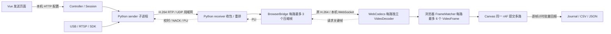

# Vue 发送端 / 接收端

默认启动入口现在是 Vue 3 页面。前端负责配置、监看和浏览器解码显示，Python 继续负责真实摄像头采集、SDK、H.264 编码、RTP/UDP、重传和校时。普通运行使用 `frontend/dist/`，不从 CDN 下载脚本。

## 运行与部署

```bash
cd /Users/fushuai/Work/low_latency_video_demo
.venv/bin/python -m pip install -r requirements.txt
.venv/bin/python demo.py web --page sender
# 接收机
.venv/bin/python demo.py web --page receiver
```

两端可位于两台电脑，也可同机联调。每台电脑只需一个本机 Web 服务，两个导航页面共享服务；重复启动同一端口会复用已运行的服务。同机联调会启动接收后再启动发送；后续两端可独立停止。接收先启动，发送机填接收机 LAN IP 与 UDP 端口，路数一致。跨机选择“自动估计”时钟；“共享时钟”只能用于同机。

Web 服务默认监听 `127.0.0.1`，端口默认 8765；`--port` 调整的是 HTTP(S) 端口，页面中的端口是视频 UDP 端口。可用 `--bind 0.0.0.0 --allow-host 域名` 显式开放受信任网络访问；用 `--tls-cert` / `--tls-key` 加载浏览器信任的证书启用 HTTPS。远程 HTTP 可配置及启停，但浏览器视频解码需要安全上下文，详见 [LAN_SETUP.md](LAN_SETUP.md)。当前没有账号登录、WebRTC 公网穿透和浏览器直接接收 UDP；UI token 用于请求校验，不是身份认证。

macOS：`start_demo.command` / `start_sender.command` / `start_receiver.command`。Windows：对应 `.bat`。原 `demo/send/receive` 命令保留 Qt/无头路径。发送 UI 只列真实摄像头；`source=synthetic` 只用于开发测试。

macOS 的 Orbbec SDK 返回 `uvc_open -3` 时，先由用户在接相机的电脑上运行 `./start_sdk_helper.command` 并完成 sudo 授权。普通用户网页会自动使用已运行的本机助手；更新代码前已启动的网页服务需重启。助手不启动采集、不新增网络端口；实际采集仍由“开始发送”触发。详见 [SDK_CAMERAS.md](SDK_CAMERAS.md)。

关闭标签页不会停掉服务或发送程序。按钮停止对应端；Ctrl+C 退出 Web 服务并关闭本机所有收发任务。每个角色每次启动创建独立 `runs/*-web-sender-*` / `runs/*-web-receiver-*`，不覆盖旧结果。页面不持久化 RTSP 地址；传给发送子进程的凭据放在环境变量里，日志与状态返回值脱敏。

## 数据路径及取舍



接收 Web 路径复用 `receiver.py` 的 RTP 重组、重排序和缺帧后等待 IDR 逻辑；重排好的压缩帧交给 `web_sink.offer()`，跳过 Python H.264 解码、RGB 数组转换及 Qt 绘制。浏览器直接解码 Annex B H.264，`VideoFrame` 画到 Canvas 后及时 `close()`。没有 JPEG 重编码、base64 或 HLS 分段。

Vue 不参与逐帧像素响应式更新。媒体类管理 Canvas / 原生帧，统计每 500ms 更新一次 Vue。浏览器请求 `optimizeForLatency` 与硬件优先，但硬件是否实际采用由浏览器决定，页面不会虚构硬件命中结果。H.264 配置字符串从实际 SPS 提取，关键帧必须含参数集。

边界：默认 WebSocket 用于同机浏览器最后一跳；远程域名访问会额外经过“接收服务 → 浏览器”的网络路径。HTTPS 自动使用 WSS，它仍是 TCP，会受网络、进程调度及浏览器缓冲影响。桥接队列满时清掉该流等待新 IDR；单次 WS 写等待超过 250ms 则断开重连。浏览器解码队列超过 3、待输出超过 8 或出现序号断裂则重建解码器；若当前包已是 IDR，直接从该包恢复，否则才请求关键帧。每路浏览器请求至少间隔 200ms，避免重复请求清掉刚到达的恢复帧。解码后过期帧不显示。这里不是对稳定物理 <100ms 的保证。

一个接收会话只允许一个活动预览页面。第二个页面会提示重连/占用；关闭前一个即可接管。页面刷新、发送进程重启或回到前台后重新请求关键帧。隐藏标签页期间停止解码/显示，发送和 UDP 接收继续工作。操作系统或浏览器主动限制后台程序时，恢复时间取决于平台。

## 关键类与函数

| 文件 / 类或函数 | 作用 |
|---|---|
| `webapp.media_args(role, data, directory)` | 将白名单配置转为原 CLI Namespace，复用范围/枚举校验；摄像头 profile 在内存验证，不落盘明文 URL |
| `webapp.Session.launch()` | 发送端创建独立 Python 子进程；接收端创建媒体工作线程，传入 BrowserBridge；原生 SDK 崩溃仍隔离在发送子进程 |
| `Session.stop()` | 写 STOP 文件，按原 stop_child 逻辑优雅等待发送端；接收线程结束后可重用 UDP 端口 |
| `Session.snapshot()` | 增量读取已有事件日志，返回脱敏错误、设备实际参数、发送帧率/码率与浏览器连接情况；速率按最后一条发送事件之前的两秒计算，避免异步刷盘造成假性低帧率；返回 sample_lag_ms，超过两秒没有新记录则速率置零 |
| `Controller.start()/stop()` | 异步锁串行化生命周期，拒绝覆盖运行中的会话，等待接收 ready 后才允许联调发送 |
| `normalized_hostname()` / `web_settings()` | 验证域名/IP 白名单、监听 IP、TLS 证书/私钥成对配置，创建 SSLContext 和对外访问 URL；不启动监听 |
| `create_app()` | 注册控制与视频接口；拒绝白名单之外的 Host、跨 Origin 请求；Origin 根据实际 HTTP/HTTPS 校验；修改接口与 WS 要求每次服务启动生成的 UI token |
| `run_web()` | 默认启动 localhost 服务；可显式开放 LAN/HTTPS。仅默认本地模式复用旧服务，改变监听或 TLS 时需要停止旧进程再启动 |
| `BrowserBridge.bind()/unbind()` | 连接/断开 receiver 的关键帧请求、日志和实时统计；锁保护媒体线程与事件循环之间的访问 |
| `BrowserBridge.offer()/pop()` | 非阻塞接收原压缩帧；有界队列、慢消费者恢复；封装二进制包及实际时钟映射结果 |
| `BrowserBridge.attach()/recover()` | 连接改变或解码失步时清掉受影响的旧压缩数据，从 IDR 恢复，保持 P 帧参考依赖 |
| `BrowserBridge.browser_recover()` | 验证路号及原因，单独记录 browser_recovery，然后进入 recover；便于区分浏览器重置与 UDP 丢包 |
| `BrowserBridge.telemetry()` | 根据已发送的 `(stream, epoch, frame_id)` 关联浏览器回报；限制大小、过滤非有限值、去重；不会把网页回报记成原生 decode |
| `App.vue` | 两个路由页面及共享布局；首次访问时才挂载相应页面，导航不停止运行任务 |
| `SenderPanel.vue` | 设备/SDK 异步枚举、RTSP 输入、统一输出质量、目标 IP、启动/停止、同机联调和发送状态 |
| `CameraInput.vue` | 一路设备的选择、自动模式、实际模式组合与 FPS 范围、无模式列表时手动配置、深度预览量程 |
| `ReceiverPanel.vue` | 接收配置、生命周期状态同步、Canvas 引用、统计、全屏和测试报告 |
| `api.js` | 同源 HTTP API、启动 token，按页面协议选择 WS/WSS、保留域名端口；不把密码写 localStorage |
| `VideoPlayer.connect()/control()` | WS 建连、接收当前会话配置、ping/pong 估计浏览器 performance.now 与 Python 单调时钟偏移 |
| `VideoPlayer.packet()/dropStream()` | 从二进制包读元数据与 H.264；按路维护 decoder、epoch、PTS 映射、依赖连续性与有界待输出表 |
| `VideoPlayer.key()` | 按路限制恢复请求频率；已有可用 IDR 时不再请求，避免桥接暂停与序号断裂互相触发 |
| `DisplayPacer.due()/submitted()` | 显示节拍沿固定时间轴推进，容忍 0.5ms 的 rAF 时间戳取整；跳过错过的时隙，不补播积压帧；仅实际绘制才消耗额度 |
| `VideoPlayer.tick()` | rAF 内按显示 FPS 上限取匹配组，过期检查、直接绘制 VideoFrame 并释放资源；全组绘制后计算可见集合的时间偏差 |
| `VideoPlayer.report()/close()` | 每 500ms 发布速率与计时，批量回传帧记录；关闭时清理计时器、WS 和原生解码/图像对象 |
| JS `FrameMatcher.add()/poll()/clear()` | 最近帧模式立即选择各路最新值；对齐模式按容差和有限等待选组；每路最多六帧，丢弃和清理均释放原生帧 |
| `avcCodec()` | 从 Annex B SPS 获取 profile/constraints/level，构造实际 `avc1.xxxxxx` |
| `cameras.validate_profile()` | 文件与 HTTP 共用 profile 校验；保留原 `read_profile()` 文件入口 |
| `metrics.summarize()` | 分开汇总原生 `decode/submit` 与 `browser_submit`；新增浏览器分段、帧间隔和可见取帧偏差 |

`receiver.run_receiver(args, web_sink=None)` 的默认 `None` 完全保留原生对照路径。Web 接收传入 bridge 并设置 `ui_backend=webcodecs`；原生 `FrameMatcher` 不产生帧，真正的配帧工作在 JS 中完成。因此 Web 报告的 `decode_latency_ms` 为零样本是正常的，应读取 `browser_submit_latency_ms`。

## 控制 API 与 WebSocket

| 接口 | 内容 |
|---|---|
| `GET /api/bootstrap` | 应用标识、UI token、已登记 SDK 路径 |
| `GET /api/cameras` / `?sdk=1` | 本地 / SDK 能力枚举，不启动采集 |
| `POST /api/sdk` | `{path}` 登记 SDK 目录，原系统权限规则不变 |
| `POST /api/sender/start` | `{cameras:[...], width,height,fps,bitrate_kbps,encoder,host,port}`；支持原 SDK/RTSP profile 字段 |
| `POST /api/receiver/start` | `{streams,bind,port,clock_mode,sync_mode,sync_wait_ms,sync_tolerance_ms,max_age_ms,display_fps}` |
| `GET /api/{sender|receiver}/status` | 当前会话状态、运行目录、错误及指标 |
| `POST /api/{sender|receiver}/stop` | 优雅停止并生成 CSV / summary |
| `GET /api/{sender|receiver}/report` | 下载当前会话停止后生成的 summary.json |
| `WS /api/video?token=…` | 本机 H.264 预览与 ping/key/telemetry 反馈 |

修改接口携带 `X-Video-Token`。开放 LAN 后，能访问此服务的客户端可获取 token 并控制收发，因此仅用于受信任网络，不作为公网管理后台。SDK 目录填写服务所在机器的路径，不是浏览器文件上传，不会上传 SDK。TLS 直接由 Python 服务处理；不默认信任客户端提供的 X-Forwarded-* 头。

视频二进制消息：`4 字节大端 JSON 长度 | UTF-8 JSON | 一帧 Annex B H.264`。JSON 包含 stream、epoch、frame_id、key、depth_preview、capture_ms（发送端取帧时钟）、host_capture_ms（映射到接收端时钟，可能 null）、host_sent_ms、uncertainty_ms。

客户端 JSON：`ping` 携带 t1，服务端 pong 回 t1/t2/t3；`key` 携带 stream 及可选 reason 请求 IDR，原因按白名单写入 browser_recovery；`telemetry` 携带最多 1024 条逐帧提交记录。浏览器时钟至少三次有效回包且样本新鲜后才报告映射，未知/负值不伪造为 0ms。发送端与接收端的时钟估计仍走原 UDP 校时，两段不确定度相加记录。

## 指标定义

- “测试记录与丢帧”显示每路浏览器收到 / 解码 / 显示 FPS：分别计压缩帧到达、VideoDecoder 输出、Canvas 提交，每 500ms 更新。它们不是相机采集 FPS，也不是屏幕实际出光 FPS。
- **应用取帧 → 提交**：发送端取得图像至浏览器 Canvas 调用完成；不包含全部曝光、传感器和最终屏幕出光。RTSP 的前段输入编码/网络/解码也不计入，SDK 硬件时间戳不当作公共曝光时钟。
- **距应用取帧**：正在保留的画面距应用取帧过去多久，停帧时增长；停止会话后显示未知。
- **可见画面取帧时间偏差**：同一发送会话中，当前各路可见帧的应用取帧时间最大减最小；不是相机硬件曝光同步误差。
- `browser_submit_latency_ms` 统计的是已回报显示提交帧，过期被丢弃的帧不会混入；需结合丢帧、帧率、空窗和原始事件判断稳定性。不能只看低 P95 就宣称满足物理延迟验收。
- `browser_decode_ms` 包括浏览器输入到解码输出的排队/解码；`browser_wait_ms` 是解码后至绘制前等待；`browser_draw_ms` 是 Canvas 调用时间。真实屏幕出光仍为 `glass_to_glass_latency_ms: null`。
- 浏览器帧间隔由页面单调时钟计算；刷新页面会重置该时钟，跨页面的间隔不作为连续测量。后台暂停、启动和断流要结合事件时间线分析。统计回传有批量延迟，页面突然崩溃可能丢失最后一批记录。
- `metrics.csv` 的 `fps_measurement=browser_reported_submit` 表示服务端最近一秒收到的浏览器提交回报数量，会受 500ms 批量回报影响；页面实时 FPS 用浏览器实际提交计数。原生路径仍标记 `native_decode`，不会混为同一测量。

## 前端开发

Node 22.12+ 或当前兼容版本，已提供 package-lock。

```bash
cd frontend
npm ci
npm run build
npm test
# 先在另一终端启动 Python web 服务，再启动热更新开发界面：
npm run dev
```

Vite 开发服务仅绑定 127.0.0.1，并代理 `/api` 的 HTTP 和 WS 到 8765；变更后自动更新。生产页面在重新 `npm run build` 后刷新即可。`frontend/dist/` 随项目提供，前端源码修改后必须同时重新构建。

Python：`.venv/bin/python -m pytest -q`。`tests/test_web.py` 覆盖配置校验、凭据不落盘、本机接口防护、有界桥接/IDR 恢复、真实两进程 H.264 UDP 到 WebSocket、回连、报告和再次启动。JS 测试覆盖配帧、有限等待、过期和资源释放、SPS 解析。

## 2026-09-29 双路低帧率修复

Air 的两路 1280×720@60 SDK 摄像头发送日志，在所取的连续 10 秒内各有 600 帧。Mac mini 的 `20260929-115739-web-receiver-42c13c` 报告记录了 13.13 秒：S0/S1 显示平均 10.05/26.04fps，PLI 请求分别 68/2 次，浏览器解码均值 3.71/1.47ms。这些数据包含启动与恢复阶段，并非物理延迟验收。

发现并修复了两处可独立复现的代码问题：

1. 浏览器收到序号不连续的 IDR 时，无条件再次请求 IDR。此请求会使桥接清理后续 P 帧；下一 IDR 又有序号间隙，从而可能持续重复恢复。现在直接使用已经收到的 IDR，并限制重复恢复请求频率。
2. 显示截止时间每次设为 `now + 1000/fps`，rAF 时间取整后会漏过可显示的刷新。改用固定节拍，在停顿后跳过过时显示时隙，不补播旧帧。

旧代码运行新增的两项回归测试均失败：关键帧恢复产生 1 个多余请求；10 秒、取整到 0.1ms 的 60Hz 双路调度，每路只提交 400 帧。修复后分别为 0 个多余请求及每路 600 帧。此处是模拟浏览器调度/解码回调的测试，不是实机达到 60fps 的声明。11 项 JS 测试、23 项 Python Web/指标测试及 Vue 构建通过。

真实双机 + SSH 预览的修复后帧率待用户更新 Mac mini 并复测。建议先使用最新帧模式、发送及显示上限 60fps、100ms 过期阈值，保持原分辨率/码率做前后对比，再评估多路对齐的额外等待。更新步骤见 [LAN_SETUP.md](LAN_SETUP.md#7-更新双路低帧率修复)。

## 2026-09-28 验证记录

macOS Apple M4、PyAV 18.1、Vue 3、Vite 7、Codex 内置浏览器。前端构建通过；Python 回归 92 项通过，JS 4 项通过。GUI 的 SDK/RTSP 配置入口迁移已完成；本次未新增管理员 SDK 实拍或独立 PoE 实机验证。

1. **真实内置摄像头**：在 Vue 页面选择 MacBook Air 相机，640×360 输出、30fps 上限、1000kbps、libx264，同机 UDP → WebCodecs。发送 281 帧，记录到 274 次浏览器提交；界面稳定时约 30fps，应用取帧→提交 P50 14.11ms、P95 23.33ms、最大 64.05ms。发送与接收日志无错误。此短测非物理延迟验收，未保存摄像头画面。报告：[发送](docs/results/vue-20260928/real-camera-sender.json)、[接收](docs/results/vue-20260928/real-camera-receiver.json)。
2. **双路协议/浏览器测试**：开发测试合成源，每路640×360@30；对齐模式、8ms 等待、18ms 容差。浏览器每路记录573次提交，已知时钟样本547个；P95约27.30/27.40ms，已记录可见取帧偏差为0ms。测试包含主动停流、刷新页面、发送进程重启，不能拿其整个会话平均帧率作稳定性结论；一处重组不完整丢帧被记录。已确认重启后两路重新显示约30fps。报告：[双路浏览器](docs/results/vue-20260928/synthetic-browser-receiver.json)。这些图像仅用于测试，产品界面默认选择真实摄像头。
3. 通过页面停止接收，并通过 API 测试验证报告下载；枚举查询、输出质量预设、前端路由、断流停帧提示均验证。原Qt/无头测试继续通过。

实现依据：[Vue 官方快速开始](https://vuejs.org/guide/quick-start)、[WebCodecs](https://www.w3.org/TR/webcodecs/)、[H.264 Annex B 与 SPS/PPS 约定](https://www.w3.org/TR/webcodecs-avc-codec-registration/)。
